## LAPORAN PRAKTIKUM PERTEMUAN 10
>Nama  : Naresh Pratista<p>
>Kelas : 1F-D4TI<p>
>Absen : 22<p>
**QUEUE**

**8.1 Tujuan Praktikum**  
Setelah melakukan materi praktikum ini, mahasiswa mampu:
1. Mengenal struktur data Queue
2. Membuat dan mendeklarasikan struktur data Queue
3. Menerapkan algoritma Queue dengan menggunakan array

**8.2 Praktikum 1**

Pada percobaan ini, kita akan mengimplementasikan penggunaan class Queue.

**8.2.1 Langkah-langkah Percobaan**

1. class queue
```java
package tugas1;
/**
 *
 * @author nares
 */
public class queue {
    int max, size, front, rear, data[];
    
    public queue(int n){
        max = n;
        data = new int [max];
        size = 0;
        front = rear = -1;
    }
    public boolean IsEmpty(){
        if(size == 0){
            return true;
        }else{
            return false;
        }
    }
    public boolean IsFull(){
        if(size == max){
            return true;
        }else {
            return false;
        }
    }
    public void peek(){
        if(!IsEmpty()){
            System.out.println("Elemen terdepan : "+data[front]);
        }else{
            System.out.println("Queue masih kosong");
        }
    }
    public void print(){
        if(IsEmpty()){
            System.out.println("Queue masih kosong");
        }else {
            int i = front;
            while(i != rear){
                System.out.println(data[i] + " ");
                i = (i + 1) % max;
            }
            System.out.println(data[i] + " ");
            System.out.println("Jumlah elemen = "+ size);
        }
    }
    public void clear(){
        if(!IsEmpty()){
            front = rear = -1;
            size = 0;
            System.out.println("queue berhasil dikosongkan");
        }else{
            System.out.println("Queue masih kosong");
        }
    }
    public void enqueue(int dt){
        if(IsFull()){
            System.out.println("Queue sudah penuh");
            System.exit(0);
        }else{
            if(IsEmpty()){
                front = rear = 0;
            }else{
                if (rear == max -1){
                    rear = 0;
                }else{
                    rear++;
                }
            }
            data[rear] = dt;
            size++;
        }
    }
    public int dequeue(){
        int dt = 0;
        if(IsEmpty()){
            System.out.println("Queue masih kosong");
            System.exit(0);
        }else{
            dt = data[front];
            size--;
            if(IsEmpty()){
                front = rear = -1;
            }else{
                if(front == max -1){
                    front = 0;
                }else{
                    front++;
                }
            }
        }
        return dt;
    }
    public void peekPosition(int data){
        int i = front;
        boolean j = true;
        while (j){
            if (data == this.data[i]){
                System.out.println("data "+data+" ada pada index ke- "+i);
                j = false;
            }
            i++;
        }
    }
    public void peekAt (int posisi){
        int i = front;
        boolean j = true;
        while(j){
            if(posisi == i){
                System.out.println("data pada index ke - "+i+" adalah "+this.data[i]);
                j = false;
            }
            i++;
        }
    }
}
```

2. class queueMain
```java
package tugas1;
/**
 *
 * @author nares
 */
import java.util.Scanner;
public class queueMain {
    public static void menu(){
        System.out.println("\nMasukkan Operasi yang diinginkan ");
        System.out.println(" 1. Enqueue\n 2. Dequeue\n 3. Print\n 4. Peek\n 5. Clear\n 6. Cari indeks \n 7. cari data\n 0. Exit");
        System.out.println("-----------------------------------");
        
    }
    public static void main(String[] args) {
        Scanner sc = new Scanner(System.in);
        
        System.out.print("Masukkan kapasitas queue\t\t: ");
        int n = sc.nextInt();
        queue Q = new queue(n);
        int pilih;
        do{
            menu();
            pilih = sc.nextInt();
            switch (pilih){
                case 1:
                    System.out.print("Masukkan data baru\t\t\t: ");
                    int dataMasuk = sc.nextInt();
                    Q.enqueue(dataMasuk);
                    break;
                case 2:
                    int dataKeluar = Q.dequeue();
                    if (dataKeluar != 0){
                        System.out.println("Data yang dikeluarkan\t\t: "+ dataKeluar);
                        break;
                    }
                case 3:
                    Q.print();
                    break;
                case 4:
                    Q.peek();
                    break;
                case 5:
                    Q.clear();
                    break;
                case 6:
                    System.out.print("Masukkan data yang akan dicari\t\t:");
                    int cari = sc.nextInt();
                    Q.peekPosition(cari);
                    break;
                case 7:
                    System.out.print("Masukkan indeks yang akan dicari\t:");
                    int posisi = sc.nextInt();
                    Q.peekAt(posisi);
                    break;     
            }
        }while (pilih == 1 || pilih == 2 || pilih == 3 || pilih == 4 || pilih == 5 || pilih == 6 || pilih == 7);
    }
}
```
**8.2.2 Verifikasi Hasil Percobaan** 

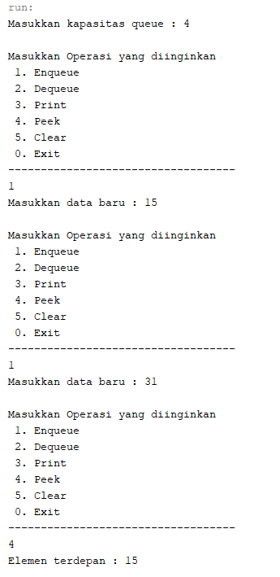

**8.2.3 Pertanyaan**

1. Pada konstruktor, mengapa nilai awal atribut front dan rear bernilai -1, sementara atribut size
bernilai 0?
    > Jika diinisialisasi 0 maka artiya ada nilai di index 0 sedangkan -1 berarti tidak ada nilai di index manapun

2. Pada method Enqueue, jelaskan maksud dan kegunaan dari potongan kode berikut!
    > jika rear berada di tempat paling belakang indeks, maka jika ditambah nilai lagi rear akan berada di indeks 0

3. Pada method Dequeue, jelaskan maksud dan kegunaan dari potongan kode berikut!
    > Jika front berada di terakhir indeks dan jika dihapus nilai maka front akan berada di indeks 0 / terdepan

4. Pada method print, mengapa pada proses perulangan variabel i tidak dimulai dari 0 (int i=0),melainkan int i=front?
    > Dikarenakan seperti no 3, front tidak selalu berada di depan bisa di tengah, atau di belakang indeks. Perulangan di mulai dari front

5. Perhatikan kembali method print, jelaskan maksud dari potongan kode berikut!
    > Memberitahu indeks sudah di indeks terakhir (max) sehingga jika iya akan dihentikan

6. Tunjukkan potongan kode program yang merupakan queue overflow!
    > 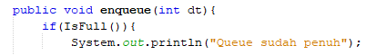

7. Pada saat terjadi queue overflow dan queue underflow, program tersebut tetap dapat berjalan dan hanya menampilkan teks informasi. Lakukan modifikasi program sehingga pada saat terjadi queue overflow dan queue underflow, program dihentikan!
    > class queue
    ```java
        package praktikum1;
    /**
    *
    * @author nares
    */
    public class Queue {
        int max, size, front, rear, data[];
    
        public Queue(int n){
        max = n;
        data = new int [max];
        size = 0;
        front = rear = -1;
    }
        public boolean IsEmpty(){
            if(size == 0){
                return true;
            }else{
                return false;
        }
    }
        public boolean IsFull(){
            if(size == max){
                return true;
            }else {
                return false;
        }
    }
        public void peek(){
            if(!IsEmpty()){
                System.out.println("Elemen terdepan : "+data[front]);
            }else{
                System.out.println("Queue masih kosong");
        }
    }
    public void print(){
        if(IsEmpty()){
            System.out.println("Queue masih kosong");
        }else {
            int i = front;
            while(i != rear){
                System.out.println(data[i] + " ");
                i = (i + 1) % max;
            }
            System.out.println(data[i] + " ");
            System.out.println("Jumlah elemen = "+ size);
        }
    }
        public void clear(){
            if(!IsEmpty()){
                front = rear = -1;
                size = 0;
                System.out.println("queue berhasil dikosongkan");
            }else{
                System.out.println("Queue masih kosong");
        }
    }
        public void enqueue(int dt){
            if(IsFull()){
                System.out.println("Queue sudah penuh");
            }else{
                if(IsEmpty()){
                    front = rear = 0;
            }else{
                if (rear == max -1){
                    rear = 0;
                }else{
                    rear++;
                }
            }
            data[rear] = dt;
            size++;
        }
    }
        public int dequeue(){
            int dt = 0;
            if(IsEmpty()){
                System.out.println("Queue masih kosong");
            }else{
                dt = data[front];
                size--;
            if(IsEmpty()){
                front = rear = -1;
            }else{
                if(front == max -1){
                    front = 0;
                }else{
                    front++;
                }
                }
            }
            return dt;
        }
    }
    ```
    > 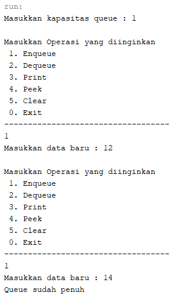
    > 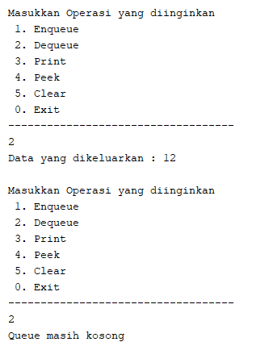

**8.3 Praktikum 2**

Pada percobaan ini, kita akan membuat program yang mengilustrasikan teller di bank dalam melayani nasabah.

**8.3.1 Langkah-langkah Percobaan**
1. class nasabah
```java
package praktikum2;
/**
 *
 * @author nares
 */
public class Nasabah {
    String norek, nama, alamat;
    int umur;
    double saldo;
    
    Nasabah(String norek, String nama, String alamat, int umur, double saldo){
        this.norek = norek;
        this.nama = nama;
        this.alamat = alamat;
        this.umur = umur;
        this.saldo = saldo;
    }
    Nasabah(){
    }
}
```

2. class queue
```java
package praktikum2;
/**
 *
 * @author nares
 */
public class Queue {
        int max, size, front, rear;
    Nasabah[] data;
    
    public Queue(int n){
        max = n;
        data = new Nasabah [max];
        size = 0;
        front = rear = -1;
    }
    public boolean IsEmpty(){
        if(size == 0){
            return true;
        }else{
            return false;
        }
    }
    public boolean IsFull(){
        if(size == max){
            return true;
        }else {
            return false;
        }
    }
    public void peek(){
        if(!IsEmpty()){
            System.out.println("Elemen terdepan : "+data[front].norek+ " "+data[front].nama+" "+data[front].alamat+" "+data[front].umur+" "+data[front].saldo);
        }else{
            System.out.println("Queue masih kosong");
        }
    }
    public void print(){
        if(IsEmpty()){
            System.out.println("Queue masih kosong");
        }else {
            int i = front;
            while(i != rear){
                System.out.println(data[i].norek + " "+data[i].nama + " "+data[i].alamat + " "+data[i].umur + " "+data[i].saldo);
                i = (i + 1) % max;
            }
            System.out.println(data[i].norek + " "+data[i].nama + " "+data[i].alamat + " "+data[i].umur + " "+data[i].saldo);
            System.out.println("Jumlah elemen = "+ size);
        }
    }
    public void clear(){
        if(!IsEmpty()){
            front = rear = -1;
            size = 0;
            System.out.println("queue berhasil dikosongkan");
        }else{
            System.out.println("Queue masih kosong");
        }
    }
    public void enqueue(Nasabah dt){
        if(IsFull()){
            System.out.println("Queue sudah penuh");
        }else{
            if(IsEmpty()){
                front = rear = 0;
            }else{
                if (rear == max -1){
                    rear = 0;
                }else{
                    rear++;
                }
            }
            data[rear] = dt;
            size++;
        }
    }
    public Nasabah dequeue(){
        Nasabah dt = new Nasabah();
        if(IsEmpty()){
            System.out.println("Queue masih kosong");
        }else{
            dt = data[front];
            size--;
            if(IsEmpty()){
                front = rear = -1;
            }else{
                if(front == max -1){
                    front = 0;
                }else{
                    front++;
                }
            }
        }
        return dt;
    }
}
```

3. class queueMain
```java
package praktikum2;
/**
 *
 * @author nares
 */
import java.util.Scanner;
public class QueueMain {

    public static void menu(){
        System.out.println("\nPilih Menu ");
        System.out.println(" 1. Antrian baru\n 2. Antrian Keluar\n 3. Cek Antrian Terdepan\n 4. Cek Semua Antrian 0. Exit");
        System.out.println("-----------------------------------");
        
    }
    public static void main(String[] args) {
        Scanner sc = new Scanner(System.in);
        
        System.out.print("Masukkan kapasitas queue : ");
        int jumlah = sc.nextInt();
        Queue antri = new Queue(jumlah);
        
        int pilih;
        do{
            menu();
            pilih = sc.nextInt();
            sc.nextLine();
            
            switch(pilih){
                case 1:
                    System.out.print("No Rekening\t: ");
                    String norek = sc.nextLine();
                    System.out.print("Nama\t\t: ");
                    String nama = sc.nextLine();
                    System.out.print("Alamat\t\t: ");
                    String alamat = sc.nextLine();
                    System.out.print("Umur\t\t: ");
                    int umur = sc.nextInt();
                    System.out.print("Saldo\t\t: ");
                    int saldo = sc.nextInt();
                    Nasabah nb = new Nasabah(norek, nama, alamat, umur, saldo);
                    sc.nextLine();
                    antri.enqueue(nb);
                    break;
                case 2:
                    Nasabah data = antri.dequeue();
                    if(!"".equals(data.norek) && !"".equals(data.nama) &&!"".equals(data.alamat) && data.umur !=0 && data.saldo !=0){
                        System.out.println("Antrian yang keluar : " + data.norek+ " "+ data.nama+" "+ data.alamat+" "+data.umur+" "+data.saldo);
                }
                    break;
                case 3:
                    antri.peek();
                    break;
                case 4:
                    antri.print();
                    break;
            }
        }while (pilih == 1 || pilih == 2 || pilih == 3 || pilih == 4);
    }
}
```

**8.3.2 Verifikasi Hasil Percobaan**

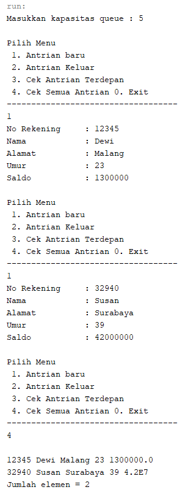

**8.3.3 Pertanyaan**

1. Pada class QueueMain, jelaskan fungsi IF pada potongan kode program berikut!
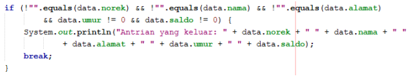

    >digunakan untuk mengecek apakah norek pada data tidak sama dengan string kosong ("") dst jika semua kondisi bernilai true maka akan menampilkan pada konsol isi dari data tersebut lalu berhenti (break) break berfungsi untuk mengakhiri kode program akgar tidak terus melakukan proses

2. Lakukan modifikasi program dengan menambahkan method baru bernama peekRear pada class Queue yang digunakan untuk mengecek antrian yang berada di posisi belakang! Tambahkan pula daftar menu 5. Cek Antrian paling belakang pada class QueueMain sehingga method peekRear dapat dipanggil!

    > 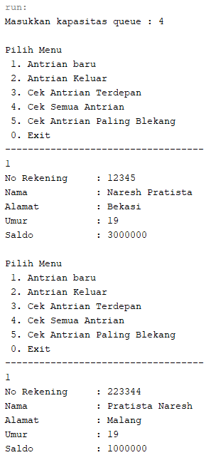
    > 

**8.4 Tugas**

1. Tambahkan dua method berikut ke dalam class Queue pada Praktikum 1:
    - Method **peekPosition(data: int) : void**    
    Untuk menampilkan posisi dari sebuah data di dalam queue, misalnya dengan mengirimkan data tertentu, akan diketahui posisi (indeks) data tersebut berada di urutan ke berapa

    - Method **peekAt(position: int) : void**
    Untuk menampilkan data yang berada pada posisi (indeks) tertentu 
    
Sesuaikan daftar menu yang terdapat pada class QueueMain sehingga kedua method tersebut dapat dipanggil!

> class queue
```java
package tugas1;
/**
 *
 * @author nares
 */
public class queue {
    int max, size, front, rear, data[];
    
    public queue(int n){
        max = n;
        data = new int [max];
        size = 0;
        front = rear = -1;
    }
    public boolean IsEmpty(){
        if(size == 0){
            return true;
        }else{
            return false;
        }
    }
    public boolean IsFull(){
        if(size == max){
            return true;
        }else {
            return false;
        }
    }
    public void peek(){
        if(!IsEmpty()){
            System.out.println("Elemen terdepan : "+data[front]);
        }else{
            System.out.println("Queue masih kosong");
        }
    }
    public void print(){
        if(IsEmpty()){
            System.out.println("Queue masih kosong");
        }else {
            int i = front;
            while(i != rear){
                System.out.println(data[i] + " ");
                i = (i + 1) % max;
            }
            System.out.println(data[i] + " ");
            System.out.println("Jumlah elemen = "+ size);
        }
    }
    public void clear(){
        if(!IsEmpty()){
            front = rear = -1;
            size = 0;
            System.out.println("queue berhasil dikosongkan");
        }else{
            System.out.println("Queue masih kosong");
        }
    }
    public void enqueue(int dt){
        if(IsFull()){
            System.out.println("Queue sudah penuh");
            System.exit(0);
        }else{
            if(IsEmpty()){
                front = rear = 0;
            }else{
                if (rear == max -1){
                    rear = 0;
                }else{
                    rear++;
                }
            }
            data[rear] = dt;
            size++;
        }
    }
    public int dequeue(){
        int dt = 0;
        if(IsEmpty()){
            System.out.println("Queue masih kosong");
            System.exit(0);
        }else{
            dt = data[front];
            size--;
            if(IsEmpty()){
                front = rear = -1;
            }else{
                if(front == max -1){
                    front = 0;
                }else{
                    front++;
                }
            }
        }
        return dt;
    }
    public void peekPosition(int data){
        int i = front;
        boolean j = true;
        while (j){
            if (data == this.data[i]){
                System.out.println("data "+data+" ada pada index ke- "+i);
                j = false;
            }
            i++;
        }
    }
    public void peekAt (int posisi){
        int i = front;
        boolean j = true;
        while(j){
            if(posisi == i){
                System.out.println("data pada index ke - "+i+" adalah "+this.data[i]);
                j = false;
            }
            i++;
        }
    }
}
```

> class queueMain
```java
package tugas1;
/**
 *
 * @author nares
 */
import java.util.Scanner;
public class queueMain {
    public static void menu(){
        System.out.println("\nMasukkan Operasi yang diinginkan ");
        System.out.println(" 1. Enqueue\n 2. Dequeue\n 3. Print\n 4. Peek\n 5. Clear\n 6. Cari indeks \n 7. cari data\n 0. Exit");
        System.out.println("-----------------------------------");
        
    }
    public static void main(String[] args) {
        Scanner sc = new Scanner(System.in);
        
        System.out.print("Masukkan kapasitas queue\t\t: ");
        int n = sc.nextInt();
        queue Q = new queue(n);
        int pilih;
        do{
            menu();
            pilih = sc.nextInt();
            switch (pilih){
                case 1:
                    System.out.print("Masukkan data baru\t\t\t: ");
                    int dataMasuk = sc.nextInt();
                    Q.enqueue(dataMasuk);
                    break;
                case 2:
                    int dataKeluar = Q.dequeue();
                    if (dataKeluar != 0){
                        System.out.println("Data yang dikeluarkan\t\t: "+ dataKeluar);
                        break;
                    }
                case 3:
                    Q.print();
                    break;
                case 4:
                    Q.peek();
                    break;
                case 5:
                    Q.clear();
                    break;
                case 6:
                    System.out.print("Masukkan data yang akan dicari\t\t:");
                    int cari = sc.nextInt();
                    Q.peekPosition(cari);
                    break;
                case 7:
                    System.out.print("Masukkan indeks yang akan dicari\t:");
                    int posisi = sc.nextInt();
                    Q.peekAt(posisi);
                    break;     
            }
        }while (pilih == 1 || pilih == 2 || pilih == 3 || pilih == 4 || pilih == 5 || pilih == 6 || pilih == 7);
    }
}
```

> Hasil Output

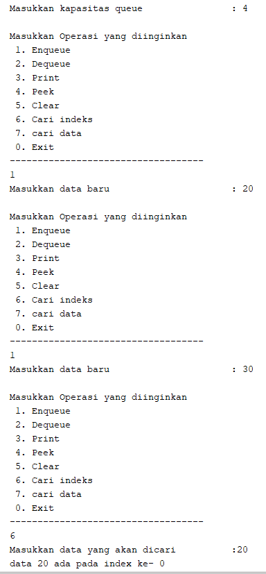
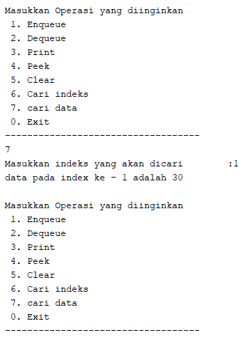

2. Buatlah program antrian untuk mengilustasikan mahasiswa yang sedang meminta tanda tangan KRS pada dosen DPA di kampus. Ketika seorang mahasiswa akan mengantri, maka dia harus menuliskan terlebih dulu NIM, nama, absen, dan IPK seperti yang digambarkan pada Class diagram berikut:

> class mahasiswa
```java
package tugas2;

/**
 *
 * @author nares
 */
public class mahasiswa {
    String nim;
    String nama;
    int absen;
    double ipk;

    mahasiswa (String nim, String nama, int absen, double ipk){
        this.nim = nim;
        this.nama = nama;
        this.absen = absen;
        this.ipk = ipk;
    }
    mahasiswa() {  
    }
}
```

> class queue
```java
package tugas2;

/**
 *
 * @author nares
 */
public class queue {
        int max, size, front, rear;
    mahasiswa[] antrian;
    
    public queue(int n){
        max = n;
        antrian = new mahasiswa [max];
        size = 0;
        front = rear = -1;
    }
    public boolean IsEmpty(){
        if(size == 0){
            return true;
        }else{
            return false;
        }
    }
    public boolean IsFull(){
        if(size == max){
            return true;
        }else {
            return false;
        }
    }
    public void peek(){
        if(!IsEmpty()){
            System.out.println("Elemen terdepan : "+antrian[front].nama+ " "+antrian[front].nim+" "+antrian[front].absen+" "+antrian[front].ipk);
        }else{
            System.out.println("Queue masih kosong");
        }
    }
    public void peekRear(){
        if(!IsEmpty()){
            System.out.println("Elemen yang belakang : "+antrian[rear].nama+ " "+antrian[rear].nim+" "+antrian[rear].absen+" "+antrian[rear].ipk);
        }else{
            System.out.println("Queue masih kosong");
        }
    }
    public void print(){
        if(IsEmpty()){
            System.out.println("Queue masih kosong");
        }else {
            int i = front;
            while(i != rear){
                System.out.println(antrian[i].nama + " "+antrian[i].nim + " "+antrian[i].absen + " "+antrian[i].ipk);
                i = (i + 1) % max;
            }
            System.out.println(antrian[i].nama + " "+antrian[i].nim + " "+antrian[i].absen + " "+antrian[i].ipk);
            System.out.println("Jumlah elemen = "+ size);
        }
    }
    public void clear(){
        if(!IsEmpty()){
            front = rear = -1;
            size = 0;
            System.out.println("queue berhasil dikosongkan");
        }else{
            System.out.println("Queue masih kosong");
        }
    }
    public void enqueue(mahasiswa dt){
        if(IsFull()){
            System.out.println("Queue sudah penuh");
        }else{
            if(IsEmpty()){
                front = rear = 0;
            }else{
                if (rear == max -1){
                    rear = 0;
                }else{
                    rear++;
                }
            }
            antrian[rear] = dt;
            size++;
        }
    }
    public mahasiswa dequeue(){
        mahasiswa dt = new mahasiswa();
        if(IsEmpty()){
            System.out.println("Queue masih kosong");
        }else{
            dt = antrian[front];
            size--;
            if(IsEmpty()){
                front = rear = -1;
            }else{
                if(front == max -1){
                    front = 0;
                }else{
                    front++;
                }
            }
        }
        return dt;
    }
    public void peekPosition(String nim){
        int i = front;
        boolean j = true;
        while (j) {
            if (nim.equals(this.antrian[i].nim)) {
            System.out.println("data " + antrian[i].nim + " ada di index ke-" + i);
            j = false;
         }
         i++;
      }
    }
    public void printMahasiswa (int posisi){
        int i = front;
        boolean j = true;
        while(j){
            if(posisi == i){
                System.out.println("data pada index ke - "+i+" adalah "+this.antrian[i].nim+" "+this.antrian[i].nama+" "+this.antrian[i].absen+" "+this.antrian[i].ipk);
                j = false;
            }
            i++;
        }
    }
}
```

> class queueMain
```java
package tugas2;
/**
 *
 * @author nares
 */
import java.util.Scanner;
public class queueMain {
    public static void menu(){
        System.out.println("\nPilih Menu ");
        System.out.println(" 1. Antrian baru\n 2. Antrian Keluar\n 3. Cek Antrian Terdepan\n 4. Cek Semua Antrian\n 5. Cek Antrian Paling Belekang\n 6. Cari index Mahasiswa dengan Nim\n 7. Cek data mahasiswa berdasarkan antrian\n 8. Hapus Antrian\n 0. Exit");
        System.out.println("-----------------------------------");
        
    }
    public static void main(String[] args) {
        Scanner sc = new Scanner(System.in);
        Scanner sd = new Scanner(System.in);
        Scanner sb = new Scanner(System.in);
        
        System.out.print("Masukkan kapasitas queue : ");
        int jumlah = sc.nextInt();
        queue antri = new queue(jumlah);
        
        int pilih;
        do{
            menu();
            pilih = sc.nextInt();
            sc.nextLine();
            
            switch(pilih){
                case 1:
                    
                    System.out.print("Nim Mahasiswa\t: ");
                    String nim = sc.nextLine();
                    System.out.print("Nama Mahasiswa\t: ");
                    String nama = sc.nextLine();
                    System.out.print("Absen Mahasiswa\t: ");
                    int absen = sd.nextInt();
                    System.out.print("IPK Mahasiswa\t: ");
                    double ipk = sb.nextDouble();
                    mahasiswa nb = new mahasiswa(nim, nama, absen, ipk);
                    sc.nextLine();
                    antri.enqueue(nb);
                    break;
                case 2:
                    mahasiswa data = antri.dequeue();
                    if(!"".equals(data.nim) && !"".equals(data.nama) &&!"".equals(data.absen) && data.ipk !=0){
                        System.out.println("Antrian yang keluar : " + data.nim+ " "+ data.nama+" "+ data.absen+" "+data.ipk);
                }
                    break;
                case 3:
                    antri.peek();
                    break;
                case 4:
                    antri.print();
                    break;
                case 5:
                    antri.peekRear();
                    break;
                case 6:
                    System.out.print("Masukkan nim Mahasiswa\t\t:");
                    String nimm = sc.nextLine();
                    antri.peekPosition(nimm);
                    break;
                case 7:
                    System.out.print("Masukkan indeks Antrian yang akan dicek\t:");
                    int posisi = sc.nextInt();
                    antri.printMahasiswa(posisi);
                    break;
                case 8:
                    antri.clear();
                    break;
            }
        }while (pilih == 1 || pilih == 2 || pilih == 3 || pilih == 4 || pilih == 5 || pilih == 6 || pilih == 7 || pilih == 8);
    }
}
```

> Hasil Output
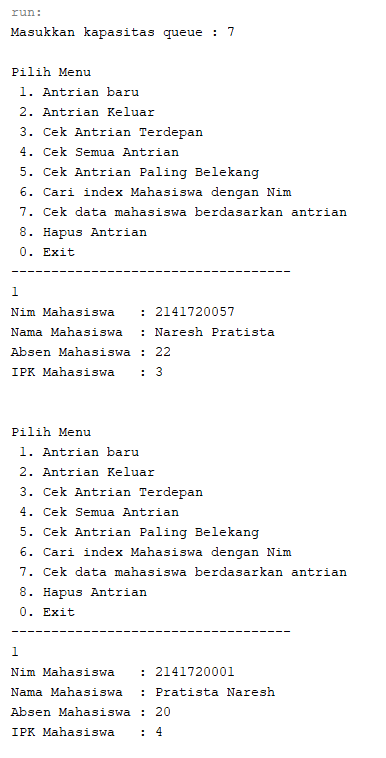
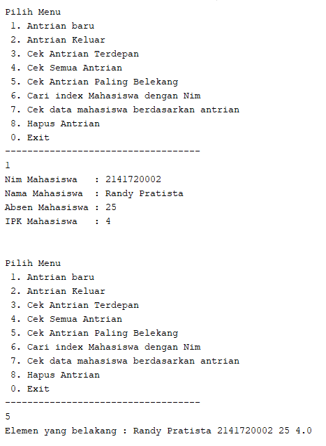
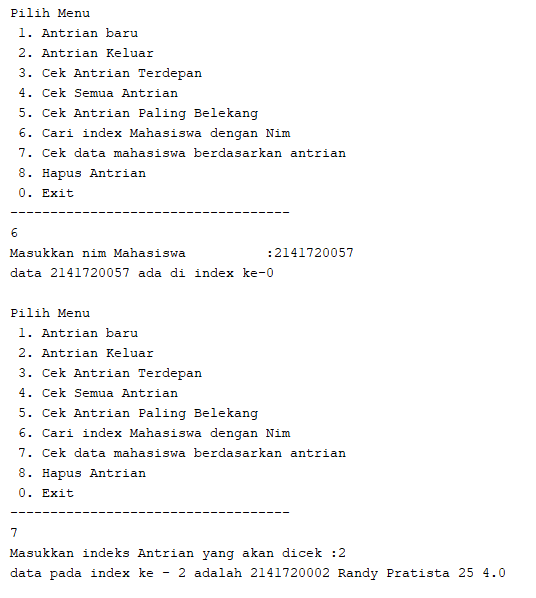