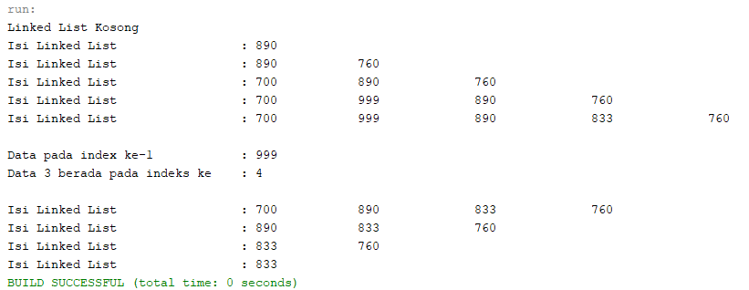

## LAPORAN PRAKTIKUM PERTEMUAN 11
>Nama  : Naresh Pratista<p>
>Kelas : 1F-D4TI<p>
>Absen : 22<p>

**Linked List**

### 1. Tujuan Praktikum
Setelah melakukan materi praktikum ini, mahasiswa mampu:
- Membuat struktur data linked list
- Membuat linked list pada program
- Membedakan permasalahan apa yang dapat diselesaikan menggunakan linked list

### 2.1 Pembuatan Single Linked List

1. class Node
```java
package praktikum;
/**
 *
 * @author nares
 */
public class Node {
    int data;
    Node next;
    
    public Node(int nilai, Node berikutnya){
        this.data = nilai;
        this.next = berikutnya;
    }
}
```

2. class SingleLinkedList
```java
package praktikum;
/**
 *
 * @author nares
 */
public class SingleLinkedList {
    Node head; //posisi awal linked list
    Node tail; //posisi akhir linked list
    
    public boolean isEmpty(){
    return head == null;
    }
    public void print(){
        if(!isEmpty()){
            Node tmp = head;
            System.out.print("Isi Linked List\t\t\t: ");
            while(tmp != null){
                System.out.print(tmp.data +"\t\t");
                tmp = tmp.next;
            }
            System.out.println("");
        }else{
            System.out.println("Linked List Kosong");
        }
    }
    public void addFirst(int input){
        Node ndInput = new Node(input, null);
        if(isEmpty()){ //jika linked list kosong
            head = ndInput; //head dan tail sama dengan node input
            tail = ndInput;
        }else{
            ndInput.next = head;
                head = ndInput;
        }
    }
    public void addLast(int input){
        Node ndInput = new Node(input, null);
        if(isEmpty()){
            head = ndInput; //head dan tail sama dengan node input
            tail = ndInput;
        }else{
            tail.next = ndInput;
            tail = ndInput;
        }
    }
    public void insertAfter(int key, int input){
        Node ndInput = new Node(input, null);
        Node temp = head;
        do {
            if (temp.data == key) {
                ndInput.next = temp.next;
                temp.next = ndInput;
                if(ndInput.next == null) tail = ndInput;
                break;
            }
            temp = temp.next;
        }while (temp != null);
    }
    public void insertAt(int index, int input){
        if (index < 0){
            System.out.println("Indeks salah");
        }else if (index == 0){
            addFirst(input);
        }else {
            Node temp = head;
            for(int i=0; i<index-1; i++){
                temp = temp.next;
            }
            temp.next = new Node(input, temp.next);
            if(temp.next.next == null) tail=temp.next;
        }
    }
}
```
3. class SLLMain
```java
package praktikum;
/**
 *
 * @author nares
 */
public class SLLMain {

    public static void main(String[] args){
        SingleLinkedList singLL = new SingleLinkedList();
        singLL.print();
        singLL.addFirst(890);
        singLL.print();
        singLL.addLast(760);
        singLL.print();
        singLL.addFirst(700);
        singLL.print();
        singLL.insertAfter(700, 900);
        singLL.print();
        singLL.insertAfter(3, 833);
        singLL.print();
    }  
}
```

### 2.1.1 Verifikasi Hasil Percobaan


### 2.1.2 Pertanyaan

1. Mengapa hasil compile kode program di baris pertama menghasilkan “Linked List Kosong”?
    >Karena belum mengisikan data, atau bisa dibilang method print saat masuk ke pemilihan masuk ke pilihan if(isEmpty()).

2. Pada step 10, jelaskan kegunaan kode berikut

    >jika data yang sudah ada pada linked list sama dengan variabel key, maka data yang kita isi = data linked list berikutnya.

3. Perhatikan class SingleLinkedList, pada method insertAt Jelaskan kegunaan kode berikut
    >Jika data setelah dan setelahnya lagi adalah kosong, maka variable tail = data berikutnya, atau bisa dibilang kita dalam kondisi menginputkan data sebelum indeks terkahir (tail).

### 2.2 Modifikasi Elemen pada Single Linked List

### 2.2.1 Langkah-langkah Percobaan

1. class singleLinkedList
```java
    node head; 
    node tail; 
    
    public boolean isEmpty() {
    return head == null;
    }
    public void print(){
        if(!isEmpty()){
            node tmp = head;
            System.out.print("Isi Linked List\t\t\t: ");
            while(tmp != null){
                System.out.print(tmp.data +"\t\t");
                tmp = tmp.next;
            }
            System.out.println("");
        }else{
            System.out.println("Linked List Kosong");
        }
    }
    public void addFirst(int input){
        node ndInput = new node(input, null);
        if(isEmpty()){ //jika linked list kosong
            head = ndInput; //head dan tail sama dengan node input
            tail = ndInput;
        }else{
            ndInput.next = head;
                head = ndInput;
        }
    }
    public void addLast(int input){
        node ndInput = new node(input, null);
        if(isEmpty()){
            head = ndInput; //head dan tail sama dengan node input
            tail = ndInput;
        }else{
            tail.next = ndInput;
            tail = ndInput;
        }
    }
    public void insertAfter(int key, int input){
        node ndInput = new node(input, null);
        node temp = head;
        do {
            if (temp.data == key) {
                ndInput.next = temp.next;
                temp.next = ndInput;
                if(ndInput.next == null) tail = ndInput;
                break;
            }
            temp = temp.next;
        }while (temp != null);
    }
    public void insertAt(int index, int input){
        if (index < 0){
            System.out.println("Indeks salah");
        }else if (index == 0){
            addFirst(input);
        }else {
            node temp = head;
            for(int i=0; i<index-1; i++){
                temp = temp.next;
            }
            temp.next = new node(input, temp.next);
            if(temp.next.next == null) tail=temp.next;
        }
    }
    public int getData(int index){
        node tmp = head;
        for (int i=0; i<index; i++){
            tmp =  tmp.next;
        }
        return tmp.data;
    }
    public int indexOf(int key){
        node tmp = head;
        int index = 0;
        while (tmp != null && tmp.data != key) {
            tmp = tmp.next;
            index++;
        }
        if (tmp == null){
            return -1;
        }else{
            return index;
        }
    }
    public void removeFirst(){
        if(isEmpty()){
            System.out.println("Linked List Masih Kosong");
        }else if (head == tail){
            head = tail = null;
        }else{
            head = head.next;
        }
    }
    public void removeLast() {
        if (isEmpty()){
            System.out.println("Linked List Masih kosong, tidak dapat dihapus!");
        }else if (head == tail){
            head = tail = null;
        }else{
            node temp = head;
            while (temp.next != tail){
                temp = temp.next;
            }
            temp.next = null;
            tail = temp;
        }
    }
    public void remove(int key){
        if(isEmpty()){
            System.out.println("Linked List Masih kosong, tidak dapat dihapus!");
        }else {
            node temp = head;
            while (temp != null){
                if((temp.data == key) && (temp == head)){
                    this.removeFirst();
                    break;
                }else if (temp.next.data == key){
                    temp.next = temp.next.next;
                    if(temp.next == null){
                        tail = temp;
                    }
                    break;
                }
                temp = temp.next;
            }
        }
    }
    public void removeAt(int index){
        if(index == 0){
            removeFirst();
        }else{
            node temp = head;
            for(int i=0; i < index-1; i++){
                temp = temp.next;
            }
            temp.next = temp.next.next;
            if (temp.next == null){
                tail = temp;
            }
        }
    }
```

2. class sllMain
```java
        singleLinkedList singLL = new singleLinkedList();
        
        singLL.print();
        singLL.addFirst(890);
        singLL.print();
        singLL.addLast(760);
        singLL.print();
        singLL.addFirst(700);
        singLL.print();
        singLL.insertAfter(700, 999);
        singLL.print();
        singLL.insertAt(3, 833);
        singLL.print();
        
        System.out.println("\nData pada index ke-1\t\t: "+singLL.getData(1));
        System.out.println("Data 3 berada pada indeks ke\t: "+singLL.indexOf(760)+"\n");
        
        singLL.remove(999);
        singLL.print();
        singLL.removeAt(0);
        singLL.print();
        singLL.removeFirst();
        singLL.print();
        singLL.removeLast();
        singLL.print();
```

### 2.2.2 Verifikasi Hasil Percobaan



### 2.2.3 Pertanyaan

1. Mengapa digunakan keyword break pada fungsi remove? Jelaskan!
    >untuk menghentikan operasi program

2. Jelaskan kegunaan kode dibawah pada method remove
    >jika data setelah (temp.next.data) sama dengan variable key, maka data setelah sama dengan data setelah setlahnya, atau bisa dibilang  data setelah diganti dengan data setelah setelah lagi (menghilangkan data setelah dengan data setelah setelahnya lagi).

3. Apa saja nilai kembalian yang dapat dikembalikan pada method indexOf? Jelaskan maksud masing-masing kembalian tersebut!
    >deklarasi variable index bertipe interger dengan nilai 0, ketika alamat tidak kosong dan data tidak sama dengan variable key maka alamat menajadi alamat selanjutnya (lanjut ke data berikutnya) dan increment variable index, kemudian jika alamat adalah kosong maka menjadi -1, selain itu kembalikan nilai index

### 3. Tugas

1. Buat method insertBefore untuk menambahkan node sebelum keyword yang diinginkan

    > class node
    ```java
    /**
    *
    * @author nares
    */
    public class node {
        int data;
        node next;
    
        public node(int nilai, node berikutnya){
            this.data = nilai;
            this.next = berikutnya;
        }
    }
    ``` 
    > class singleLinkedList
    ```java
        public class singleLinkedList {
        node head;
        node tail; 
    
        public boolean isEmpty() {
        return head == null;
        }
        public void print(){
            if(!isEmpty()){
                node tmp = head;
                System.out.print("Isi Linked List\t\t\t: ");
                while(tmp != null){
                    System.out.print(tmp.data +"\t\t");
                    tmp = tmp.next;
                }
                System.out.println("");
            }else{
                System.out.println("Linked List Kosong");
            }
        }
        public void addFirst(int input){
            node ndInput = new node(input, null);
            if(isEmpty()){ //jika linked list kosong
                head = ndInput; //head dan tail sama dengan node input
                tail = ndInput;
            }else{
                ndInput.next = head;
                    head = ndInput;
            }
        }
        public void addLast(int input){
            node ndInput = new node(input, null);
            if(isEmpty()){
                head = ndInput; //head dan tail sama dengan node    input
                tail = ndInput;
            }else{
                tail.next = ndInput;
                tail = ndInput;
            }
        }
        public void insertAfter(int key, int input){
            node ndInput = new node(input, null);
            node temp = head;
            do {
                if (temp.data == key) {
                    ndInput.next = temp.next;
                    temp.next = ndInput;
                    if(ndInput.next == null) tail = ndInput;
                    break;
                }
                temp = temp.next;
            }while (temp != null);
        }
        public void insertAt(int index, int input){
            if (index < 0){
                System.out.println("Indeks salah");
            }else if (index == 0){
                addFirst(input);
            }else {
                node temp = head;
                for(int i=0; i<index-1; i++){
                    temp = temp.next;
                }
                temp.next = new node(input, temp.next);
                if(temp.next.next == null) tail=temp.next;
            }
        }
        public int getData(int index){
            node tmp = head;
            for (int i=0; i<index; i++){
                tmp =  tmp.next;
            }
            return tmp.data;
        }
        public int indexOf(int key){
            node tmp = head;
            int index = 0;
            while (tmp != null && tmp.data != key) {
                tmp = tmp.next;
                index++;
            }
            if (tmp == null){
                return -1;
            }else{
                return index;
            }
        }
        public void removeFirst(){
            if(isEmpty()){
                System.out.println("Linked List Masih Kosong");
            }else if (head == tail){
                head = tail = null;
            }else{
                head = head.next;
            }
        }
        public void removeLast() {
            if (isEmpty()){
                System.out.println("Linked List Masih kosong, tidak dapat dihapus!");
            }else if (head == tail){
                head = tail = null;
            }else{
                node temp = head;
                while (temp.next != tail){
                    temp = temp.next;
                }
                temp.next = null;
                tail = temp;
            }
        }
        public void remove(int key){
            if(isEmpty()){
                System.out.println("Linked List Masih kosong, tidak dapat dihapus!");
            }else {
                node temp = head;
                while (temp != null){
                    if((temp.data == key) && (temp == head)){
                        this.removeFirst();
                        break;
                    }else if (temp.next.data == key){
                        temp.next = temp.next.next;
                        if(temp.next == null){
                            tail = temp;
                        }
                        break;
                    }
                    temp = temp.next;
                }
            }
        }
        public void removeAt(int index){
            if(index == 0){
                removeFirst();
            }else{
                node temp = head;
                for(int i=0; i < index-1; i++){
                    temp = temp.next;
                }
                temp.next = temp.next.next;
                if (temp.next == null){
                    tail = temp;
                }
            }
        }
        public void insertBefore(int key, int input){
            node ndInput = new node(input, null);
            node temp = head;
            node prev = null;
        
            do{
                if(head.data == key){
                    addFirst(input);
                break;
                }else if (temp.data == key){
                    ndInput.next = temp;
                    prev.next = ndInput;
                    if(temp.next == null){
                    tail = ndInput;
                    break;
                    }
                }
                prev = temp;
                temp = temp.next;
            }while (temp != null);
        }
    }
    ```
    >class sllMain
    ```java
        singleLinkedList singLL = new singleLinkedList();
        singLL.print();
        singLL.addFirst(890);
        singLL.print();
        singLL.addLast(760);
        singLL.print();
        singLL.addFirst(700);
        singLL.print();
        singLL.insertAfter(700, 999);
        singLL.print();
        singLL.insertAt(3, 833);
        singLL.print();
        System.out.println("dibawah ini hasil output penambahan method insertBefore()");
        singLL.insertBefore(760, 450);
        singLL.print();
        System.out.println("\nData pada index ke-1\t\t: "+singLL.getData(1));
        System.out.println("Data 3 berada pada indeks ke\t: "+singLL.indexOf(760)+"\n");
        singLL.remove(999);
        singLL.print();
        singLL.removeAt(0);
        singLL.print();
        singLL.removeFirst();
        singLL.print();
        singLL.removeLast();
        singLL.print();
    ```

    > Hasil Output
    

2. Implementasikan ilustrasi Linked List Berikut. Gunakan 4 macam penambahan data yang telah dipelajari sebelumnya untuk menginputkan data.

> class node
```java
package tugas2;

/**
 *
 * @author nares
 */
public class node {
    char data;
    node next;

    public node(char nilai, node berikutnya){
        this.data = nilai;
        this.next = berikutnya;
    }
}
```

> class singleLInkedList
```java
package tugas2;

/**
 *
 * @author nares
 */
public class singleLinkedList {
    node head; 
    node tail; 

    public boolean isEmpty() {
    return head == null;
    }
    public void print(){
        if(!isEmpty()){
            node tmp = head;
            System.out.print("Isi Linked List\t\t\t: ");
            while(tmp != null){
                System.out.print(tmp.data +"\t\t");
                tmp = tmp.next;
            }
            System.out.println("");
        }else{
            System.out.println("Linked List Kosong");
        }
    }
    public void addFirst(char input){
        node ndInput = new node(input, null);
        if(isEmpty()){ //jika linked list kosong
            head = ndInput; //head dan tail sama dengan node input
            tail = ndInput;
        }else{
            ndInput.next = head;
            head = ndInput;
        }
    }
    public void addLast(char input){
        node ndInput = new node(input, null);
        if(isEmpty()){
            head = ndInput; //head dan tail sama dengan node input
            tail = ndInput;
        }else{
            tail.next = ndInput;
            tail = ndInput;
        }
    }
    public void insertAfter(char key, char input){
        node ndInput = new node(input, null);
        node temp = head;
        do {
            if (temp.data == key) {
                ndInput.next = temp.next;
                temp.next = ndInput;
                if(ndInput.next == null) tail = ndInput;
                break;
            }
            temp = temp.next;
        }while (temp != null);
    }
    public void insertAt(int index, char input){
        if (index < 0){
            System.out.println("Indeks salah");
        }else if (index == 0){
            addFirst(input);
        }else {
            node temp = head;
            for(int i=0; i<index-1; i++){
                temp = temp.next;
            }
            temp.next = new node(input, temp.next);
            if(temp.next.next == null) tail=temp.next;
        }
    }
    public void insertBefore(char key, char input){
        node ndInput = new node(input, null);
        node temp = head;
        node prev = null;
    
        do{
            if(head.data == key){
                addFirst(input);
                break;
            }else if (temp.data == key){
                ndInput.next = temp;
                prev.next = ndInput;
                if(temp.next == null){
                    tail = ndInput;
                    break;
                }
            }
            prev = temp;
            temp = temp.next;
        }while (temp != null);
    }
}
```
> class sllMain
```java
package tugas2;

/**
 *
 * @author nares
 */
public class sllMain {

    /**
     * @param args the command line arguments
     */
    public static void main(String[] args) {
        singleLinkedList singLL = new singleLinkedList();
        System.out.println("------------------------------------------- LINKED LIST ---------------------------------------------");
        singLL.addFirst('a');
        singLL.print();
        singLL.addLast('e');
        singLL.print();
        singLL.insertAfter('a','b');
        singLL.print();
        singLL.insertAt(2, 'c');
        singLL.print();
        singLL.insertBefore('e', 'd');
        singLL.print();
    
        System.out.println("\nMaka Penambahan data sudah sesuai seperti berikut ini");
        singLL.print();
        System.out.println("\n------------------------------------------- LINKED LIST ---------------------------------------------");
    } 
}
```
> Hasil Output


3. Buatlah Implementasi Stack berikut menggunakan Single Linked List

> class node
```java
package tugas3;

/**
 *
 * @author nares
 */
public class node {
    String data;
    node next;

    public node(String nilai, node berikutnya){
        this.data = nilai;
        this.next = berikutnya;
    }
}
```

> class singleLinkedList
```java
public class singleLinkedList {
    node head; 
    node tail;

    public boolean isEmpty() {
    return head == null;
    }
    public void pr(){
        if(!isEmpty()){
            node tmp = head;
            System.out.println("Berhasil menambahkan "+ tmp.data);
        }
    }
    public void print(){
        if(!isEmpty()){
            node tmp = head;
            while(tmp != null){
                System.out.println(tmp.data);
                tmp = tmp.next;
            }
            System.out.println();
        }else{
            System.out.println("Linked List Kosong");
        }
    }
    public void peek(){
        if(!isEmpty()){
            node tmp = head;
            System.out.println("Elemen Teratas : "+tmp.data);
        }else{
        System.out.println("Stack Masih Kosong");
        }
    }
    public void push(String input){
        node ndInput = new node(input, null);
        if(isEmpty()){ //jika linked list kosong
            head = ndInput; //head dan tail sama dengan node input
            tail = ndInput;
        }else{
            ndInput.next = head;
            head = ndInput;
        }
    }
}
```

> class sllMain
```java
public class sllMain {
    
    /**
     * @param args the command line arguments
     */
    
    public static void main(String[] args) {
        singleLinkedList singLL = new singleLinkedList();
        System.out.println("+Linked List"+" "+"\t+");
        System.out.println("-----------------");
        singLL.push("Bahasa");
        singLL.pr();
        singLL.print();
        singLL.push("Android");
        singLL.pr();
        singLL.print();
        singLL.push("Komputer");
        singLL.pr();
        singLL.print();
        singLL.push("Basis Data");
        singLL.pr();
        singLL.print();
        singLL.push("Matematika");
        singLL.pr();
        singLL.print();
        singLL.push("Algoritma");
        singLL.pr();
        singLL.print();
        singLL.push("Statistika");
        singLL.pr();
        singLL.print();
        singLL.push("Multimedia");
        singLL.pr();
        singLL.print();
        System.out.println("\nIsi Stack menjadi");
        singLL.print();
        singLL.peek();    
    }
}
```

> Hasil Output


4. Buatlah implementasi program antrian untuk mengilustasikan mahasiswa yang sedang meminta 
tanda tangan KRS pada dosen DPA di kampus pada tugas jobsheet 8 menggunakan LinkedList.
Implementasikan Queue pada antrian mahasiswa dengan menggunakan konsep LinkedList!

> class node
```java
package tugas4;

/**
 *
 * @author nares
 */
public class node {
    String nim, nama;
    int absen;
    double ipk;
    node next;

    public node(String nim, String nama, int absen, double ipk, node berikutnya){
        this.nim = nim;
        this.nama = nama;
        this.absen = absen;
        this.ipk =ipk;
        this.next = berikutnya;
    }
}
```

> class singleLinkedList
```java
package tugas4;

/**
 *
 * @author nares
 */
public class singleLinkedList {
    node head; 
    node tail;

    public boolean isEmpty() {
        return head == null;
    }
    public void print(){
        if(!isEmpty()){
            node tmp = head;
            int antrian = 0;
            while(tmp != null){
                System.out.println("Mahasiswa ke - "+(antrian+1)+" = "+tmp.nim+" "+tmp.nama+" "+tmp.absen+" "+tmp.ipk);
                tmp = tmp.next;
                antrian ++;
            }
            System.out.println();
        }else{
            System.out.println("Linked List Kosong");
        }
    }
    public void addLast(String nim, String nama, int absen, double ipk){
        node ndInput = new node(nim, nama, absen, ipk, null);
        if(isEmpty()){
            head = ndInput; //head dan tail sama dengan node input
            tail = ndInput;
        }else{
            tail.next = ndInput;
            tail = ndInput;
        }
    }
    public void peek(){
        if(!isEmpty()){
            node tmp = head;
            System.out.println("Elemen terdepan : "+tmp.nim+ " "+tmp.nama+" "+tmp.absen+" "+tmp.ipk);
        }else{
            System.out.println("Queue masih kosong");
        }
    }
    public void peekRear(){
        if(!isEmpty()){
            node tmp = tail;
            System.out.println("Elemen yang belakang : "+tmp.nama+ " "+tmp.nim+" "+tmp.absen+" "+tmp.ipk);
        }else{
            System.out.println("Queue masih kosong");
        }
    }
    public void cariIndex(int index){
        if(isEmpty()){
            System.out.println("Antrian masih kosong");
        }else{
            node tmp = head;
            for(int i=0; i<index; i++){
                tmp = tmp.next;
            }
            System.out.println("Data pada index ke-"+index+" "+tmp.nim+" "+tmp.nama+" "+tmp.absen+" "+tmp.ipk);
        }
    }
    public void cariNim(String key){
        node tmp = head;
        int index = 0;
        while (tmp != null &&(!(tmp.nim.equals(key)))) {
            tmp = tmp.next;
            index++;
        }
        if (tmp == null){
            System.out.println("Antrian Kosong");
        }else{
            System.out.println("Data "+key+" berada pada index ke "+index);
        }
        System.out.println("Data Mahasiswa : "+tmp.nim+" "+tmp.nama+" "+tmp.absen+" "+tmp.ipk);
    }
    public void removeFirst(){
        if(isEmpty()){
            System.out.println("Linked List Masih Kosong");
        }else if (head == tail){
            head = tail = null;
        }else{
            head = head.next;
        }
    }
}
```

> class sllMain
```java
package tugas4;

/**
 *
 * @author nares
 */
import java.util.Scanner;
public class sllMain {

    /**
     * @param args the command line arguments
     */
    
    public static void menu(){
        System.out.println("\nPilih Menu ");
        System.out.println(" 1. Antrian baru\n 2. Antrian Keluar\n 3. Cek Antrian Terdepan\n 4. Cek Semua Antrian\n 5. Cek Antrian Paling Belekang\n 6. Cari index Mahasiswa dengan Nim\n 7. Cek data mahasiswa berdasarkan antrian\n 8. Keluar");
        System.out.println("-----------------------------------");
    }
    public static void main(String[] args) {
        Scanner sc = new Scanner(System.in);
        Scanner sd = new Scanner(System.in);
        Scanner sb = new Scanner(System.in);
    
        singleLinkedList singLL = new singleLinkedList();

        int pilih;
        do{
            menu();
            pilih = sc.nextInt();
            sc.nextLine();
    
        switch(pilih){
            case 1:
                System.out.print("Nim Mahasiswa\t: ");
                String nim = sc.nextLine();
                System.out.print("Nama Mahasiswa\t: ");
                String nama = sc.nextLine();
                System.out.print("Absen Mahasiswa\t: ");
                int absen = sd.nextInt();
                System.out.print("IPK Mahasiswa\t: ");
                double ipk = sb.nextDouble();
                singLL.addLast(nim, nama, absen, ipk);
                sc.nextLine();
            break;
            
            case 2:
                singLL.removeFirst();
                System.out.println("mahasiswa urutan awal berhasil keluar!!!");
                System.out.println("dengan sisa antrian dibawah ini\n");
                singLL.print();
            break;
            
            case 3:
                System.out.println("Berikut adalah antrian mahasiswa terdepan !");
                singLL.peek();
            break;
            
            case 4:
                System.out.println("Berikut adalah data semua antrian");
                singLL.print();
            break;
            
            case 5:
                System.out.println("Berikut adalah antrian mahasiswa paling belakang !");
                singLL.peekRear();
            break;
            
            case 6:
                System.out.println("Pencarian Index Mahasiswa Dengan Nim");
                System.out.print("Masukkan Nim mahasiswa : ");
                String nimm = sc.nextLine();
                singLL.cariNim(nimm);
            break;
            
            case 7:
                System.out.println("Pencarian data mahasiswa berdasarkan antrian");
                System.out.print("Masukkan antrian Mahasiswa : ");
                int antrian = sd.nextInt();
                singLL.cariIndex(antrian);
            break;
            
            case 8:
                System.out.println("Terima Kasih Telah menggunakan layanan kami");
                System.out.println("----------Alvian Nur Firdaus @ 2022--------");
                System.exit(0);
            break;
        }
    }while (pilih == 1 || pilih == 2 || pilih == 3 || pilih == 4 || pilih == 5 || pilih == 6 || pilih == 7 || pilih == 8);
}
}
```