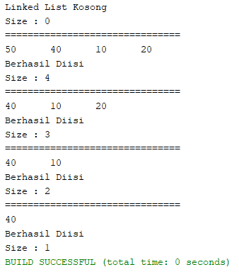
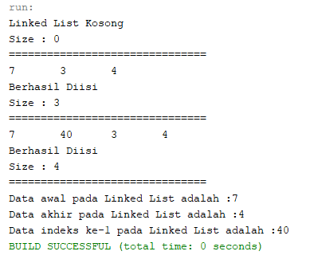
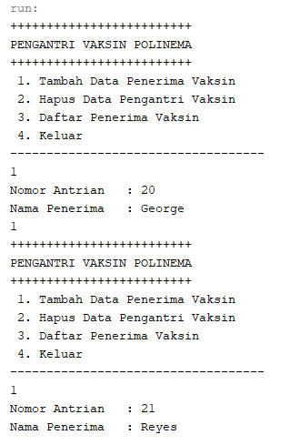
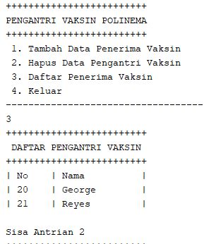
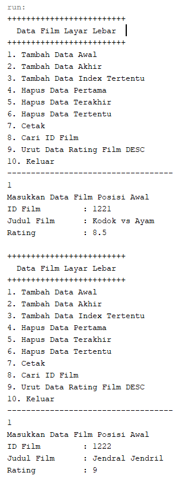

## LAPORAN PRAKTIKUM PERTEMUAN 12
>Nama  : Naresh Pratista<p>
>Kelas : 1F-D4TI<p>
>Absen : 22<p>
**Double Linked List**

**12.1 Tujuan Praktikum**
Setelah melakukan praktikum ini, mahasiswa mampu:
1. memahami algoritma double linked lists
2. membuat dan mendeklarasikan struktur algoritma double linked lists
3. menerapkan algoritma double linked lists dalam beberapa study case

**12.2 Kegiatan Praktikum 1**

**12.2.1 Percobaan 1**
1. class Node
```java
package praktikum1;

/**
 *
 * @author nares
 */
public class Node {
    int data;
    Node prev, next;

    Node(Node prev, int data, Node next) {
        this.prev = prev;
        this.data = data;
        this.next = next;
    }
}
```

2. class DoubleLinkedList
```java
package praktikum1;

/**
 *
 * @author nares
 */
public class DoubleLinkedList {
    Node head;
    int size;

    public DoubleLinkedList() {
        head = null;
        size = 0;
    }

    public boolean isEmpty() {
        return head == null;
    }

    public void addFirst(int item) {
        if (isEmpty()) {
            head = new Node(null, item, null);
        } else {
            Node newNode = new Node(null, item, head);
            head.prev = newNode;
            head = newNode;
        }
        size++;
    }

    public void addLast(int item) {
        if (isEmpty()) {
            addFirst(item);
        } else {
            Node current = head;
            while (current.next != null) {
                current = current.next;
            }
            Node newNode = new Node(current, item, null);
            current.next = newNode;
            
        }
        size++;
    }

    public void add(int item, int index) throws Exception {
        if (isEmpty()) {
            addFirst(item);
        } else if (index < 0 || index > size) {
            throw new Exception("Nilai index di luar batas");
        } else {
            Node current = head;
            int i = 0;
            while (i < index) {
                current = current.next;
                i++;
            }
            if (current.prev == null) {  // kasus ketika index diberi nilai 0
                Node newNode = new Node(null, item, current);
                current.prev = newNode;
                head = newNode;
            } else {
                Node newNode = new Node(current.prev, item, current);
                newNode.prev = current.prev;
                newNode.next = current;
                current.prev.next = newNode;
                current.prev = newNode;
            }
        }
        size++;
    }

    public int size() {
        return size;
    }

    public void clear() {
        head = null;
        size = 0;
    }

    public void print() {
        if (!isEmpty()) {
            Node tmp = head;
            while (tmp != null) {
                System.out.print(tmp.data + "\t");
                tmp = tmp.next;
            }
            System.out.println("\nBerhasil Diisi");
        } else {
            System.out.println("Linked List Kosong");
        }
    }
}
```

3. class DoubleLinkedListMain
```java
package praktikum1;

/**
 *
 * @author nares
 */
public class DoubleLinkedListMain {

    /**
     * @param args the command line arguments
     */
    public static void main(String[] args) throws Exception {
        DoubleLinkedList dll = new DoubleLinkedList();
        dll.print();
        System.out.println("Size : " + dll.size);
        System.out.println("===============================");
        dll.addFirst(3);
        dll.addLast(4);
        dll.addFirst(7);
        dll.print();
        System.out.println("Size : " + dll.size);
        System.out.println("===============================");
        dll.add(40, 1);
        dll.print();
        System.out.println("Size : " + dll.size);
        System.out.println("===============================");
        dll.clear();
        dll.print();
        System.out.println("Size : " + dll.size);
    }
}
```

**12.2.2 Verifikasi Hasil Percobaan**


**12.2.3 Pertanyaan Percobaan**
1. Jelaskan perbedaan antara single linked list dengan double linked lists!
    >Terletak pada pointernya, pada single linked list pointer hanya ada 1 yaitu next, sedangkan pada double linked list ada 2 pointer yakni next dan previous.

2. Perhatikan class Node, didalamnya terdapat atribut next dan prev. Untuk apakah atribut tersebut?
    >Untuk menunjukan kepada node berikutnya, dan atribut prev berguna untuk menunjuk kepada node sebelumnya

3. Perhatikan konstruktor pada class DoubleLinkedLists. Apa kegunaan inisialisasi atribut head dan size seperti pada gambar berikut ini?
    >Dilakukan untuk menunjukkan bahwa head belum menunjuk ke node manapaun. Sedangkan size diinisialisasi untuk menyimpan jumlah data pada linked list.

4. Pada method addFirst(), kenapa dalam pembuatan object dari konstruktor class Node prev dianggap sama dengan null? Node newNode = new Node(null, item, head);
    >Karena operasi addFirst digunakan untuk penambahan data/node di awal atau di index0. Yang mana data yang ditambahkan ke node baru prevnya akan bernilai null karena pointer prev pada node tersebut tidak menunjukan ke node manapun.

5. Perhatikan pada method addFirst(). Apakah arti statement head.prev = newNode ?
    >Artinya adalah pointer prev pada data yang sudah ada pada linked list akan menunjukan ke node yang baru.

6. Perhatikan isi method addLast(), apa arti dari pembuatan object Node dengan mengisikan parameter prev dengan current, dan next dengan null?
    >Untuk menyimpan node yang sebelumnya, dimana jika dilakukan penambahan data pada index terakhir, maka pointer prev pda node yang ditambahkan akan menunjuk ke node yang sebelumnya.

**12.3 Kegiatan Praktikum 2**

**12.3.1 Percobaan**
1. class Node
```java
package praktikum2;

/**
 *
 * @author nares
 */
public class Node {
    int data;
    Node prev;
    Node next;

    Node(Node prev, int data, Node next) {
        this.prev = prev;
        this.data = data;
        this.next = next;
    }
}
```

2. class DoubleLinkedList
```java
package praktikum2;

/**
 *
 * @author nares
 */
public class DoubleLinkedList {
    Node head;
    int size;

    public DoubleLinkedList() {
        head = null;
        size = 0;
    }

    public boolean isEmpty() {
        return head == null;
    }

    public void addFirst(int item) {
        if (isEmpty()) {
            head = new Node(null, item, null);
        } else {
            Node newNode = new Node(null, item, head);
            head.prev = newNode;
            head = newNode;
        }
        size++;
    }

    public void addLast(int item) {
        if (isEmpty()) {
            addFirst(item);
        } else {
            Node current = head;
            while (current.next != null) {
                current = current.next;
            }
            Node newNode = new Node(current, item, null);
            current.next = newNode;
            size++;
        }
    }

    public void add(int item, int index) throws Exception {
        if (isEmpty()) {
            addFirst(item);
        } else if (index < 0 || index > size) {
            throw new Exception("Nilai index di luar batas");
        } else {
            Node current = head;
            int i = 0;
            while (i < index) {
                current = current.next;
                i++;
            }
            if (current.prev == null) {
                Node newNode = new Node(null, item, current);
                current.prev = newNode;
                head = newNode;
            } else {
                Node newNode = new Node(current.prev, item, current);
                newNode.prev = current.prev;
                newNode.next = current;
                current.prev.next = newNode;
                current.prev = newNode;
            }
        }
        size++;
    }

    public int size() {
        return size;
    }

    public void clear() {
        head = null;
        size = 0;
    }

    public void print() {
        if (!isEmpty()) {
            Node tmp = head;
            while (tmp != null) {
                System.out.print(tmp.data + "\t");
                tmp = tmp.next;
            }
            System.out.println("\nBerhasil Diisi");
        } else {
            System.out.println("Linked List Kosong");
        }
    }

    public void removeFirst() throws Exception {
        if (isEmpty()) {
            throw new Exception("Linked List masih kosong, tidak dapat dihapus");
        } else if (size == 1) {
            removeLast();
        } else {
            head = head.next; // memindahkan head ke node setelahnya sebagai head yang baru
            head.prev = null; // previous dari head yang baru bernilai null
            size--;
        }
    }

    public void removeLast() throws Exception {
        if (isEmpty()) {
            throw new Exception("Linked List masih kosong, tidak dapat dihapus");
        } else if (head.next == null) {
            head = null; // proses penghapusan head
            size--;
            return;
        }
        Node current = head;
        while (current.next.next != null) { // 12-->c.,13-->c.n,14-->c.n.n,15,16
            current = current.next;
        }
        current.next = null; // 16 diset null, 12, 13, 14, 15-->c, null
        size--;
    }

    public void remove(int index) throws Exception {
        if (isEmpty() || index >= size) { // index dimulai 0, jumlah(size) = -1
            throw new Exception("Nilai index di luar batas");
        } else if (index == 0) {
            removeFirst();
        } else {
            Node current = head;
            int i = 0;
            while (i < index) {
                current = current.next;
                i++;
            }
            if (current.next == null) { //posisi paling akhir
                current.prev.next = null;
            } else if (current.prev == null) { //posisi depan (bagian head)
                current = current.next;
                current.prev = null; //hapus posisi head lama
                head = current;
            } else {
                current.prev.next = current.next; // menghapus node/elemen sesuai indeks yang dikehendaki, dan menyambungkan node previous yang dihapus dengan node next yang dihapus -->
                current.next.prev = current.prev; // menyambungkan C dengan A
            }
            size--;
        }
    }
}
```

3. class DoubleLinkedListMain
```java
package praktikum2;

/**
 *
 * @author nares
 */
public class DoubleLinkedListMain {

    public static void main(String[] args) throws Exception {
        DoubleLinkedList dll = new DoubleLinkedList();
        dll.print();
        System.out.println("Size : " + dll.size);
        System.out.println("===============================");
        dll.addLast(50);
        dll.addLast(40);
        dll.addLast(10);
        dll.addLast(20);
        dll.print();
        System.out.println("Size : " + dll.size);
        System.out.println("===============================");
        dll.removeFirst();
        dll.print();
        System.out.println("Size : " + dll.size);
        System.out.println("===============================");
        dll.removeLast();
        dll.print();
        System.out.println("Size : " + dll.size);
        System.out.println("===============================");
        dll.remove(1);
        dll.print();
        System.out.println("Size : " + dll.size);
    }
} 
```

**12.3.2 Verifikasi Hasil Percobaan**


**12.3.3 Pertanyaan Percobaan**
1. Apakah maksud statement berikut pada method removeFirst()?
    >Ketika dilakukan penghapusan node pada index pertama, maka posisi head akan berpindah posisi ke node yang selanjutnya, dan pointer prev pada head akan bernilai null

2. Bagaimana cara mendeteksi posisi data ada pada bagian akhir pada method removeLast()?
    >Dengan melihat apakah pointer next pada node bernilai null atau tidak. Jika pointer next pada node bernilai null maka bisa dipastikan bahwa data tersebut berada pada bagian akhir.

3. Jelaskan alasan potongan kode program di bawah ini tidak cocok untuk perintah remove!
    >Karena kode tersebut lebih cocok untuk removeFirst, dimana tmp menyimpan data setelah head, lalu head.next menyimpan data tmp.next.

4. Jelaskan fungsi kode program berikut ini pada fungsi remove!
    >Pointer next pada node sebelumnya akan menunjuk ke node selanjutnya, dan pointer prev pada node selanjutnya akan menunjuk ke node sebelumnya.

**12.4 Kegiatan Praktikum 3**

**12.4.1 Percobaan**
1. class Node
```java
package praktikum3;

/**
 *
 * @author nares
 */
public class Node {
    int data;
    Node prev;
    Node next;

    Node(Node prev, int data, Node next) {
        this.prev = prev;
        this.data = data;
        this.next = next;
    }
}
```

2. class DoubleLinkedList
```java
package praktikum3;

/**
 *
 * @author nares
 */
public class DoubleLinkedList {
    Node head;
    int size;

    public DoubleLinkedList() {
        head = null;
        size = 0;
    }

    public boolean isEmpty() {
        return head == null;
    }

    public void addFirst(int item) {
        if (isEmpty()) {
            head = new Node(null, item, null);
        } else {
            Node newNode = new Node(null, item, head);
            head.prev = newNode;
            head = newNode;
        }
        size++;
    }

    public void addLast(int item) {
        if (isEmpty()) {
            addFirst(item);
        } else {
            Node current = head;
            while (current.next != null) {
                current = current.next;
            }
            Node newNode = new Node(current, item, null);
            current.next = newNode;
            size++;
        }
    }

    public void add(int item, int index) throws Exception {
        if (isEmpty()) {
            addFirst(item);
        } else if (index < 0 || index > size) {
            throw new Exception("Nilai index di luar batas");
        } else {
            Node current = head;
            int i = 0;
            while (i < index) {
                current = current.next;
                i++;
            }
            if (current.prev == null) {
                Node newNode = new Node(null, item, current);
                current.prev = newNode;
                head = newNode;
            } else {
                Node newNode = new Node(current.prev, item, current);
                newNode.prev = current.prev;
                newNode.next = current;
                current.prev.next = newNode;
                current.prev = newNode;
            }
        }
        size++;
    }
    public int size() {
        return size;
    }

    public void clear() {
        head = null;
        size = 0;
    }

    public void print() {
        if (!isEmpty()) {
            Node tmp = head;
            while (tmp != null) {
                System.out.print(tmp.data + "\t");
                tmp = tmp.next;
            }
            System.out.println("\nBerhasil Diisi");
        } else {
            System.out.println("Linked List Kosong");
        }
    }

    public void removeFirst() throws Exception {
        if (isEmpty()) {
            throw new Exception("Linked List masih kosong, tidak dapat dihapus");
        } else if (size == 1) {
            removeLast();
        } else {
            head = head.next;
            head.prev = null;
            size--;
        }
    }

    public void removeLast() throws Exception {
        if (isEmpty()) {
            throw new Exception("Linked List masih kosong, tidak dapat dihapus");
        } else if (head.next == null) {
            head = null;
            size--;
            return;
        }
        Node current = head;
        while (current.next.next != null) {
            current = current.next;
        }
        current.next = null;
        size--;
    }

    public void remove(int index) throws Exception {
        if (isEmpty()) {
            throw new Exception("Nilai index di luar batas");
        } else if (index == 0) {
            removeFirst();
        } else {
            Node current = head;
            int i = 0;
            while (i < index) {
                current = current.next;
                i++;
            }
            if (current.next == null) {
                current.prev.next = null;
            } else if (current.prev == null) {
                current = current.next;
                current.prev = null;
                head = current;
            } else {
                current.prev.next = current.next;
                current.next.prev = current.prev;
            }
            size--;
        }
    }

    public int getFirst() throws Exception {
        if (isEmpty()) {
            throw new Exception("Linked List kosong");
        }
        return head.data;
    }

    public int getLast() throws Exception {
        if (isEmpty()) {
            throw new Exception("Linked List kosong");
        }
        Node tmp = head;
        while (tmp.next != null) {
            tmp = tmp.next;
        }
        return tmp.data;
    }

    public int get(int index) throws Exception {
        if (isEmpty() || index >= size) {
            throw new Exception("Nilai index di luar batas");
        }
        Node tmp = head;
        for (int i = 0; i < index; i++) {
            tmp = tmp.next;
        }
        return tmp.data;
    }
}
```
3. class DoubleLinkedListMain
```java
package praktikum3;

/**
 *
 * @author nares
 */
public class DoubleLinkedListMain {

    public static void main(String[] args) throws Exception {
        DoubleLinkedList dll = new DoubleLinkedList();
        dll.print();
        System.out.println("Size : " + dll.size);
        System.out.println("===============================");
        dll.addFirst(3);
        dll.addLast(4);
        dll.addFirst(7);
        dll.print();
        System.out.println("Size : " + dll.size);
        System.out.println("===============================");
        dll.add(40, 1);
        dll.print();
        System.out.println("Size : " + dll.size);
        System.out.println("===============================");
        System.out.println("Data awal pada Linked List adalah :" + dll.getFirst());
        System.out.println("Data akhir pada Linked List adalah :" + dll.getLast());
        System.out.println("Data indeks ke-1 pada Linked List adalah :" + dll.get(1));
    }
}
```
**12.3.2 Verifikasi Hasil Percobaan**


**12.3.3 Pertanyaan Percobaan**
1. Jelaskan method size() pada class DoubleLinkedLists!
    >method size() akan mereturn nilai 0 jika linked list dalam kondisi kosong atau tidak ada datanya

2. Jelaskan cara mengatur indeks pada double linked lists supaya dapat dimulai dari indeks ke1!
    >dengan melakukan perulangan dan diinisialisasikan index sama dengan 1

3. Jelaskan perbedaan karakteristik fungsi Add pada Double Linked Lists dan Single Linked Lists!
    >Pada single linked list operasi terbagi menjadi beberapa fungsi, sedangkan pada double linked list menjadi satu fungsi berdasarkan index.

4. Jelaskan perbedaan logika dari kedua kode program di bawah ini!
    >Pada gambar A Jika atribut size atau jumlah data bernilai 0, maka akan mereturn true atau kondisi tersebut adalah true.Jika tidak maka kondisi tersebut adalah false. sedangkan pada gambar B Jika head atau data pada index pertama bernilai null, maka kondisi tersebut adalah true.

**12.5 Tugas Praktikum**
1. Buat program antrian vaksinasi menggunakan queue berbasis double linked list sesuai ilustrasi dan menu di bawah ini! (counter jumlah antrian tersisa di menu cetak(3) dan data orang yang telah divaksinasi di menu Hapus Data(2) harus ada) Ilustrasi Program 
> class Node
```java
    package tugas1;

/**
 *
 * @author nares
 */
public class Node {
    int nomor;
    String nama;
    Node prev, next;

    public Node(Node prev, int nomor, String nama, Node next) {
        this.prev = prev;
        this.nomor = nomor;
        this.nama = nama;
        this.next = next;

    }
}
```

>class DoubleLinkedList
```java
package tugas1;

/**
 *
 * @author nares
 */
public class DoubleLinkedList {
    Node head;
    int size;
    
    public DoubleLinkedList(){
        head = null;
        size = 1;    
    }
    public boolean isEmpty(){
        return head == null;
    }
    public void addLast(int nomor, String nama){
        if (isEmpty()){
            head  = new Node(null, nomor, nama, null);
        }else{
            Node current = head;
            while (current.next != null){
                current = current.next;
            }
            Node newNode = new Node(current, nomor, nama,null);
            current.next = newNode;
            size++;
        }
    }
    public void removeFirst() throws Exception{
        if(isEmpty()){
            throw new Exception("Linked List Masih kosong, tidak dapat dihapus!");
        }else if (size == 1){
            removeLast();
        }else{
            System.out.println(head.nama+"Sudah Divaksin");
            head = head.next;
            head.prev = null;
            size--;
        }
    }
    public void removeLast() throws Exception {
        if(isEmpty()){
            throw new Exception("Linked list masih kosong, tidak dapat dihapus!");
        }else if (head.next == null){
            System.out.println(head.nama+"Sudah Divaksin");
            head = null;
            size--;
            return;
        }
        Node current = head;
        while (current.next.next != null){
            current = current.next;
        }
        current.next = null;
        size--;
    }
    public void print(){
        System.out.println("+++++++++++++++++++++++++");
        System.out.println(" DAFTAR PENGANTRI VAKSIN ");
        System.out.println("+++++++++++++++++++++++++"); 
        System.out.println("| No\t| Nama"+"\t\t|");
        if(!isEmpty()){
            Node tmp = head;
            while (tmp != null){
                System.out.print("| "+tmp.nomor+"\t| "+tmp.nama+" "+"\t|\n");
                tmp = tmp.next;
            }
            System.out.println("\nSisa Antrian "+size);
        }else{
            System.out.println("Linked List Kosong");
        }
    }
}
```
>class DoubleLinkedListMain
```java
package tugas1;

/**
 *
 * @author nares
 */
import java.util.Scanner;
public class DoubleLinkedListMain {

    public static void menu(){
        System.out.println("+++++++++++++++++++++++++");
        System.out.println("PENGANTRI VAKSIN POLINEMA");
        System.out.println("+++++++++++++++++++++++++");
        System.out.println(" 1. Tambah Data Penerima Vaksin");
        System.out.println(" 2. Hapus Data Pengantri Vaksin");
        System.out.println(" 3. Daftar Penerima Vaksin");
        System.out.println(" 4. Keluar");
        System.out.println("-----------------------------------");
    }
    
    public static void main(String[] args) throws Exception  {
        Scanner sc = new Scanner(System.in);
        Scanner sd = new Scanner(System.in);
        
        DoubleLinkedList dll = new DoubleLinkedList();
        
        int pilih;
        do{
            menu();
            pilih = sc.nextInt();
            sc.nextLine();
    
            switch(pilih){
                case 1:
                    System.out.print("Nomor Antrian\t: ");
                    int nim = sd.nextInt();
                    System.out.print("Nama Penerima\t: ");
                    String nama = sc.nextLine();
                    dll.addLast(nim, nama);
                    sc.nextLine();
                break;
                
                case 2:
                    dll.removeFirst();
                    dll.print();
                break;
                
                case 3:
                    dll.print();
                break;
                
                case 4:
                    System.exit(0);
                break;
                
            } 
        }while (pilih == 1 || pilih == 2 || pilih == 3 || pilih == 4 );
    }
}
```

> Hasil Output




2. Buatlah program daftar film yang terdiri dari id, judul dan rating menggunakan double linked lists, bentuk program memiliki fitur pencarian melalui ID Film dan pengurutan Rating secara descending. Class Film wajib diimplementasikan dalam soal ini.
>class Node
```java
package tugas2;

/**
 *
 * @author nares
 */
public class Node {
    int id;
    String judulFilm;
    double rating;
    Node prev, next;

    Node(Node prev, int id, String judulFilm, double rating, Node next) {
        this.prev = prev;
        this.id = id;
        this.judulFilm = judulFilm;
        this.next = next;
        this.rating = rating;
    }
}
```
>class DoubleLinkedList
```java
package tugas2;

/**
 *
 * @author nares
 */
public class DoubleLinkedList {
    Node head;
    int size;

    public DoubleLinkedList() {
        head = null;
        size = 0;
    }

    public boolean isEmpty(){
        return head == null;
    }
    public void addFirst(int id, String judulFilm, double rating){
        if (isEmpty()){
            head  = new Node(null, id, judulFilm, rating, null);
        }else{
            Node newNode = new Node(null, id, judulFilm, rating, head);
            head.prev = newNode;
            head = newNode;
        }
        size++;
    }
    public void addLast(int id, String judulFilm, double rating){
        if (isEmpty()){
            addFirst(id, judulFilm, rating);
        }else{
            Node current = head;
            while (current.next != null){
                current = current.next;
            }
            Node newNode = new Node(current, id, judulFilm, rating, null);
            current.next = newNode;
            size++;
        }
    }
    public void add(int id, String judulFilm, double rating, int index) throws Exception {
        if (isEmpty()){
            addFirst(id, judulFilm, rating);
        }else if (index <0 || index > size){
            throw new Exception("Nilai indeks di luar batas");
        }else{
            Node current = head;
            int i = 0;
            while(i<index){
                current = current.next;
                i++;
            }
            if(current.prev == null){
                Node newNode = new Node(null, id, judulFilm, rating, current);
                current.prev = newNode;
                head = newNode;
            }else{
                Node newNode = new Node(current.prev, id, judulFilm, rating, current);
                newNode.prev = current.prev;
                newNode.next = current;
                current.prev.next = newNode;
                current.prev = newNode;
            }
        }
        size++;
    }
    public void removeFirst() throws Exception{
        if(isEmpty()){
            throw new Exception("Linked List Masih kosong, tidak dapat dihapus!");
        }else if (size == 1){
            removeLast();
        }else{
            head = head.next;
            head.prev = null;
            size--;
        }
    }
    public void removeLast() throws Exception {
        if(isEmpty()){
            throw new Exception("Linked list masih kosong, tidak dapat dihapus!");
        }else if (head.next == null){
            head = null;
            size--;
            return;
        }
        Node current = head;
        while (current.next.next != null){
            current = current.next;
        }
        current.next = null;
        size--;
    }
    public void remove(int index) throws Exception {
        if (isEmpty() || index >= size){
            throw new Exception("Nilai indeks di luar batas");
        }else if (index == 0){
            removeFirst();
        }else{
            Node current = head;
            int i=0;
            while (i<index){
                current = current.next;
                i++;
            }
            if(current.next == null){
                current.prev.next = null;
            }else if(current.prev == null){
                current = current.next;
                current.prev = null;
                head = current;
            }else{
                current.prev.next = current.next;
                current.next.prev = current.prev;
            }
            size--;
        }
    }
    public void print(){
        System.out.println("----------------------");
        System.out.println("Data Saat Ini Menjadi"); 
        if(!isEmpty()){
            Node tmp = head;
            while (tmp != null){
                System.out.println("ID \t\t: "+tmp.id);
                System.out.println("Judul Film \t: "+tmp.judulFilm);
                System.out.println("Rating \t\t: "+tmp.rating);
                System.out.println();
                tmp = tmp.next;
            }
        }else{
            System.out.println("Linked List Kosong");
        }
    }
    public int findSeqSearch(int cari){
        Node tmp = head;
        int posisi = -1;
        int index = 0;
        while (tmp != null){
            if(tmp.id == cari){
                posisi = index;
                break;
            }
            index++;
            tmp = tmp.next;
        }
        return posisi;
    }
    public void tampilPosisi(int x, int pos){
        if(pos != -1){
            System.out.println("ID\t\t: "+ x +" ditemukan pada indeks "+pos);
        }else {
            System.out.println("ID\t\t"+ x +" tidak ditemukan");
        }
    }
    public void sort(){
        Node current = null, index = null;
        int tempID;
        String tempJD;
        Double tempRT;
        if (head == null) {
            return;
        } else {
            for (current = head; current.next != null; current = current.next) {
                for (index = current.next; index != null; index = index.next) {
                    if (current.rating < index.rating) {
                        tempRT = current.rating;
                        current.rating = index.rating;
                        index.rating = tempRT;
                        tempID = current.id;
                        current.id = index.id;
                        index.id = tempID;
                        tempJD = current.judulFilm;
                        current.judulFilm = index.judulFilm;
                        index.judulFilm = tempJD;
                    }
                }
            }
            print();
        }
    }
}
```
>class DoubleLinkedListMain
```java
package tugas2;

/**
 *
 * @author nares
 */
import java.util.Scanner;
public class DoubleLinkedListMain {

    public static void menu(){
        System.out.println("+++++++++++++++++++++++++");
        System.out.println("  Data Film Layar Lebar  ");
        System.out.println("+++++++++++++++++++++++++");
        System.out.println("1. Tambah Data Awal");
        System.out.println("2. Tambah Data Akhir");
        System.out.println("3. Tambah Data Index Tertentu");
        System.out.println("4. Hapus Data Pertama");
        System.out.println("5. Hapus Data Terakhir");
        System.out.println("6. Hapus Data Tertentu");
        System.out.println("7. Cetak");
        System.out.println("8. Cari ID Film");
        System.out.println("9. Urut Data Rating Film DESC");
        System.out.println("10. Keluar");
        System.out.println("-----------------------------------");
    }

    public static void main(String[] args) throws Exception {
       Scanner sc = new Scanner(System.in);
       Scanner sd = new Scanner(System.in);
       Scanner sb = new Scanner(System.in);
       
       DoubleLinkedList dll = new DoubleLinkedList();
        
       int pilih;
        do{
            menu();
            pilih = sc.nextInt();
            sc.nextLine();
    
            switch(pilih){
                case 1:
                    System.out.println("Masukkan Data Film Posisi Awal");
                    System.out.print("ID Film\t\t: ");
                    int id = sd.nextInt();
                    System.out.print("Judul Film\t: ");
                    String judulFilm = sc.nextLine();
                    System.out.print("Rating\t\t: ");
                    double rating = sb.nextDouble();
                    dll.addFirst(id, judulFilm, rating);
                    sc.nextLine();
                break;
                
                case 2:
                    System.out.println("Masukkan Data Film Posisi Akhir");
                    System.out.print("ID Film\t\t: ");
                    int idD = sd.nextInt();
                    System.out.print("Judul Film\t: ");
                    String judulFilmM = sc.nextLine();
                    System.out.print("Rating\t\t: ");
                    double ratingG = sb.nextDouble();
                    dll.addLast(idD, judulFilmM, ratingG);
                    sc.nextLine();
                break;
                
                case 3:
                    System.out.println("Masukkan Data Film Posisi yang diinginkan");
                    System.out.print("Urutan ke - ");
                    int idx = sd.nextInt();
                    System.out.print("ID Film\t\t: ");
                    int idDD = sd.nextInt();
                    System.out.print("Judul Film\t: ");
                    String judulFilmMM = sc.nextLine();
                    System.out.print("Rating\t\t: ");
                    double ratingGG = sb.nextDouble();
                    dll.add(idDD, judulFilmMM, ratingGG, idx);
                    sc.nextLine();
                break;
                
                case 4:
                    dll.removeFirst();
                    dll.print();
                break;
                
                case 5:
                    dll.removeLast();
                    dll.print();
                break;
                
                case 6:
                    System.out.println("hapus Data Film Posisi yang diinginkan");
                    System.out.print("Urutan ke - ");
                    int index = sd.nextInt();
                    dll.remove(index);
                    dll.print();
                break;
                
                case 7:
                    dll.print();
                break;
                
                case 8:
                    System.out.println("Cari ID Film Yang ingin dicari");
                    System.out.print("Masukkan ID\t: ");
                    int cari = sd.nextInt();
                    int idF = dll.findSeqSearch(cari);
                    dll.tampilPosisi(cari, idF);
                break;
                
                case 9:
                    System.out.println("Data Akan diurut secara DESC");
                    dll.sort();
                break;
                
                case 10:
                    System.exit(0);
                break;
            } 
        }while (pilih == 1 || pilih == 2 || pilih == 3 || pilih == 4 || pilih == 5 || pilih == 6 || pilih == 7 || pilih == 8 || pilih == 9 || pilih == 10);
    }
}
```
>Hasil Output

