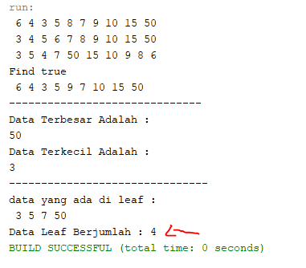

## LAPORAN PRAKTIKUM PERTEMUAN 14
>Nama  : Naresh Pratista<p>
>Kelas : 1F-D4TI<p>
>Absen : 22<p>
**TREE**

**1. Tujuan Praktikum**

Setelah melakukan praktikum ini, mahasiswa mampu:
1. memahami model Tree khususnya Binary Tree
2. membuat dan mendeklarasikan struktur algoritma Binary Tree.
3. menerapkan dan mengimplementasikan algoritma Binary Tree dalam kasus

**2. Praktikum**

**2.1 Implementasi Binary Search Tree menggunakan Linked List**

**2.1.1 Tahapan percobaan**

1. Buatlah class Node, BinaryTree dan BinaryTreeMain

2. Di dalam class Node, tambahkan atribut data, left dan right, serta konstruktor default dan berparameter.
    ```java
    package praktikum;
    /**
    *
    * @author nares
    */
    public class Node {
        int data;
        Node left;
        Node right;
    
        public Node(){
        }
        public Node(int data){
            this.left = null;
            this.data = data;
            this.right = null;
        }
    }
    ```

3. Di dalam class BinaryTree, tambahkan atribut root.
    ```java
    public class BinaryTree {
    Node root;
    ```

4. Tambahkan konstruktor default dan method isEmpty() di dalam class BinaryTree
    ```java
    public BinaryTree(){
    }
    
    boolean isEmpty(){
        return root == null;
    }
    ```

5. Tambahkan method add() di dalam class BinaryTree. Di bawah ini proses penambahan node tidak dilakukan secara rekursif, agar lebih mudah dilihat alur proses penambahan node dalam tree. Sebenarnya, jika dilakukan dengan proses rekursif, penulisan kode akan lebih efisien. 
    ```java
        void add(int data){
        if (isEmpty()){
            root = new Node(data);
        } else {
            Node current = root;
            while (true) {
                if (data < current.data) {
                    if (current.left != null) {
                        current = current.left;
                    } else {
                        current.left = new Node(data);
                        break;
                    }
                } else if (data > current.data) {
                    if (current.right != null) {
                        current = current.right;
                    } else {
                        current.right = new Node(data);
                        break;
                    }
                } else {
                    break;
                }
            }
        }
    }
    ```

6. Tambahkan method find()
    ```java
    boolean find(int data) {
        boolean hasil = false;
        Node current = root;
        while (current != null) {
            if (current.data == data) {
                hasil = true;
                break;
            } else if (data < current.data) {
                current = current.left;
            } else {
                current = current.right;
            }
        }
        return hasil;
    }
    ```

7. Tambahkan method traversePreOrder(), traverseInOrder() dan traversePostOrder(). Method traverse digunakan untuk mengunjungi dan menampilkan node-node dalam tree, baik dalam mode pre-order, in-order maupun post-order.
    ```java
    void traversePreorder(Node node) {
        if (node != null) {
            System.out.print(" " + node.data);
            traversePreorder(node.left);
            traversePreorder(node.right);
        }
    }

    void traversePostorder(Node node) {
        if (node != null) {
            traversePostorder(node.left);
            traversePostorder(node.right);
            System.out.print(" " + node.data);
        }
    }

    void traverseInorder(Node node) {
        if (node != null) {
            traverseInorder(node.left);
            System.out.print(" " + node.data);
            traverseInorder(node.right);
        }
    }
    ```

8. Tambahkan method getSuccessor(). Method ini akan digunakan ketika proses penghapusan node yang memiliki 2 child.
    ```java
    Node getSuccessor(Node del) {
        Node successor = del.right;
        Node successorParent = del;
        while (successor.left != null) {
            successorParent = successor;
            successor = successor.left;
        }
        if (successor != del.right) {
            successorParent.left = successor.right;
            successor.right = del.right;
        }
        return successor;
    }
    ```

9. Tambahkan method delete(). Di dalam method delete tambahkan pengecekan apakah tree kosong, dan jika tidak cari posisi node yang akan di hapus 
    ```java
    void delete(int data) {
        if (isEmpty()) {
            System.out.println("Tree is empty!!");
            return;
        }
        Node parent = root;
        Node current = root;
        boolean isLeftChild = false;
        while (current != null) {
            if (current.data == data) {
                break;
            } else if (data < current.data) {
                parent = current;
                current = current.left;
                isLeftChild = true;
            } else if (data > current.data) {
                parent = current;
                current = current.right;
                isLeftChild = false;
            }
        }
    ```

Kemudian tambahkan proses penghapusan terhadap node current yang telah ditemukan.

```jav
        if (current == null) {
            System.out.println("Couldn't find data!");
            return;
        } else {
            if (current.left == null && current.right == null) {
                if (current == root) {
                    root = null;
                } else {
                    if (isLeftChild) {
                        parent.left = null;
                    } else {
                        parent.right = null;
                    }
                }
            } else if (current.left == null) {
                if (current == root) {
                    root = current.right;
                } else {
                    if (isLeftChild) {
                        parent.left = current.right;
                    } else {
                        parent.right = current.right;
                    }
                }
            } else if (current.right == null) {
                if (current == root) {
                    root = current.left;
                } else {
                    if (isLeftChild) {
                        parent.left = current.left;
                    } else {
                        parent.right = current.right;
                    }
                }
            } else {
                Node successor = getSuccessor(current);
                if (current == root) {
                    root = successor;
                } else {
                    if (isLeftChild) {
                        parent.left = successor;
                    } else {
                        parent.right = successor;
                    }
                    successor.left = current.left;
                }
            }
        }
    }
}  
```

10. Buka class BinaryTreeMain dan tambahkan method main().
    ```java
    package praktikum;

    /**
    *
    * @author nares
    */
    public class BinaryTreeMain {

        /**
        * @param args the command line arguments
        */
        public static void main(String[] args) {
            BinaryTree bt = new BinaryTree();
        
            bt.add(6);
            bt.add(4);
            bt.add(8);
            bt.add(3);
            bt.add(5);
            bt.add(7);
            bt.add(9);
            bt.add(10);
            bt.add(15);
        
            bt.traversePreorder(bt.root);
            System.out.println("");
            bt.traverseInorder(bt.root);
            System.out.println("");
            bt.traversePostorder(bt.root);
            System.out.println("");
            System.out.println("Find "+bt.find(5));
            bt.delete(8);
            bt.traversePreorder(bt.root);
            System.out.println("");
        }
    }
    ```

11. Compile dan jalankan class BinaryTreeMain untuk mendapatkan simulasi jalannya program tree yang telah dibuat.

12. Amati hasil running tersebut. <p>


<br>

**2.1.2 Pertanyaan Percobaan**

1. Mengapa dalam binary search tree proses pencarian data bisa lebih efektif dilakukan dibanding binary tree biasa?
    > Karena pada Binary Search Tree node disusun sudah secara berurutan (Pohon Biner Terurut) yang mana penempatan data berdasarkan Left Child akan selalu lebih kecil dari node induk, dan right child akan lebih besar dari node induk.

2. Untuk apakah di class Node, kegunaan dari atribut left dan right?
    > pada class node atribut left berfungsi untuk menyimpan "left child" atau nilai yang lebih kecil dari root (node induk) dan atribut right berfungsi untuk menyimpan "right child" atau nilai yang lebih besar dari root (node induk)

3.  - a. Untuk apakah kegunaan dari atribut root di dalam class BinaryTree?
    - b. Ketika objek tree pertama kali dibuat, apakah nilai dari root? <p>

    >- a. untuk menyimpan data yang berada pada bagian paling atas tree
    >- b. ketika objek tree pertama kali dibuat nilai dari root bernilai null, karena masih belum ada data yang dimasukan

4. Ketika tree masih kosong, dan akan ditambahkan sebuah node baru, proses apa yang akan terjadi?
    > 

5. Perhatikan method add(), di dalamnya terdapat baris program seperti di bawah ini. Jelaskan secara detil untuk apa baris program tersebut?
    > 

<br>

**2.2 Implementasi binary tree dengan array**

**2.2.1 Tahapan Percobaan**

1. Di dalam percobaan implementasi binary tree dengan array ini, data tree disimpan dalam array dan langsung dimasukan dari method main(), dan selanjutnya akan disimulasikan proses traversal secara inOrder.

2. Buatlah class BinaryTreeArray dan BinaryTreeArrayMain

3. Buat atribut data dan idxLast di dalam class BinaryTreeArray. Buat juga method populateData() dan traverseInOrder().
    ```java
        package praktikum2;

    /**
    *
    * @author nares
    */
    public class BinaryTreeArray {
        int[] data;
        int idxlast;
    
        public BinaryTreeArray(){
            data = new int[10];
        }
    
        void populateData(int data[], int idxlast){
            this.data = data;
            this.idxlast = idxlast;
        }
    
        void traverseinOrder(int idxStart){
            if(idxStart <= idxlast){
                traverseinOrder(2*idxStart+1);
                System.out.println(data[idxStart]+" ");
                traverseinOrder(2*idxStart+1);
            }
        }
    }
    ```

4. Kemudian dalam class BinaryTreeArrayMain buat method main() seperti gambar berikut ini.
    ```java
        package praktikum2;

    /**
    *
    * @author nares
    */
    public class BinaryTreeArrayMain {

        /**
        * @param args the command line arguments
        */
        public static void main(String[] args) {
            BinaryTreeArray bta = new BinaryTreeArray();
            int[] data = {6,4,8,3,5,7,9,0,0,0};
            int idxLast = 6;
            bta.populateData(data, idxLast);
            bta.traverseinOrder(0);
        
        }
    }
    ```

5. Jalankan class BinaryTreeArrayMain dan amati hasilnya! <p>
    

<br>

**3.2.1 Pertanyaan Percobaan**

1. Apakah kegunaan dari atribut data dan idxLast yang ada di class BinaryTreeArray?
    >atribut data berfungsi untuk menyimpan data array, sedangkan idxLast berfungsi untuk menyimpan batas index

2. Apakah kegunaan dari method populateData()?
    >Untuk menunjukkan data pada idxLast

3. Apakah kegunaan dari method traverseInOrder()?
    >Untuk menelusuri tree dengan metode in order dengan prinsip(left visit right)

4. Jika suatu node binary tree disimpan dalam array indeks 2, maka di indeks berapakah posisi left child dan rigth child masin-masing?
    >Left child pada indeks ke 5, dan right child pada indeks ke 6

5. Apa kegunaan statement int idxLast = 6 pada praktikum 2 percobaan nomor 4?
    >untuk menunjukkan idxLast atau batas indeks arraynya adalah 6

<br>

**3.3 Tugas Praktikum**

1. Buat method di dalam class BinaryTree yang akan menambahkan node dengan cara rekursif.
    ```java
    void addNodeR(int key){ //Nomor 1
        root = addNodeR(root, key);
    }
    public Node addNodeR(Node current, int data){
        if (current == null){
            return new Node(data);
        }
        if (data < current.data){
            current.left = addNodeR(current.left, data);
        }else if(data > current.data){
            current.right = addNodeR(current.right, data);
        }else{
            return current;
        }
        return current;
    }
    ``` 

     <p>

2. Buat method di dalam class BinaryTree untuk menampilkan nilai paling kecil dan yang paling besar yang ada di dalam tree.
    ```java
    void maksimal(){    //Nomor 2
        Node current = root;
        while(current.right != null){
            current = current.right;
        }
        System.out.println(current.data);
    }
    void minimal(){
        Node current = root;
        while(current.left != null){
            current = current.left;
        }
        System.out.println(current.data);
    }
    ```
     <p>

3. Buat method di dalam class BinaryTree untuk menampilkan data yang ada di leaf.
    ```java
    void printLeft(Node root){  //Nomor 3
        if(root == null){
        return;            
        }
        if(root.left == null && root.right == null){
            System.out.print(" "+ root.data);
            return;
        }if(root.left != null){
            printLeft(root.left);
        }if(root.right != null){
            printLeft(root.right);
        }
    }
    ```
     <p>

4. Buat method di dalam class BinaryTree untuk menampilkan berapa jumlah leaf yang ada di dalam tree.
    ```java
        int jumlahLeft(){   //Nomor 4
        return jumlahLeft(root);
    }
    int jumlahLeft(Node node){
        if(node == null){
            return 0;
        }
        if(node.left == null && node.right == null){
            return 1;
        }else{
            return jumlahLeft(node.left)+jumlahLeft(node.right);
        }
    }
    ```
     <p>

5. Modifikasi class BinaryTreeArray, dan tambahkan :
    - method add(int data) untuk memasukan data ke dalam tree
    - method traversePreOrder() dan traversePostOrder() <p>

> class BinaryTreeArray 

```java
package praktikum2;

/**
 *
 * @author nares
 */
public class BinaryTreeArray {
    int[] data;
    int idxlast;
    
    public BinaryTreeArray(){
        data = new int[10];
    }
    
    void populateData(int data[], int idxlast){
        this.data = data;
        this.idxlast = idxlast;
    }
    
    void traverseinOrder(int idxStart){
        if(idxStart <= idxlast){
            traverseinOrder(2*idxStart+1);
            System.out.println(data[idxStart]+" ");
            traverseinOrder(2*idxStart+2);
        }
    }
    
        void add(int data){
        if(idxlast == this.data.length -1){
            System.out.println("Tree Array sudah Penuh");
        }else{
            this.data[++idxlast] = data;
        }
    }
    void traversePreOrder(int idxStart){
        if(idxStart <= idxlast){
            System.out.print(" "+data[idxStart]);
            traversePreOrder(2 * idxStart + 1);
            traversePreOrder(2 * idxStart + 2);
        }
    }
    void traversePostOrder(int idxStart){
        if(idxStart <= idxlast){
            traversePostOrder(2 * idxStart + 1);
            traversePostOrder(2 * idxStart + 2);
            System.out.print(" "+data[idxStart]);
        }
    }
}
```

> class BinaryTreeArrayMain
```java
package praktikum2;

/**
 *
 * @author nares
 */
public class BinaryTreeArrayMain {

    /**
     * @param args the command line arguments
     */
    public static void main(String[] args) {
        BinaryTreeArray bta = new BinaryTreeArray();
        int[] data = {6,4,8,3,5,7,9,0,0,0};
        int idxLast = 6;
        bta.populateData(data, idxLast);
        bta.traverseinOrder(0);
        
        System.out.println("");
        System.out.println("No 5");
        bta.add(90);
        bta.add(72);
        System.out.println("method traverse Pre Order");
        bta.traversePreOrder(0);
        System.out.println("");
        System.out.println("method traverse Post Order");
        bta.traversePostOrder(0);
        System.out.println("");
    } 
}
```
<br>

