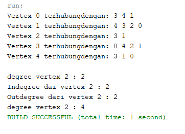
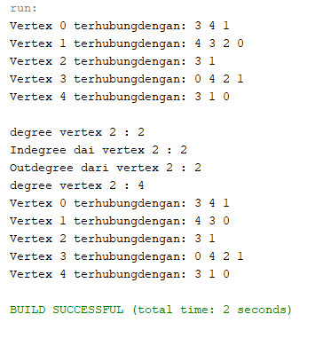
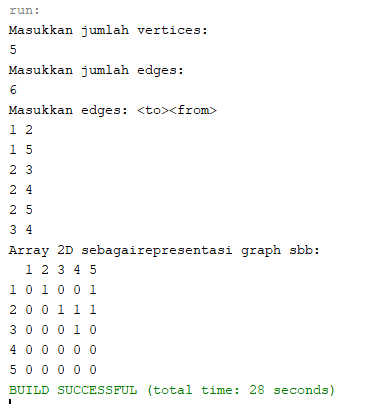

## LAPORAN PRAKTIKUM PERTEMUAN 15
>Nama  : Naresh Pratista<p>
>Kelas : 1F-D4TI<p>
>Absen : 22<p>
**GRAPH**

**1. Tujuan Praktikum**

Setelah melakukan praktikum ini, mahasiswa mampu:
1. memahami model graph
2. membuat dan mendeklarasikan struktur algoritma graph
3. menerapkan algoritma dasar graph dalam beberapa studi kasus.

**2. Praktikum**

**2.1 Implementasi Binary Search Tree menggunakan Linked List**

**2.1.1 Tahapan percobaan**

1. Buatlah class Node, dan class Linked Lists sesuai dengan praktikum Double Linked Lists.

2. Tambahkan class Graph yang akan menyimpan method-method dalam graph dan juga method main().
```java
package praktikum;

/**
 *
 * @author nares
 */
public class Graph {
    
}
```

3. Di dalam class Graph, tambahkan atribut vertex bertipe integer dan list[] bertipe LinkedList.
```java
public class Graph {
    int vertex;
    LinkedList list[];
```

4. Tambahkan konstruktor default untuk menginisialisasi variabel vertex dan menambahkan perulangan untuk jumlah vertex sesuai dengan jumlah length array yang telah ditentukan.
```java
public Graph(int vertex) {
        this.vertex = vertex;
        list = new LinkedList[vertex];
        for (int i = 0;  i< vertex; i++) {
            list[i] = new LinkedList();
        }
    }
```

5. Tambahkan method addEdge(). Jika yang akan dibuat adalah graph berarah, maka yang dijalankan hanya baris pertama saja. Jika graph tidak berarah yang dijalankan semua baris pada method addEdge().
```java
public void addEdge(int source, int destination) {
        list[source].addFirst(destination);
        list[destination].addFirst(source);
    }
```

6. Tambahkan method degree() untuk menampilkan jumlah derajat lintasan pada suatu vertex. Di dalam metode ini juga dibedakan manakah statement yang digunakan untuk graph berarah atau graph tidak berarah. Eksekusi hanya sesuai kebutuhan saja.
```java
public void degree(int source) throws Exception {
        System.out.println("degree vertex " + source + " : " + list[source].size());
        int k, totalIn = 0, totalOut = 0;
        for (int i = 0; i< vertex; i++) {
            for (int j = 0; j < list[i].size(); j++) {
                if (list[i].get(j) == source)
                    ++totalIn;
            }
                //outDegree
            for (k = 0; k < list[source].size(); k++) {
                list[source].get(k);
            }
            totalOut = k;
        }
        System.out.println("Indegree dai vertex " + source + " : " + totalIn);
        System.out.println("Outdegree dari vertex " + source + " : " + totalOut);
        System.out.println("degree vertex " + source + " : " + (totalIn + totalOut));
    }
```

7. Tambahkan method removeEdge(). Method ini akan menghapus lintasan ada suatu graph. Oleh karena itu, dibutuhkan 2 parameter untuk menghapus lintasan yaitu source dan destination.
```java
public void removeEdge(int source, int destination) throws Exception {
        for (int i = 0; i< vertex; i++) {
            if (i == destination) {
                list[source].remove(destination);
            }
        }
    }
```

8. Tambahkan method removeAllEdges() untuk menghapus semua vertex yang ada di dalam graph.
```java
public void removeAllEdges() {
        for (int i = 0; i< vertex; i++) {
            list[i].clear();
        }
        System.out.println("Graph berhasildikosongkan");
    }
```

9. Tambahkan method printGraph() untuk mencatak graph ter-update.
```java
public void printGraph() throws Exception {
        for (int i = 0; i< vertex; i++) {
            if (list[i].size() > 0) {
                System.out.print("Vertex " + i + " terhubungdengan: ");
                for (int j = 0; j < list[i].size(); j++) {
                    System.out.print(list[i].get(j) + " ");
                }
                System.out.println("");
            }
        }
        System.out.println(" ");
    }
```

10. Compile dan jalankan method main() dalam class Graph untuk menambahkan beberapa edge pada graph, kemudian tampilkan. Setelah itu keluarkan hasilnya menggunakan pemanggilan method main(). Keterangan: degree harus disesuaikan dengan jenis graph yang telah dibuat (directed/undirected).
```java
public static void main (String[] args) throws Exception {
        Graph graph = new Graph(6);
        graph.addEdge(0, 1);
        graph.addEdge(0, 4);
        graph.addEdge(1, 2);
        graph.addEdge(1, 3);
        graph.addEdge(1, 4);
        graph.addEdge(2, 3);
        graph.addEdge(3, 4);
        graph.addEdge(3, 0);
        graph.printGraph();
        graph.degree(2); 
    }
```

11. Amati hasil running tersebut. <p>


<br>

12. Tambahkan pemanggilan method removeEdge() sesuai potongan code di bawah ini pada method main(). Kemudian tampilkan graph tersebut.
```java
        graph.removeEdge(1, 2);
        graph.printGraph();
```

13. Amati hasil running tersebut. <p>


<br>

**2.1.2 Verifikasi Hasil Percobaan** <p>
> 
> 

<br>

**2.1.3 Pertanyaan Percobaan**

1. Sebutkan beberapa jenis (minimal 3) algoritma yang menggunakan dasar Graph, dan apakah kegunaan algoritma-algoritma tersebut?
    > - Algoritma Brent, kegunaannya untuk menentukan adanya jalur pada graph
    > - Algortima Floyd, kegunaannya untuk menentukan adanya jalur pada graph
    > - Algoritma Djikstra, legunaannya untuk dipakai dalam memecahkan permasalahan jarak terpendek untuk sebuah fraph berarah (directed graph) 


2. Pada class Graph terdapat array bertipe LinkedList, yaitu LinkedList list[]. Apakah tujuan pembuatan variabel tersebut ?
    > Tujuan dari pembuatan variabet tersebut adalah untuk memanggil fungsi linked list dan mengisi list yang berupa vertex pada linked list tersebut.

3. Apakah alasan pemanggilan method addFirst() untuk menambahkan data, bukan method add jenis lain pada linked list ketika digunakan pada method addEdge pada class Graph?
    > Alasannya adalah untuk menambahkan data, bukan method add jenis lain pada linked list ketika digunakan pada method addEdge pada class Graph yakni untuk mengenalkan vertex tersebut.

4. Bagaimana cara mendeteksi prev pointer pada saat akan melakukan penghapusan suatu edge pada graph ?
    > Ketika i == destination maka disitu akan dilihat dari i atau dengan cara looping vertex.

5. Kenapa pada praktikum 2.1.1 langkah ke-12 untuk menghapus path yang bukan merupakan lintasan pertama kali menghasilkan output yang salah ? Bagaimana solusinya ?
    > 

<br>

**2.2 Implementasi Graph menggunakan Matriks**

**2.2.1 Tahapan Percobaan**

1. Uji coba graph bagian 2.2 menggunakan array 2 dimensi sebagai representasi graph. Buatlah class graphArray yang didalamnya terdapat variabel vertices dan array twoD_array!
```java
public class GraphArray {
    private final int vertices;
    private final int[][] twoD_array;
```

2. Buatlah konstruktor graphArray sebagai berikut!
```java
    public GraphArray(int v) {
        vertices = v;
        twoD_array = new int[vertices + 1][vertices + 1];
    }
```

3. Untuk membuat suatu lintasan maka dibuat method makeEdge() sebagai berikut
```java
    public void makeEdge(int to, int from, int edge) {
        try {
            twoD_array[to][from] = edge;
        }
        catch (ArrayIndexOutOfBoundsException index) {
            System.out.println("Vertex tidakada");
        }
    }
```
Untuk menampilkan suatu lintasan diperlukan pembuatan method getEdge() berikut.
```java
public int getEdge(int to, int from) {
        try {
            return twoD_array[to][from];
        }
        catch (ArrayIndexOutOfBoundsException index) {
            System.out.println("Vertex tidakada");
        }
        return -1;
    }
```

4. Kemudian buatlah method main() seperti berikut ini.
```java
public static void main (String args[]) {
        int v, e, count = 1, to = 0, from = 0;
        Scanner sc = new Scanner(System.in);
        GraphArray graph;
        try {
            System.out.println("Masukkan jumlah vertices: ");
            v = sc.nextInt();
            System.out.println("Masukkan jumlah edges: ");
            e = sc.nextInt();
            graph = new GraphArray(v);
            System.out.println("Masukkan edges: <to><from>");
            while (count <= e) {
                to = sc.nextInt();
                from = sc.nextInt();
                graph.makeEdge(to, from, 1);
                count++;
            }
            System.out.println("Array 2D sebagairepresentasi graph sbb: ");
            System.out.print("  ");
            for (int i = 1; i<= v; i++) {
                System.out.print(i + " ");
            }
            System.out.println();
            for (int i = 1; i<= v; i++) {
                System.out.print(i + " ");
                for (int j = 1; j <= v; j++) {
                    System.out.print(graph.getEdge(i, j) + " ");
                }
                System.out.println();
            }
        } catch (Exception E) {
            System.out.println("Error. Silakancekkembali\n" + E.getMessage());
        }
        sc.close();
    }
}
```

5. Jalankan class GraphArray dan amati hasilnya! <p>


<br>

**2.2.2 Verifikasi Hasil Percobaan** <p>


<br>

**2.2.3 Pertanyaan Percobaan**

1. Apakah perbedaan degree/derajat pada directed dan undirected graph?
    > Directed graph degree / derajat tidak selalu berhubungan kembali, sedangkan pada undirected graph degree/derajat pasti berhubungan

2. Pada implementasi graph menggunakan adjacency matriks. Kenapa jumlah vertices harus ditambahkan dengan 1 pada indeks array berikut?
    > Karena index di mulai dari 0, sehingga perlu di tambah dengan 1

3. Apakah kegunaan method getEdge() ?
    > Digunakan untuk menampilkan suatu lintasan yang di perlukan

4. Termasuk jenis graph apakah uji coba pada praktikum 2.2?
    > Termasuk dalam graph Directed

5. Mengapa pada method main harus menggunakan try-catch Exception ?
    > Untuk penanganan proses error

**3. Tugas Praktikum**

1. Ubahlah lintasan pada praktikum 2.1 menjadi inputan!
```java
public static void main (String[] args) throws Exception {
        Scanner sc = new Scanner(System.in);
        System.out.print("Masukkan vertex graph : ");
        int v = sc.nextInt();
        Graph G = new Graph(v);
        System.out.print("Masukkan banyak edge : ");
        int e = sc.nextInt();
        for (int i = 0; i < e; i++) {
            System.out.print("Masukkan Source : ");
            int source = sc.nextInt();
            System.out.print("Masukkan Destination : ");
            int des = sc.nextInt();

            G.addEdge(source, des);

        }
        G.printGraph();
        //Graph.addEdge(0, 1);
        //Graph.addEdge(0, 4);
        //Graph.addEdge(1, 2);
        //Graph.addEdge(1, 3);
        //Graph.addEdge(1, 4);
        //Graph.addEdge(2, 3);
        //Graph.addEdge(3, 4);
        //Graph.addEdge(3, 0);
        //Graph.removeEdge(1, 2);
        //Graph.printGraph();
        //Graph.degree(2);
    }
}
```

2. Tambahkan method graphType dengan tipe boolean yang akan membedakan graph termasuk directed atau undirected graph. Kemudian update seluruh method yang berelasi dengan method graphType tersebut (hanya menjalankan statement sesuai dengan jenis graph) pada praktikum 2.1
```java
public boolean graphType(int source, int destination) throws Exception{
    list[source].addFirst(destination);
    return true;
}
```

3. Modifikasi method removeEdge() pada praktikum 2.1 agar tidak menghasilkan output yang salah untuk path selain path pertama kali!
```java
    public void removeEdge(int source, int destination) throws Exception {
        for (int i = 0; i< vertex; i++) {
            if (i == destination) {
                list[source].remove(destination);
            }
        }
    }
```

4. Ubahlah tipe data vertex pada seluruh graph pada praktikum 2.1 dan 2.2 dari Integer menjadi tipe generic agar dapat menerima semua tipe data dasar Java! Misalnya setiap vertex yang awalnya berupa angka 0,1,2,3, dst.  selanjutnya ubah menjadi suatu nama daerah seperti Gresik,Bandung, Yogya, Malang, dst.
```java
public void printGraph() throws Exception {
        String namKota = "";
        for (int i = 0; i < vertex; i++) {
            if (list[i].size() > 0) {
                if (i == 0) {
                    namKota = "Malang";
                } else if (i == 1) {
                    namKota = "Surabaya";
                } else if (i == 2) {
                    namKota = "Gresik";
                } else if (i == 3) {
                    namKota = "Pandaan";
                } else if (i == 4) {
                    namKota = "Bandung";
                } else {
                    namKota = "Jakarta";
                }
                System.out.print("Vertex " + namKota + " terhubung dengan: ");
                for (int j = 0; j < list[i].size(); j++) {
                    System.out.print(list[i].get(j) + " ");
                }
                System.out.println("");
            }
        }
        System.out.println(" ");
    }
```