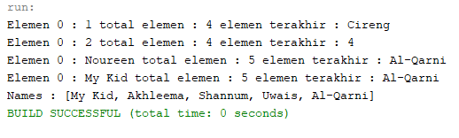
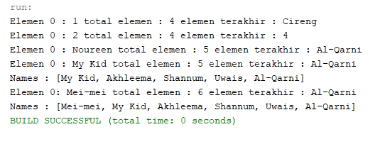
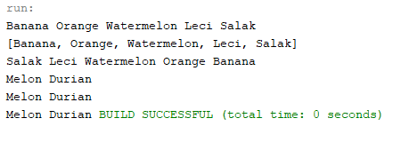
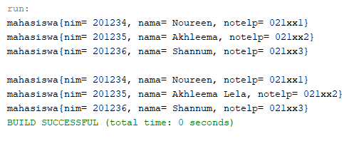

## LAPORAN PRAKTIKUM PERTEMUAN 16
>Nama  : Naresh Pratista<p>
>Kelas : 1F-D4TI<p>
>Absen : 22<p>
**Collection**

**16.1 Tujuan Praktikum**

Setelah melakukan praktikum ini, mahasiswa mampu:
1. memahami bentuk-bentuk collection dan hierarkinya;
2. menerapkan collection sesuai dengan fungsi dan jenisnya;
3. menyelesaikan kasus menggunakan collection yang sesuai.

## 16.2. Kegiatan Praktikum 1

## 16.2.1. Percobaan 1

1. Buatlah sebuah class ContohList yang main methode berisi kode program seperti di bawah ini
```java
 l.add(1);
        l.add(2);
        l.add(3);
        l.add("Cireng");
        System.out.printf("Elemen 0 : %d total elemen : %d elemen terakhir : %s\n", 
                l.get(0), l.size(), l.get(l.size() - 1));
        
        l.add(4);
        l.remove(0);
        System.out.printf("Elemen 0 : %d total elemen : %d elemen terakhir : %s\n", 
                l.get(0), l.size(), l.get(l.size() - 1));
```

2. Tambahkan kode program untuk menggunakan collection dengan aturan penulisan kode
```java
List<String> names = new LinkedList<>();
        names.add("Noureen");
        names.add("Akhleema");
        names.add("Shannum");
        names.add("Uwais");
        names.add("Al-Qarni");
        System.out.printf("Elemen 0 : %s total elemen : %s elemen terakhir : %s\n", 
                names.get(0), names.size(), names.get(names.size() - 1));
        names.set(0, "My Kid");
        System.out.printf("Elemen 0 : %s total elemen : %s elemen terakhir : %s\n", 
                names.get(0), names.size(), names.get(names.size() - 1));
        System.out.println("Names : "+ names.toString());
```

**16.2.2. Verifikasi Hasil Percobaan**



**16.2.3. Pertanyaan Percobaan**

1. Perhatikan baris kode 25-36, mengapa semua jenis data bisa ditampung ke dalam sebuah Arraylist?
    >karena arrayList dapat menampung data secara dinamis, karena pada kode program di baris 25-36 tidakdiberikan kurung sudut yang menyimpan secara spesifik data yang akan di simpan di dalamnya, sehingga arraylist tersebut bersifat sintak umum yang dapat meyimpan segala jenis tipe data.

2. Modifikasi baris kode 25-36 seingga data yang ditampung hanya satu jenis atau spesifik tipe tertentu!
    ```java
            List l = new ArrayList();
        
        l.add(1);
        l.add(2);
        l.add(3);
        l.add("Cireng");
        System.out.printf("Elemen 0 : %d total elemen : %d elemen terakhir : %s\n", 
                l.get(0), l.size(), l.get(l.size() - 1));
        
        l.add(4);
        l.remove(0);
        System.out.printf("Elemen 0 : %d total elemen : %d elemen terakhir : %s\n", 
                l.get(0), l.size(), l.get(l.size() - 1));
    ```

3. Ubah kode pada baris kode 38 menjadi seperti ini
    ```java
            LinkedList<String> names = new LinkedList<>();
        names.add("Noureen");
        names.add("Akhleema");
        names.add("Shannum");
        names.add("Uwais");
        names.add("Al-Qarni");
    ```

4. Tambahkan juga baris berikut ini, untuk memberikan perbedaan dari tampilan yang sebelumnya
    ```java
    LinkedList<String> names = new LinkedList<>();
        names.add("Noureen");
        names.add("Akhleema");
        names.add("Shannum");
        names.add("Uwais");
        names.add("Al-Qarni");
        System.out.printf("Elemen 0 : %s total elemen : %s elemen terakhir : %s\n", 
        names.get(0), names.size(), names.get(names.size() - 1));
        names.set(0, "My Kid");
        System.out.printf("Elemen 0 : %s total elemen : %s elemen terakhir : %s\n", 
        names.get(0), names.size(), names.get(names.size() - 1));
        System.out.println("Names : "+ names.toString());
        
        names.push("Mei-mei");
        System.out.printf("Elemen 0: %s total elemen : %s elemen terakhir : %s\n",
            names.getFirst(), names.size(), names.getLast());
        System.out.println("Names : "+ names.toString());
    ```

5. Dari penambahan kode tersebut, silakan dijalankan dan apakah yang dapat Anda jelaskan!



## 16.3. Kegiatan Praktikum 2

**16.3.1. Tahapan Percobaan**

1. Buatlah class dengan nama LoopCollection serta tambahkan method main yang isinya adalah sebagai berikut**.**
    ```java
        Stack<String> fruits = new Stack<>();
        fruits.push("Banana");
        fruits.add("Orange");
        fruits.add("Watermelon");
        fruits.add("Leci");
        fruits.push("Salak");
        
        for(String fruit : fruits){
            System.out.printf("%s ", fruit);
        }
        System.out.println("\n"+ fruits.toString());
        
        while(!fruits.empty()){
            System.out.printf("%s ", fruits.pop());
        }
    ```

2. Tambahkan potongan kode berikut ini dari yang sebelumnya agar proses menampilkan elemen pada sebuah stack bervariasi.
    ```java
    fruits.push("Melon");
        fruits.push("Durian");
        System.out.println("");
        for(Iterator<String> it = fruits.iterator(); it.hasNext();){
            String fruit = it.next();
            System.out.printf("%s ", fruit);
        }
        System.out.println("");
        fruits.stream().forEach(e -> {
            System.out.printf("%s ",e);
        });
        System.out.println("");
        for(int i=0; i<fruits.size(); i++){
            System.out.printf("%s ", fruits.get(i));
    ```

**16.3.2. Verifikasi Hasil Percobaan**



**16.3.3. Pertanyaan Percobaan**

1. Apakah perbedaan fungsi push() dan add() pada objek _fruits_?
    > pada objek fruits yakni push lebih spesifik pada stack sedangkan untuk yang add lebih spesifik di ininterface nya yang merupakan list

2. Silakan hilangkan baris 43 dan 4 4 , apakah yang akan terjadi? Mengapa bisa demikian?
    > Data “Melon” dan “Durian” tidak ada. Karena saat kita mengakses fungsi push(),artinya kita akan menambahkan data “Melon” dan “Durian”

3. Jelaskan fungsi dari baris 46 - 49?
    > untuk menginisialisasi method iterator dengan type data String.Statement hasNext() digunakan untuk mengecek apakah iterator memiliki elemen selanjutnya. Jika bersifat true, maka variable fruit akan menyimpan nilai selanjutnya. Kemudian ditampilkan elemen tersebut

4. Silakan ganti baris kode 25, _Stack<String>_ menjadi _List<String>_ dan apakah yang terjadi? Mengapa bisa demikian?
    > akan terjadi eror saat programdi lakukan running, karena collection List tidak memiliki method yang terdapat pada collection Stack.

5. Ganti elemen terakhir dari dari objek fruits menjadi “Strawberry”!
    ```java
    fruits.push("Melon");
      fruits.push("Strawberry");
    ```

6. Tambahkan 3 buah seperti “Mango”,”guava”, dan “avocado” kemudian dilakukan sorting!
    ```java
            fruits.push("Melon");
        fruits.push("Strawberry");
        System.out.println("");
        for(Iterator<String> it = fruits.iterator(); it.hasNext();){
            String fruit = it.next();
            System.out.printf("%s ", fruit);
        }
        System.out.println("");
        fruits.stream().forEach(e -> {
            System.out.printf("%s ",e);
        });
        System.out.println("");
        for(int i=0; i<fruits.size(); i++){
            System.out.printf("%s ", fruits.get(i));
        }
        fruits.push("Manggo");
        fruits.push("Guava");
        fruits.push("Avocado");
    
        System.out.println("");
        System.out.println("\nData sesudah disorting ");
        Collections.sort(fruits);
        Iterator i= fruits.iterator();
    
        while(i.hasNext()){
            System.out.print(i.next() + "  ");
            System.out.println("");
    ```


## 16.4. Kegiatan Praktikum 3


**16.4.1. Tahapan Percobaan**
1. class mahasiswa
```java
package percobaan.prak3;
/**
 *
 * @author nares
 */
public class mahasiswa {
    String nim;
    String nama;
    String notelp;
    
    public mahasiswa(){
        
    }
    public mahasiswa(String nim, String nama, String notelp){
        this.nim = nim;
        this.nama = nama;
        this.notelp = notelp;
    }
    @Override
    public String toString(){
        return "mahasiswa{" +"nim= "+nim +", nama= "+nama+", notelp= "+notelp+ '}';
    }
}
```

2. class listMahasiswa
```java
package percobaan.prak3;
/**
 *
 * @author nares
 */
import java.util.ArrayList;
import java.util.Arrays;
import java.util.List;

public class ListMahasiswa {
    
    List<mahasiswa> mahasiswas = new ArrayList<>();
    
    public void tambah(mahasiswa... Mahasiswa){
            mahasiswas.addAll(Arrays.asList(Mahasiswa));
    }
    public void hapus(int index){
        mahasiswas.remove(index);
    }
    public void update(int index, mahasiswa mhs){
        mahasiswas.set(index, mhs);
    }
    public void tampil(){
        mahasiswas.stream().forEach(mhs -> {
            System.out.println(""+ mhs.toString());
        });
    }
    int linearSearch(String nim){
        for(int i=0; i<mahasiswas.size(); i++){
            if(nim.equals(mahasiswas.get(i).nim)){
                return i;
            }
        }
        return -1;

    }
    public static void main(String[] args) {
        ListMahasiswa lm = new ListMahasiswa();
        mahasiswa m = new mahasiswa("201234", "Noureen", "021xx1");
        mahasiswa m1 = new mahasiswa("201235", "Akhleema", "021xx2");
        mahasiswa m2 = new mahasiswa("201236", "Shannum", "021xx3");
        lm.tambah(m, m1, m2);
        lm.tampil();
        lm.update(lm.linearSearch("201235"), new mahasiswa("201235", "Akhleema Lela", "021xx2"));
        System.out.println("");
        lm.tampil();
        
    }   
}
```
**16.4.2. Verifikasi Hasil Percobaan**



**16.4.3. Pertanyaan Percobaan**

1. Pada fungsi tambah() yang menggunakan unlimited argument itu menggunakan konsep apa? Dan kelebihannya apa?
    > Kelebihannya ini memungkinkan metode untuk mengambil sejumlah argumen. Mereka dapat diakses sebagai array dalam metode.

2. Pada fungsi linearSearch() di atas, silakan diganti dengan fungsi binarySearch() dari collection!
    ```java
        int binarySearch(String nim){
        for(int i=0; i<mahasiswas.size(); i++){
            if(nim.equals(mahasiswas.get(i).nim)){
                return i;
            }
        }
        return -1;

    }
    public static void main(String[] args) {
        ListMahasiswa lm = new ListMahasiswa();
        mahasiswa m = new mahasiswa("201234", "Noureen", "021xx1");
        mahasiswa m1 = new mahasiswa("201235", "Akhleema", "021xx2");
        mahasiswa m2 = new mahasiswa("201236", "Shannum", "021xx3");
        lm.tambah(m, m1, m2);
        lm.tampil();
        lm.update(lm.binarySearch("201235"), new mahasiswa("201235", "Akhleema Lela", "021xx2"));
        System.out.println("");
        lm.tampil();
        
    ```

3. Tambahkan fungsi sorting baik secara ascending ataupun descending pada class tersebut!
    ```java
    void ascSort(){
    Collections.sort(mahasiswas, new Comparator<mahasiswa>(){
        @Override
        public int compare(mahasiswa o1, mahasiswa o2){
            return o1.nim.compareTo(o2.nim);
    ```

    ```java
    void dscSort(){
    Collections.reverse(mahasiswas);
    ```

## 16.5. Tugas Praktikum

1. Implementasikan stack menggunakan collection dengan contoh kasus tumpukan daftar film sesuai dengan fitur-fitur yang ditunjukkan pada gambar di bawah ini!
- class film
```java
package tugas;

/**
 *
 * @author nares
 */
public class film {
    String id, judul, tahun, director;
    public film(String id, String judul, String tahun, String director){
        this.id = id;
        this.judul = judul;
        this.tahun = tahun;
        this.director = director;
    }
    @Override
    public String toString(){
        return "FILM {Id Film= "+id +", Judul FIlm= "+judul+", Tahun Tayang= "+tahun+", Director= "+director+"}";
    }
}
```

- class filmMain
```java
package tugas;
import java.util.Scanner;
import java.util.Stack;
/**
 *
 * @author nares
 */
public class filmMain {

    /**
     * @param args the command line arguments
     */
    public static void main(String[] args) {
        Scanner sc = new Scanner(System.in);
        Scanner sd = new Scanner(System.in);
        Scanner sa = new Scanner(System.in);
        
        Stack <film> films = new Stack();
        
        char pilih;
        int menu = 0;
        do{
            System.out.println("======================================");
            System.out.println(" Data Film Layar Lebar Sepanjang Masa ");
            System.out.println("======================================");
            System.out.println("1. Input Judul FIlm                   ");
            System.out.println("2. Hapus Data Film Teratas            ");
            System.out.println("3. Cek Judul Film Teratas             ");
            System.out.println("4. Info semua judul Film              ");
            System.out.println("5. Keluar                             ");
            System.out.println("======================================");
            System.out.print("Pilih menu\t: ");
            menu = sd.nextInt();
            switch(menu){
                case 1:{
                    do{ 
                    System.out.println("+=====================================+");
                    System.out.print(" Id Film\t: ");
                    String id = sc.nextLine();
                    System.out.print(" Judul Film\t: ");
                    String judul = sc.nextLine();
                    System.out.print(" Tahun Tayang\t: ");
                    String tahun = sc.nextLine();
                    System.out.print(" Director\t: ");
                    String director = sc.nextLine();
                    film data = new film(id, judul, tahun, director);
                    films.push(data);
                    System.out.println("Mau tambah data atau tidak Y/n");
                    pilih = sa.next().charAt(0);
                    System.out.println("");
                    
                    }while (pilih == 'y' || pilih == 'Y');
                     
                }
                break;
                case 2 :{
                    System.out.println("=====================================");
                    System.out.println("       Hapus Data Film Teratas       ");
                    System.out.println("=====================================");
                    System.out.println(films.pop());
                    System.out.println("");
                }
                break;
                case 3:{
                    System.out.println("=====================================");
                    System.out.println("           Judul Film Teratas        ");
                    System.out.println("=====================================");
                    System.out.println(films.peek());
                    System.out.println("");
                }
                break;
                case 4:{
                    System.out.println("=====================================");
                    System.out.println("        Info Semua Judul FIlm        ");
                    System.out.println("=====================================");
                    for(int i=0; i<films.size(); i++){
                        System.out.println(films.get(i));
                    }
                    System.out.println("");
                }
                break;
                case 5: {
                    System.out.println("");
                    System.out.println("+            Terima Kasih             +");
                }
                break;
            }
        }while (menu < 5 && menu > 0);
    }
}
```

2. Buatlah implementasi program daftar nilai mahasiswa semester, minimal memiliki 3 class yaitu Mahasiswa, Nilai, dan Mata Kuliah. Khusus untuk data Mahasiswa dan Mata Kuliah harus sudah diinisialisasi, sehingga ketika memasukkan data nilai data mahasiswa dan mata kuliah cukup menginputkan nim ataupun kode mata kuliah. Yang paling penting adalah antara objek mahasiswa, matakuliah, dan nilai harus saling terhubung.

- class mahasiswa
```java
package tugas.tugas2;

/**
 *
 * @author nares
 */
public class mahasiswa {
    String nim, nama, noTelp;
    
    public mahasiswa(){
        
    }
    public mahasiswa(String nim, String nama, String noTelp){
        this.nim = nim;
        this.nama = nama;
        this.noTelp = noTelp;
    }
    @Override
    public String toString(){
        return String.format("%s\t%-15s\t%s", nim, nama, noTelp);
    }
}
```

- class matkul
```java
package tugas.tugas2;

/**
 *
 * @author nares
 */
public class matkul {
    String kodeMk, namaMk;
    int sks;
    
    public matkul(String kodeMk, String namaMk, int sks){
        this.kodeMk = kodeMk;
        this.namaMk = namaMk;
        this.sks = sks;
    }
    public String toString(){
        return String.format("%s\t%-40s%s", kodeMk, namaMk, sks);
    }
}
```

- class nilaiMain
```java
package tugas.tugas2;
import java.util.Scanner;
import java.util.List;
import java.util.ArrayList;
import java.util.Arrays;
import java.util.Comparator;
/**
 *
 * @author nares
 */
public class nilaiMain {

    String kodeNil;
    double nilai;
    mahasiswa mhs;
    matkul mk;
    
    public nilaiMain(String kodeNil, double nilai, mahasiswa mhs, matkul mk){
        this.kodeNil = kodeNil;
        this.nilai = nilai;
        this.mhs = mhs;
        this.mk = mk;
    }
    List<mahasiswa> mhsA = new ArrayList<>();
    List<matkul> matkulA = new ArrayList<>();
    
    public void tambahMhs(mahasiswa... mahasiswa){
        mhsA.addAll(Arrays.asList(mahasiswa));
    }
    public void tambahMatkul(matkul... matkul){
        matkulA.addAll(Arrays.asList(matkul));
    }
    public void tampilMhs(){
        mhsA.stream().forEach(mhs -> {
                System.out.println("" + mhs.toString());
        });
    }
    public void tampilMatkul(){
        matkulA.stream().forEach(mk -> {
                System.out.println("" + mk.toString());
        });
    }
    int linearSearchMhs(String nim){
            for(int i = 0; i < mhsA.size(); i++){ 
                if(nim.equals(mhsA.get(i).nim)){
                    return i;
                }
            }
            return -1;
    }
    int linearSearchMatkul(String matkul){
            for(int i = 0; i < matkulA.size(); i++){ 
                if(matkul.equals(matkulA.get(i).kodeMk)){
                    return i;
                }
            }
            return -1;
    }
    mahasiswa cariMhs(String nim){
        for(int i = 0; i < mhsA.size(); i++){
            if(nim.equals(mhsA.get(i).nim)){
                return mhsA.get(i);
            }
        }
        return null;
    }
    matkul cariMatkul(String matkul){
        for(int i = 0; i < matkulA.size(); i++){
            if(matkul.equals(matkulA.get(i).kodeMk)){
                return matkulA.get(i);
            }
        }
        return null;
    }
    public String toString(int idx1, int idx2){
        return mhsA.get(idx1).nim + "\t" + mhsA.get(idx1).nama + "\t" + matkulA.get(idx2).namaMk + "\t" + matkulA.get(idx2).sks + "\t";
    }
    
    static Comparator<nilaiMain> CompNilai = (n1, n2) ->{
        if(n1.nilai < n2.nilai){
            return -1;
        } else if (n1.nilai > (n2).nilai){
            return 1;
        } else {
            return 0;
        }
    };
    //main 
    public static void main(String[] args) {
        Scanner sc = new Scanner(System.in);
        Scanner sd = new Scanner(System.in);
        Scanner sb = new Scanner(System.in);
        
        List<nilaiMain> nill = new ArrayList<>();
        nilaiMain n = new nilaiMain("", 0, null, null);
        
        mahasiswa m1 = new mahasiswa("20001", "Natasha", "021xxx");
        mahasiswa m2 = new mahasiswa("20002", "Amanda", "021xxx");
        mahasiswa m3 = new mahasiswa("20003", "Iqball", "021xxx");
        mahasiswa m4 = new mahasiswa("20004", "Anggara", "021xxx");
        mahasiswa m5 = new mahasiswa("20005", "Guanna", "021xxx");
        mahasiswa m6 = new mahasiswa("20006", "Natasha", "021xxx");
        
        n.tambahMhs(m1, m2, m3, m4, m5, m6);
        
        matkul mk1 = new matkul("0001", "Internet of Things", 3);
        matkul mk2 = new matkul("0002", "Algoritma dan Struktur Data", 2);
        matkul mk3 = new matkul("0003", "Algoritma dan Pemrograman", 2);
        matkul mk4 = new matkul("0004", "Praktikum Algoritma dan Struktur Data", 3);
        matkul mk5 = new matkul("0005", "Algoritma dan Struktur Data", 3);
        
        n.tambahMatkul(mk1, mk2, mk3, mk4, mk5);
        
        nilaiMain n1 = null;
        String nimMhs, mkMhs;
        
        int menu = 0;
        do{
            System.out.println("===================================================");
            System.out.println(" Sistem Pengelolahan Data Nilai Mahasiswa Semester ");
            System.out.println("===================================================");
            System.out.println(" 1. Input Nilai");
            System.out.println(" 2. Tampil Nilai");
            System.out.println(" 3. Mencari Nilai Mahasiswa");
            System.out.println(" 4. Urut Data Nilai");
            System.out.println(" 5. Keluar");
            System.out.println("==================================================");
            System.out.print("Pilih\t\t\t\t: ");
            menu = sd.nextInt();
            System.out.println("");
            
            switch(menu){
                case 1 :
                    System.out.print("Kode\t\t\t\t: ");
                    String kd = sc.nextLine();
                    System.out.print("Nilai\t\t\t\t: ");
                    double nilMhs = sb.nextDouble();
                    System.out.println("");
                    
                    System.out.println("====================================================");
                    System.out.println("                    Daftar Mahasiswa               ");
                    System.out.println("====================================================");
                    System.out.println("NIM\tNama\t\tNo Telp");
                    n.tampilMhs();
                    System.out.println("---------------------------------------------------");
                    System.out.print("Pilih Mahasiswa by nim\t\t: ");
                    nimMhs = sc.nextLine();
                    mahasiswa mahaSiswas;
                    mahaSiswas = n.cariMhs(nimMhs);
                    
                    System.out.println("");
                    System.out.println("====================================================");
                    System.out.println("                    Daftar Mata Kuliah              ");
                    System.out.println("====================================================");
                    System.out.println("Kode\tMata Kuliah\t\t\t\tSKS");
                    n.tampilMatkul();
                    System.out.println("---------------------------------------------------");
                    System.out.print("Pilih Mata Kuliah by Kode\t:");
                    mkMhs = sc.nextLine();
                    matkul mataKuliah;
                    mataKuliah = n.cariMatkul(mkMhs);
                    
                    n1 = new nilaiMain(kd, nilMhs, mahaSiswas, mataKuliah);
                    
                    nill.add(n1);
                    System.out.println("");
                    break;
                    
                case 2:
                    System.out.println("====================================================");
                    System.out.println("                  Daftar Nilai Mahasiswa           ");
                    System.out.println("====================================================");
                    System.out.println("NIM\tNama\tMata Kuliah\t\tSKS\tNilai");
                    for(int i=0; i<nill.size(); i++){
                        n.linearSearchMhs(nill.get(i).mhs.nim);
                        n.linearSearchMatkul(nill.get(i).mk.kodeMk);
                        System.out.println(n.toString(n.linearSearchMhs(nill.get(i).mhs.nim), n.linearSearchMatkul(nill.get(i).mk.kodeMk))+ nill.get(i).nilai);
                    }
                    System.out.println("");
                    break;
                    
                case 3:
                    System.out.println("====================================================");
                    System.out.println("                  Daftar Nilai Mahasiswa           ");
                    System.out.println("====================================================");
                    System.out.println("NIM\tNama\tMata Kuliah\t\tSKS\tNilai");
                    int sks = 0;
                    for(int i=0; i<nill.size(); i++){
                        n.linearSearchMhs(nill.get(i).mhs.nim);
                        n.linearSearchMatkul(nill.get(i).mk.kodeMk);
                        System.out.println(n.toString(n.linearSearchMhs(nill.get(i).mhs.nim), n.linearSearchMatkul(nill.get(i).mk.kodeMk))+ nill.get(i).nilai);
                    }
                    System.out.println("---------------------------------------------------");
                    System.out.print("Masukkan Data Mahasiswa NIM\t\t: ");
                    String input = sc.nextLine();
                    System.out.println("");
                    for (int i = 0; i < nill.size(); i++){
                        if(input.equalsIgnoreCase(nill.get(i).mhs.nim)){
                            sks += n.matkulA.get(i).sks;
                            n.linearSearchMhs(nill.get(i).mhs.nim);
                            n.linearSearchMatkul(nill.get(i).mk.kodeMk);
                            System.out.println(n.toString(n.linearSearchMhs(nill.get(i).mhs.nim), n.linearSearchMatkul(nill.get(i).mk.kodeMk)) + nill.get(i).nilai);    
                        }
                    }
                    System.out.println("---------------------------------------------------");
                    System.out.println("Total SKS " + sks + " Telah Diambil");
                    System.out.println("");
                    break;
                    
                case 4:
                    System.out.println("====================================================");
                    System.out.println("                   Daftar Mahasiswa                 ");
                    System.out.println("====================================================");
                    System.out.println("NIM\tNama\tMata Kuliah\t\tSKS\tNilai");
                    nill.sort(CompNilai);
                    for (int i = 0; i < nill.size(); i++){
                        n.linearSearchMhs(nill.get(i).mhs.nim);
                        n.linearSearchMatkul(nill.get(i).mk.kodeMk);
                        System.out.println(n.toString(n.linearSearchMhs(nill.get(i).mhs.nim), n.linearSearchMatkul(nill.get(i).mk.kodeMk)) + nill.get(i).nilai);
                    }
                    System.out.println("");
                    break;
                    
        } while (menu < 5 && menu > 0);
    }
}
```