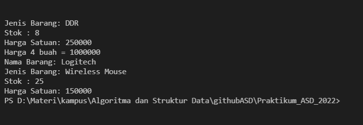
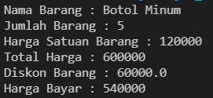
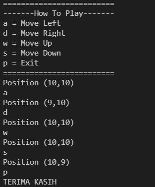

# LAPORAN PRAKTIKUM PERTEMUAN 2
>Nama  : Naresh Pratista<p>
>Kelas : 1F-D4TI<p>
>Absen : 22<p>

<br>

## 2.1 Tujuan Praktikum
1. Mengenal objek dan class sebagai konsep mendasar pada pemrograman berorientasi objek
2. Mendeklarasikan class, atribut dan method
3. Membuat objek (instansiasi)
4. Mengakses atribut dan method dari suatu objek
5. Menerapkan konstruktor

<br>

## 2.2 Deklarasi Class, Atribut dan Method
``` java
package pertemuan2;

public class Barang {
        String namaBarang, jenisBarang;
        int stok, hargaSatuan;
        
        Barang(){
            
        }
        
        Barang(String nm, String jn, int st, int hg){
            namaBarang = nm;
            jenisBarang = jn;
            stok = st;
            hargaSatuan = hg;
        }    
        void tampilBarang(){
            System.out.println("Nama Barang: " +namaBarang);
            System.out.println("Jenis Barang: " +jenisBarang);
            System.out.println("Stok : " +stok);
            System.out.println("Harga Satuan: " +hargaSatuan);
    }
        void tambahStok(int n){
            stok = stok + n;
        }
        void kurangiStok(int n){
            stok = stok - n;
        }
        int hitungHargaTotal(int jumlah){
            return jumlah*hargaSatuan;
        }
    }
``` 
## 2.2.3 Pertanyaan
 1. Sebutkan 2 karakteristik class/objek!
 
    >- Memiliki sesuatu data/ karakter properti variabel / state / atribut
    >- Bisa melakukan sesuatu tingkah laku / behaviour / fungsi / method

<br>

2. Kata kunci apakah yang digunakan untuk mendeklarasikan class?

    >- class //deklarasi nama class

<br> 

3. Perhatikan class Barang yang ada di Praktikum di atas, ada berapa atribut yang dimiliki oleh class 
tersebut? Sebutkan! Dan pada baris berapa saja deklarasi atribut dilakukan?

    >- 4 atribut, (namaBarang, jenisBarang, stok, hargaSatuan), baris 13 dan 14 dideklarasikan

<br> 

4. Ada berapa method yang dimiliki oleh class tersebut? Sebutkan! Dan pada baris berapa saja deklarasi method dilakukan?

    > - void tampilBarang()
    > - void tambahStok(), 
    > - void kurangStok(), 
    > - int hitungTotalHarga(). 
    > - Method tersebut dideklarasikan pada baris ke 16, 23, 27, dan 31.

<br>

5. Perhatikan method kurangiStok() yang ada di class Barang, modifikasi isi method tersebut sehingga proses pengurangan hanya dilakukan jika stok masih ada (masih lebih besar dari 0)

    > - 

<br>

6. Menurut Anda, mengapa method tambahStok() dibuat dengan memiliki 1 parameter berupa bilangan int?

    > - Nama dari parameter tidak boleh sama dengan variabel yang sudah di deklarasi. dari nama parameter (int n) merujuk pada (int stok) yang sudah dideklarasikan pada bagian atribut diatas. yang digunakan untuk memberikan nilai pada instansiasi.

<br>   

7. Menurut Anda, mengapa method hitungHargaTotal() memiliki tipe data int?

    > - untuk me-return jumlah * hargaSatuan (hargaTotal) dan digunakan untuk int

<br>   

8. Menurut Anda, mengapa method tambahStok() memiliki tipe data void?

    > - karena tidak menggunakan return nilai / value

<br>

## 2.3 Instansiasi Objek dan Mengakses atribut & method

```java
package pertemuan2;

public class BarangMain {
    public static void main(String[] args) {
        Barang b1 = new Barang();
        b1.namaBarang = "Corsair 2 GB";
        b1.jenisBarang = "DDR";
        b1.hargaSatuan = 250000;
        b1.stok = 10;
        b1.tambahStok(1);
        b1.kurangiStok(3);
        b1.tampilBarang();
        int hargaTotal = b1.hitungHargaTotal(4);
        System.out.println("Harga 4 buah = "+hargaTotal);
        Barang b2 = new Barang("Logitech", "Wireless Mouse", 25, 150000);
        b2.tampilBarang();
    }

}
```
<br>

## 2.3.3 Pertanyaan

1. Pada class BarangMain, pada baris berapakah proses instansiasi dilakukan? Dan apa nama objek yang dihasilkan?

    > - Pada baris ke-6 dan nama objek yang dihasilkan adalah "b1"

    <br>

2. Bagaimana cara mengakses atribut dan method dari suatu objek?

    > - mengakses atribut <p>
    > namaObjek.namaAtribut = nilai; <p>
    > b1.namaBarang = "corsair 2GB"

    > - mengakses Method <p>
    > namaObjek.namaMethod(); <p>
    > b1.tambahStok(1);
    
    <br>

## 2.4 Membuat Konstruktor
```java
package pertemuan2;

public class BarangMain {
    public static void main(String[] args) {
        Barang b1 = new Barang();
        b1.namaBarang = "Corsair 2 GB";
        b1.jenisBarang = "DDR";
        b1.hargaSatuan = 250000;
        b1.stok = 10;
        b1.tambahStok(1);
        b1.kurangiStok(3);
        b1.tampilBarang();
        int hargaTotal = b1.hitungHargaTotal(4);
        System.out.println("Harga 4 buah = "+hargaTotal);
        Barang b2 = new Barang("Logitech", "Wireless Mouse", 25, 150000);
        b2.tampilBarang();
    }

}
```


<br>

## 2.5 Latihan Praktikum

<br>

> Nomor 1

```java
package latihan1;
public class nomor1 {

    String nama;
    int jumlah, hargaSatuan, hargaBayar, harga;
    float diskon;
    
    nomor1(){
        
    }
    nomor1(String nm, int jml, int hs){
        nama = nm;
        jumlah = jml;
        hargaSatuan = hs;
    }
    int hitungHargaTotal(int jumlah){
        harga = jumlah*hargaSatuan;
        return 0;
    }
    void hitungDiskon(){
        if(harga > 100000){
            diskon = (float)(harga*0.1);
        }else if(harga >= 50000 && harga <= 100000){
            diskon = (float)(harga*0.05);
        }
    }
    void hitungHargaBayar (){
        hargaBayar =(int) (harga - diskon);
    }
    void tampilBarang(){
        System.out.println("Nama Barang : " +nama);
        System.out.println("Jumlah Barang : " +jumlah);
        System.out.println("Harga Satuan Barang : " +hargaSatuan);
        System.out.println("Total Harga : " +harga);
        System.out.println("Diskon Barang : " +diskon);
        System.out.println("Harga Bayar : " +hargaBayar);
    }
}
```
```java
package latihan1;

public class nomor1Main {
    
    public static void main(String[] args) {
        nomor1 b1 = new nomor1();
        b1.nama = "Botol Minum";
        b1.jumlah = 5;
        b1.hargaSatuan = 120000;
        b1.hitungHargaTotal(b1.jumlah);    
        b1.hitungDiskon();
        b1.hitungHargaBayar();
        b1.tampilBarang();
    }
}
```


<br>

> Nomor 2 
```java
package latihan2;

public class pacman {
    int x, y, width, height;

    pacman(){

    }
    pacman(int xm, int ym, int w, int  h){
        x = xm;
        y = ym;
        width = w;
        height = h;
    }
    void moveLeft(){
        if(x > 1) x--;
        printPosition();
    }
    void moveRight(){
        if(x < width) x++;
        printPosition();
    }
    void moveUp(){
        if(y > height) y++;
        printPosition();
    }
    void moveDown(){
        if(y > 1) y--;
        printPosition();    
    }
    void printPosition(){
        System.out.println("Position (" + x + ","+y+")");
 }
               
}
```
```java
package latihan2;
import java.util.Scanner;
public class pacmanMain {
    
    public static void main(String[] args) {
        pacman pcm = new pacman(10, 10, 20, 20);
        Scanner sc = new Scanner(System.in);

        System.out.println("=========================");
        System.out.println("-------How To Play-------");
        System.out.println("a = Move Left");
        System.out.println("d = Move Right");
        System.out.println("w = Move Up");
        System.out.println("s = Move Down");
        System.out.println("p = Exit");
        System.out.println("=========================");

        pcm.printPosition();
        loop :while (true) {
            switch(sc.nextLine()){
                case "a" :
                pcm.moveLeft();
                break;

                case "d" :
                pcm.moveRight();
                break;

                case "w" :
                pcm.moveUp();
                break;

                case "s" :
                pcm.moveDown();
                break;

                case "p" :
                System.out.println("TERIMA KASIH");
                break loop;

                default :
                pcm.printPosition();
                break;
            }
        }
        sc.close() ;
    }
}
```



    