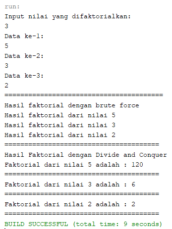

## LAPORAN PRAKTIKUM PERTEMUAN 5
>Nama  : Naresh Pratista<p>
>Kelas : 1F-D4TI<p>
>Absen : 22<p>

**4.1 Tujuan Praktikum**

Setelah melakukan materi praktikum ini, mahasiswa mampu:

1. Mahasiswa mampu membuat algoritma bruteforce dan divide-conquer

2. Mahasiswa mampu menerapkan penggunaan algorima bruteforce dan divide-conquer


**4.2.1 Langkah-langkah Percobaan**
1. classFaktorial
```java
package jobsheet5;
/**
 *
 * @author nares
 */
public class faktorial {
    public int nilai;
    
    int faktorialBF(int n){
        int fakto = 1;
        for(int i=1; i <= n; i++){
            fakto *= i;
        }
        return fakto;
    }
int faktorialDC(int n){
    if(n == 1){
        return 1;  
} else {
    int fakto = n * faktorialDC(n-1);
    return fakto;
}
}
}
```
2. mainFaktorial
```java
package jobsheet5;
/**
 *
 * @author nares
 */
import java.util.Scanner;
public class faktorialMain {

    /**
     * @param args the command line arguments
     */
    public static void main(String[] args) {
        Scanner sc = new Scanner(System.in);
        System.out.println("Input nilai yang difaktorialkan: ");
        int elemen = sc.nextInt();
        
        faktorial[] fk = new faktorial[elemen];
        for(int i=0; i < elemen; i++){
            fk[i] = new faktorial();
            System.out.println("Data ke-"+(i+1)+": ");
            fk[i].nilai = sc.nextInt();
        }
        System.out.println("========================================");
        System.out.println("Hasil faktorial dengan brute force");
        for(int i=0; i < elemen; i++){
            System.out.println("Hasil faktorial dari nilai " + fk[i].nilai);
        }
    }
    
}
```

**4.2.2 Verifikasi Hasil Percobaan**


**4.2.3 Pertanyaan**

1. Jelaskan mengenai base line Algoritma Divide Conquer untuk melakukan pencarian nilai faktorial!
    >- Dalama base line Algorima Divide Conquer pada class factorial menggunakan pemilihan if(n==1) return 1; artinya jika nilai yang dimasukkan nantinya adalah 1 maka hasil yang akan ditampilkan oleh program main nantinya adalah 1 dan erfungsi sebagai batas dari devide conquer dimana perulangan akan berakhir saat n sudah sama dengan 1

2. Pada implementasi Algoritma Divide and Conquer Faktorial apakah lengkap terdiri dari 3 tahapan
divide, conquer, combine? Jelaskan masing-masing bagiannya pada kode program!
    >- Divide : membagi masalah menjadi beberapa masalah yang memiliki kemiripan dengan masalah semua namun berukuran lebih kecil. 
    >- Conquer : menyelesaikan masing-masing masalah secara rekursif 
    >- Combine : menngabungkan solusi masing-masing masalah sehingga membentuk solusi masalah semula

3. Apakah memungkinkan perulangan pada method faktorialBF()dirubah selain menggunakan for? Buktikan!
    >- Bisa, selama termasuk looping maka jenis looping apapun bisa digunakan pada method faktorialBF() dan saya sudah mencoba membuktikannya dengan looping jenis while dan program tetap berjalan dengan baik 
    ```java
        int fakto = 1;
        int i = 1;
        while(i <= n) {
            fakto *= fakto * i;
        }
        return fakto;
    ```
    

4. Tambahkan pegecekan waktu eksekusi kedua jenis method tersebut!
```java
        long end = System.currentTimeMillis();
        System.out.println(end-start);
        System.out.println("==================================");
        System.out.println("Hasil Faktorial dengan Brute Force");
        long start2 = System.currentTimeMillis();
        System.out.println(end-start);
        for (int i = 0; i < elemen; i++){
            System.out.println("Faktorial dari nilai"+fk[i].nilai+ " adalah : "+fk[i].faktorialDC(fk[i].nilai));
        }
        long end2 = System.currentTimeMillis();
        System.out.println(end2 - start2);
        System.out.println("===================================");
            }
        }
```

**4.3 Menghitung Hasil Pangkat dengan Algoritma Brute Force dan Divide and Conquer**


**4.3.1 Langkah-langkah Percobaan**
1. classPangkat
```java
package jobsheet5.pangkat;
/**
 *
 * @author nares
 */
public class pangkat {
    int nilai, pangkat;
    
    int pangkatBF(int a, int n){
        int hasil = 1;
        for(int i=0; i < n; i++){
            hasil *= a;
        }
        return hasil;
    }
    
    int pangkatDC(int a, int n){
        if(n==0){
            return 1;
        }
        else {
            if(n%2 == 1){
                return (pangkatDC(a,n/2)*pangkatDC(a,n/2)*a);
            } else{
                return (pangkatDC(a,n/2)*pangkatDC(a,n/2)*a);
            }
        }
    }
}
```
2. mainPangkat
```java
package jobsheet5.pangkat;
/**
 *
 * @author nares
 */
import java.util.Scanner;
public class pangkatMain {
    public static void main(String[] args) {
        Scanner sc = new Scanner(System.in);
        System.out.println("Masukkan jumlah elemen yang dihitung: ");
        int elemen = sc.nextInt();
        
        pangkat[] png = new pangkat[elemen];
        for(int i=0; i < elemen; i++){
            png[i] = new pangkat();
            System.out.println("Masukkan nilai yang dipangkatkan: ");
            png[i].nilai = sc.nextInt();
            System.out.println("Masukkan nilai pemangkat ke-"+(i+1)+": ");
            png[i].pangkat = sc.nextInt();
        }
        System.out.println("Hasil pangkat dengan Brute Force");
        for(int i=0; i < elemen; i++){
            System.out.println("Nilai "+png[i].nilai+ " pangkat " +png[i].pangkat+ " adalah " +png[i].pangkatBF(png[i].nilai,png[i].pangkat));
        }
        System.out.println("Hasil pangkat dengan Divide and Conquer");
        for(int i=0; i < elemen; i++){
            System.out.println("Nilai "+png[i].nilai+ " pangkat " +png[i].pangkat+ " adalah " +png[i].pangkatBF(png[i].nilai,png[i].pangkat));
    }
    
}
}
```

**4.3.2 Verifikasi Hasil Percobaan**


**4.3.3 Pertanyaan**

1. Jelaskan mengenai perbedaan 2 method yang dibuat yaitu PangkatBF()dan PangkatDC()!
    >- pada method pangkatBF() operasi mencari hitung hasil pangkat dilakukan dengan cara bruteforce yang dilakukan dengan interative/perulangan/looping dan algoritma bruteforce nya adalah mendeklarasikan dahulu hasil = 1 lalu melakukan perulangan dengan batas n(pangkatnya) dan dalam perulangan tersebut dilakukan looping dari hasil tadi di kali dengan a (bilangan yang akan dipangkat) dan perulangan akan terus berlanjut hingga < n sehingga a akan menghasilkan nilai hasil dari pemangkatnya.
    >- pada method pangkatDC() operasi mencari hitung hail pangkat dilakukan dengan cara divide conqquer yang dilakukan dengan rekursif dan algoritma divide conquer yang dilakukan terbagi dalam 3 tahapan yaitu : Divide, Conquer, Combine

2. Pada method PangkatDC()terdapat potongan program sebagai berikut:
Jelaskan arti potongan kode tersebut
    >- jika n(pangkat bilangan) dimodulus 2 hasilnya adalah 1 maka returnya(kembalian nilai) adalah hasil dari (pangkatDC(a,n/2)*pangkatDC(a,n/2)*a) karena bilangan pangkatnya adalah ganjil
    >- jika n(pangkat bilangan) dimodulus 2 hasilnya adalah tidak sama dengan 1 maka returnya (kembalian nilai) adalah hasil dari (pangkatDC(a,n/2)*pangkatDC(a,n/2)) karena bilangan pangkatnya adalah genap

3. Apakah tahap *combine* sudah termasuk dalam kode tersebut?Tunjukkan!
    >- Ya termasuk, Tahap Combine dalam kode tersebut ditunjukkan pada sintaks return atau pengembalian nilai dimana hasil conquer atau penyelesaian masalah sebelumnya direturnkan semua dan dalam tahap combine dilakukan pemanggilan hasil dari bilangan berpangkat tersebut

4. Modifikasi kode program tersebut, anggap proses pengisian atribut dilakukan dengan konstruktor.
    >- classPangkat
    ```java
        public pangkat(int n, int p){
        nilai = n;
        pangkat = p;
    }
    ```
     >- mainPangkat
    ```java
        pangkat[]png = new pangkat[5];
        png[0] = new pangkat (5,2);
        png[1] = new pangkat (10,2);
        png[2] = new pangkat (15,4);
        png[3] = new pangkat (20,2);
        png[4] = new pangkat (25,2);
    ````
    >- output
    

5. Tambahkan menu agar salah satu method yang terpilih saja yang akan dijalankan!

```java
Scanner sc = new Scanner (System.in);
char keluar;
System.out.println("============================");
Pangkat[] png = new Pangkat[5];
png[0] = new Pangkat(2,2);
png[1] = new Pangkat(3,3);
png[2] = new Pangkat(4,4); //konstruktor
png[3] = new Pangkat(5,5);
png[4] = new Pangkat(6,6);
do {
    System.out.println("=========================================");
    System.out.println("Hitung Pangkat Brute Force dan Divide Conquer");
    System.out.println("=========================================");
    System.out.println("Menu Hitung : ");
    System.out.println("1. Hitung Brute Force");
    System.out.println("2. Hitung Divide Conquer");
    System.out.println("3. Keluar");
    int menu = sc.next();
    switch (menu) {
        case 1 :
        System.out.println("Hasil Pangkat dengan Brute Force");
        for (int i=0; i<png.length; i++) {
            System.out.println("Nilai " + png[i].nilai + "pangkat " + png[i].pangkat + "adalah : " + png[i].pangkatDC(png[i].nilai,png[i].pangkat);
        }
        break;
    }
}
```

**4.4 Menghitung Sum Array dengan Algoritma Brute Force dan Divide and Conquer**


**4.4.1 Langkah-langkah Percobaan**
>- classSum
```java
package jobsheet5.sum;

/**
 *
 * @author nares
 */
public class sum {
    public int elemen;
    public double keuntungan[];
    public double total;
    
    sum(int elemen){
        this.elemen = elemen;
        this.keuntungan = new double[elemen];
        this.total = 0;
    }
    double totalBF(double arr[]){
        for (int i=0; i<elemen; i++){
            total = total + arr[i];
        }
        return total;
    }
    double totalDC(double arr[], int l, int r){
        if(l == r){    
        return arr[l];
    } else if (l < r) {
        int mid = (1 + r) / 2;
        double lsum = totalDC(arr, l, mid - 1);
        double rsum = totalDC(arr, r, mid + l);
        return lsum + rsum + arr[mid];
    }
        return 0;
}
}
```
>- mainSum
```java
package jobsheet5.sum;

/**
 *
 * @author nares
 */
import java.util.Scanner;
public class sumMain {
    public static void main(String[] args) {
        Scanner sc = new Scanner(System.in);
        System.out.println("Program menghitung total (satuan juta, misal 5.9)");
        System.out.print("Masukkan jumlah bulan: ");
        int elm = sc.nextInt();
        
        sum sm = new sum(elm);
        System.out.println("=========================================");
        for (int i = 0; i < sm.elemen; i++) {
            System.out.println("Masukkan untuk bulan ke- "+(i+1)+" = ");
            sm.keuntungan[i] = sc.nextDouble();
        }
        System.out.println("==============================================================");
        System.out.println("Algoritma Brute Force");
        System.out.println("Total keuntungan perusahaan selama " + sm.elemen + " bulan adalah = "+sm.totalBF(sm.keuntungan));
        System.out.println("==============================================================");
        System.out.println("Algoritma Divide Conquer");
        System.out.println("Total keuntungan perusahaan selama " + sm.elemen + " bulan adalah = "+sm.totalDC(sm.keuntungan, 0,sm.elemen-1));
        System.out.println("==============================================================");
    } 
}
```

**4.4.2 Verifikasi Hasil Percobaan**


**4.4.3 Pertanyaan**

1. Berikan ilustrasi perbedaan perhitungan keuntungan dengan method TotalBF() ataupun TotalDC()
    >- pangkatBF memproses langsung inputan, sedangkan pangkatDC membagi atau  memecah sebuah inputan lalu menjulahkannya lagi di akhir proses

2. Perhatikan output dari kedua jenis algoritma tersebut bisa jadi memiliki hasil berbeda di belakang koma. Bagaimana membatasi output di belakang koma agar menjadi standar untuk kedua jenis algoritma tersebut.
    >- Membagi masalah menjadi beberapa masalah yang mempunyai kemiripan masalah namun masalah tersebut berukuran lebih kecil lalu menyelesaikan masing-masing masalah secara rekrusif dan menggabungkan sebuah solusi masalah sehingga membentuk sebuah solusi masalah semula

3. Mengapa terdapat formulasi *return value* berikut?Jelaskan!
    >- untuk mereturnkan semua hasil dari penjumlahan keuntungan dari (lsum) lalu sengan (rsum) dan dengan (arr[mid]), sehingga dari penjmlahan ketigannya bisa diketemukan berapa banyak keuntungan yang didapat dari perusahaan tersebut dalam rentang waktu n bulan.

4. Kenapa dibutuhkan variable midpada method TotalDC()?
    >- karena perhitungan keuntungan pada method totalDC() tersebut membagi bagiannya menjadi left(l), dan right(r). maka dari itu membutuhkan variable mid untuk perhitungan semua bagian tengahnya.

5. Program perhitungan keuntungan suatu perusahaan ini hanya untuk satu perusahaan saja. Bagaimana cara menghitung sekaligus keuntungan beberapa bulan untuk beberapa perusahaan.(Setiap perusahaan bisa saja memiliki jumlah bulan berbeda-beda)? Buktikan dengan program!

    ```java
    public class SumMain {
    public static void main(String[]args){
        Scanner sc = new Scanner(System.in);
        System.out.println("===================================");
        System.out.println("Program menghitung keuntungan total (Satuan juta, misal 5.9)");
        System.out.print("Masukkan banyak perusahaan: ");
        int per = sc.nextInt();
        Sum[] sm = new Sum[per];

        for(int i=0; i<sm.length; i++ ){
            System.out.print("Masukkan jumlah bulan untuk perusahan ke-" + (i+1) + ": " );
            int elm = sc.nextInt();
            sm[i] = new Sum(elm);
            for(int j=0; j<sm[i].elemen; j++){
                System.out.print("Masukkan untung bulan ke-" +(j+1) + " = ");
                sm[i].keuntungan[j]= sc.nextDouble(); 
            }
            System.out.println("===================================");
            System.out.println("Algoritma Brute Force");
            System.out.println("Total keuntungan perusahaan selama " + sm[i].elemen + " bulan adalah = " + sm[i].totalBF(sm[i].keuntungan));
            System.out.println("===================================");
            System.out.println("Algoritma Divide & Conquer");
            System.out.println("Total keuntungan perusahaan selama " + sm[i].elemen + " bulan adalah = " + sm[i].totalDC(sm[i].keuntungan, 0, sm[i].elemen-1));
        }
      }
    }
    ```

**4.5 Latihan Praktikum**
>- classLatihan
```java
package jobsheet5.latihan;
/**
 *
 * @author nares
 */
public class Latihan {
    public int vote, jmlhVote, jmlhKandidat = 4;
    public String kandidat;
    public int nilai, acc, seleksi = 0;
    public int[] array = new int[1000];
            
            public int hitungHasilSuara(int js, int k1, int k2, int k3, int k4){
                if (nilai == 5) {
                    nilai = 1;
                }
                if (nilai == 1 && k1 > 0){
                    array[seleksi] = nilai;
                    seleksi++;
                    nilai++;
                    return hitungHasilSuara(js, k1 - 1, k2, k3, k4);
                }else if (nilai == 2 && k2 > 0){
                    array[seleksi] = nilai;
                    seleksi++;
                    nilai++;
                    return hitungHasilSuara(js, k1 - 1, k2, k3, k4);
                }else if (nilai == 3 && k2 > 0){
                    array[seleksi] = nilai;
                    seleksi++;
                    nilai++;
                    return hitungHasilSuara(js, k1 - 1, k2, k3, k4);
                }else if (nilai == 4 && k2 > 0){
                    array[seleksi] = nilai;
                    seleksi++;
                    nilai++;
                    return hitungHasilSuara(js, k1 - 1, k2, k3, k4);
                }else if (k1 == 0 && k2 == 0 && k3 == 0 && k4 == 0){
                    if (array[acc] == array[acc+1] && acc+1 < js){
                    return array[acc];
                    
                    }else if (acc + 2 < js){
                        acc += 2;
                        return hitungHasilSuara(js, k1, k2, k3, k4);
                    }else{
                        return 0;
                    }
                }else{
                    nilai++;
                    return hitungHasilSuara(js, k1, k2, k3, k4);
                    }
            }
}
``` 
>- mainLatihan
```java
package jobsheet5.latihan;
/**
 *
 * @author nares
 */
import java.util.Scanner;
public class LatihanMain {
    public static void main(String[] args) {
        Scanner sc = new Scanner(System.in);
        System.out.println("================================================");
        System.out.println("===========PORTAL PEMILIHAN BEM 2020============");
        System.out.println("================================================");
        Latihan vte = new Latihan();
        Latihan[] bm = new Latihan[vte.jmlhKandidat];
        
        for (int i = 0; i < vte.jmlhKandidat; i++){
            bm[i] = new Latihan();
            System.out.println("Nama Kandidat Presiden BEM ke- " + (i+i) + ": ");
            bm[i].kandidat = sc.nextLine();
      }
       for (int i = 0; i < vte.jmlhKandidat; i++){
           System.out.println("Masukkan Jumlah Pemilih Kandidat BEM ke- " + (i+i) + ": ");
           bm[i].vote = sc.nextInt();
           vte.jmlhVote += bm[i].vote;
      }
       System.out.println("================================================");
       int hasil = vte.hitungHasilSuara(vte.jmlhVote, bm[0].vote, bm[1].vote, bm[2].vote, bm[3].vote);
       if(hasil == 0) {
            System.out.println("Kandidat memiliki mayoritas hampir sama");
      }else{
            System.out.println("Presiden BEM Terpilih Adalah " + bm[hasil-1].kandidat);
        
       }   
    }
}
```
>- Output

