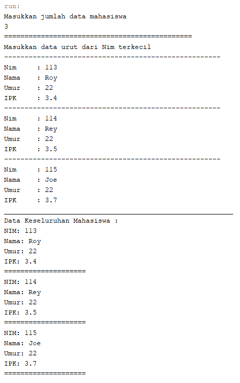
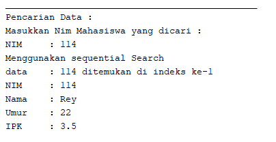
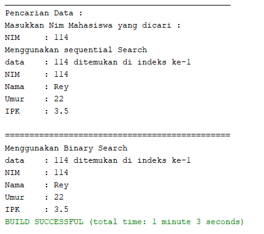
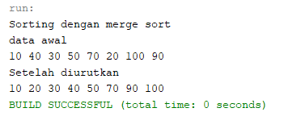
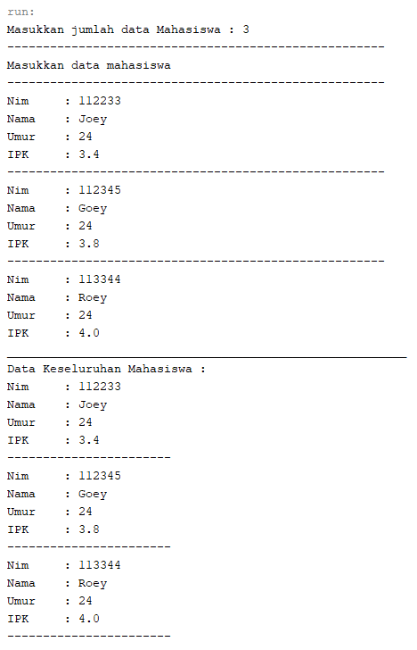
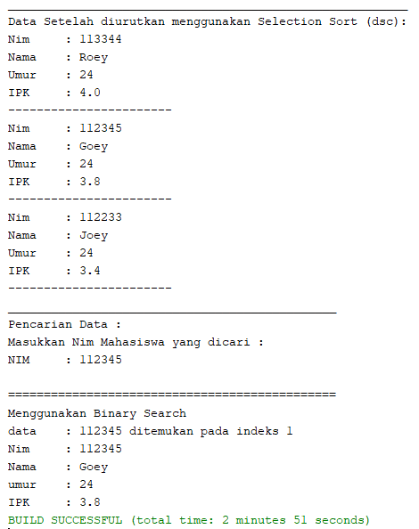
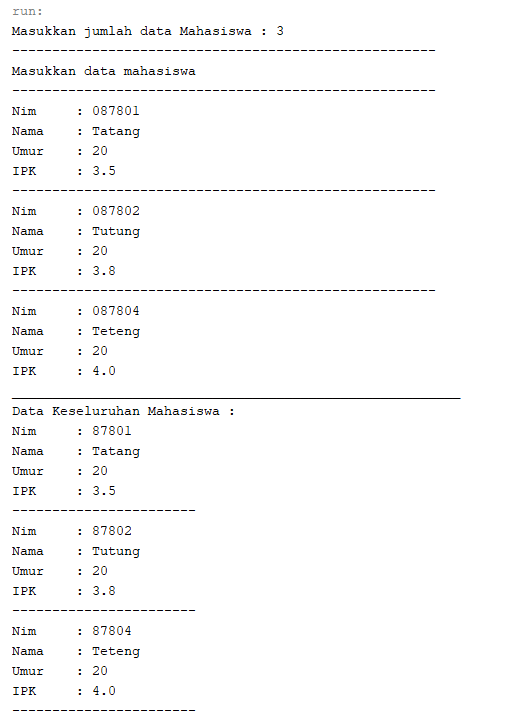
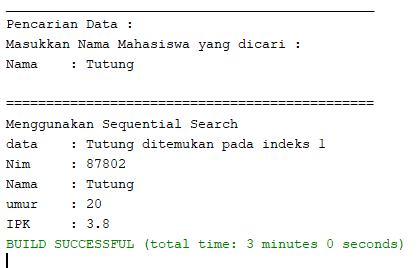
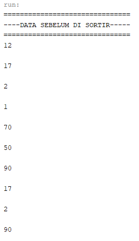
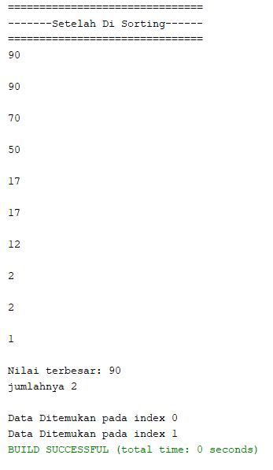

## LAPORAN PRAKTIKUM PERTEMUAN 6
>Nama  : Naresh Pratista<p>
>Kelas : 1F-D4TI<p>
>Absen : 22<p>
**SEARCHING** 

**6.1. Tujuan Praktikum** 

Setelah melakukan materi praktikum ini, mahasiswa mampu: 

1. Menjelaskan mengenai algoritma Searching. 
2. Membuat dan mendeklarasikan struktur algoritma Searching. 
3. Menerapkan dan mengimplementasikan algoritma Searching.  

**6.2.1 Langkah - langkah Percobaan Sequential Search**

1. class Mahasiswa
```java
package percobaan;

/**
 *
 * @author nares
 */
public class Mahasiswa {
    int nim;
    String nama;
    int umur;
    double ipk;
    
    Mahasiswa(int n,String na, int u, double i){
        nim = n;
        nama = na;
        umur = u;
        ipk = i;
    }
    
    void tampil(){
        System.out.println("NIM: " + nim);
        System.out.println("Nama: " + nama);
        System.out.println("Umur: " + umur);
        System.out.println("IPK: " + ipk);
    }
}
```

2. class PencarianMhs
```java
package percobaan;

/**
 *
 * @author nares
 */
public class pencarianMhs {
    Mahasiswa listMhs[] = new Mahasiswa[5];
    int idx;
    
    void tambah(Mahasiswa m){
        if(idx < listMhs.length){
            listMhs[idx] = m;
            idx++;
        } else{
            System.out.println("Data sudah penuh!");
        }
    }
    
    void tampil(){
        for(Mahasiswa m: listMhs){
            m.tampil();
            System.out.println("====================");
        }
    }
    
    int FindSeqSearch(int cari){
        int posisi = -1;
        for(int j=0; j < listMhs.length; j++){
            if(listMhs[j].nim == cari){
                posisi = j;
                break;
            }
        }
        return posisi;
    }
    
    int findBinarySearch(int cari, int left, int  right){
        int mid;
        if(right >= left){
            mid = (left+right)/2;
            if(cari == listMhs[mid].nim){
                return mid;
            } else if(listMhs[mid].nim > cari){
                return findBinarySearch(cari, left, mid -1);
            } else{
                return findBinarySearch(cari, mid+1, right);
            }
        }
        return -1;
    }
    
    void tampilPosisi(int x, int pos){
        if(pos != -1){
            System.out.println("data: " + x+" ditemukan di indeks ke-"+pos);
        } else{
            System.out.println("Data "+x+" tidak ditemukan");
        }
    }
    
    void tampilData(int x, int pos){
        if(pos != -1){
            System.out.println("NIM:\t " + x);
            System.out.println("Nama:\t " + listMhs[pos].nama);
            System.out.println("Umur:\t " + listMhs[pos].umur);
            System.out.println("IPK:\t " + listMhs[pos].ipk);
        } else{
            System.out.println("data " + x + "tidak ditemukan");
        }
    }
}
```

3. class mahasiswaMain
```java
package percobaan;
/**
 *
 * @author nares
 */
import java.util.Scanner;
public class mahasiswaMain {

    public static void main(String[] args) {
        Scanner s = new Scanner(System.in);
        Scanner sl = new Scanner(System.in);
        
        pencarianMhs data = new pencarianMhs();
        System.out.println("Masukkan jumlah data mahasiswa");
        int jumMhs = s.nextInt();
        Mahasiswa[] input = new Mahasiswa[jumMhs];
        data.listMhs = input;
        
        System.out.println("==============================================");
        System.out.println("Masukkan data urut dari Nim terkecil");
        for(int i=0; i < jumMhs; i++){
            System.out.println("-----------------------------------------------------");
            System.out.print("Nim\t: ");
            int nim = s.nextInt();
            System.out.print("Nama\t: ");
            String nama = sl.nextLine();
            System.out.print("Umur\t: ");
            int umur = s.nextInt();
            System.out.print("IPK\t: ");
            double ipk = s.nextDouble();
            
            Mahasiswa m = new Mahasiswa(nim, nama, umur, ipk);
            data.tambah(m);
        }    
        System.out.println("________________________________________________________");
        System.out.println("Data Keseluruhan Mahasiswa : ");
        data.tampil();
            
        System.out.println("______________________________________________");
        System.out.println("Pencarian Data : ");
        System.out.println("Masukkan Nim Mahasiswa yang dicari : ");
        System.out.print("NIM\t: ");
        int cari = s.nextInt();
        System.out.println("Menggunakan sequential Search");
        int posisi = data.FindSeqSearch(cari);
            
        data.tampilPosisi(cari, posisi);
        data.tampilData(cari, posisi);
        
        System.out.println();
        System.out.println("==============================================");
        System.out.println("Menggunakan Binary Search");
        posisi = data.findBinarySearch(cari, 0, jumMhs -1);
        
        data.tampilPosisi(cari, posisi);
        data.tampilData(cari, posisi);
    }
}
```

**6.2.2 Verifikasi Hasil Percobaan** 




**6.2.3 Pertanyaan** 

1. Jelaskan perbedaan method **TampilData** dan **Tampilposisi** pada class PencarianMhs 
    > method TampilData digunakan untuk menampilkan data yang ingin dicari oleh pengguna, dimana pengguna memasukan Nim dan kemudian akan di proses dan menampilkan data berupa NIM, NAMA, UMUR, IPK. 

    > method TampilPosisi digunakan untuk menampilkan posisi data yang ingin dicari oleh pengguna, dimana disaat pengguna memasukkan nim kemudian akan di proses dan menampilkan posisi data yang dicari berada pada index ke berapa.

2. Jelaskan fungsi **break** pada kode program dibawah ini!  
    > berfungsi apabila listMhs[j].nim sama dengan variable cari atau data listMhs[j] berhasil ditemukan. maka fungsi break adaah menghentikan perulangan pencarian data. karena data yang dicari sudah ditemukan

3. Jika Data Nim yang dimasukkan tidak terurut dari kecil ke besar. Apakah program masih dapat berjalan? Apakah hasil yang dikeluarkan benar? Mengapa demikian! 
    >Ya, hasil yang dikeluarkan benar, Karena pada algoritma Sequential Search dilakukan Proses pencarian dilakukan dengan membandingkan elemen array satu per satu secara beruntun sehingga kumpulan data tidak harus dalam keadaan terurut program tetap bisa dijalankan

**6.3 Searching / Pencarian Menggunakan Binary Search** 

**6.3.1 Langkah-langkah Percobaan Binary Search** 
1. Pada percobaan 6.2.1 (sequential search) tambahkan method FindBinarySearch bertipe integer pada class PencarianMhs. Kemudian Deklarasikan isi method FindBinarySearch dengan algoritma pencarian data menggunakan teknik binary searching.
```java
    int findBinarySearch(int cari, int left, int  right){
        int mid;
        if(right >= left){
            mid = (left+right)/2;
            if(cari == listMhs[mid].nim){
                return mid;
            } else if(listMhs[mid].nim > cari){
                return findBinarySearch(cari, left, mid -1);
            } else{
                return findBinarySearch(cari, mid+1, right);
            }
        }
        return -1;
    }
```

2. Panggil method FindBinarySearch terdapat pada class PencarianMhs di kelas Mahasiswamain. Kemudia panggil method tampilposisi dan tampilData
```java
    System.out.println();
    System.out.println("==============================================");
    System.out.println("Menggunakan Binary Search");
    posisi = data.findBinarySearch(cari, 0, jumMhs -1);
        
    data.tampilPosisi(cari, posisi);
    data.tampilData(cari, posisi);
```
**6.3.2 Verifikasi Hasil Percobaan** 




**6.3.3 Pertanyaan** 
1. Tunjukkan pada kode program yang mana proses divide dijalankan! 
    ```java
    mid = (left+right)/2;
    ```

2. Tunjukkan pada kode program yang mana proses conquer dijalankan! 
    ```java
            } else if(listMhs[mid].nim > cari){
                return findBinarySearch(cari, left, mid -1);
            } else{
                return findBinarySearch(cari, mid+1, right);
    ```

3. Jika data Nim yang dimasukkan tidak urut. Apakah program masih dapat berjalan? Mengapa demikian! 
    > Ya, program masih dapat berjalan, tetapi data yang dicari tidak dapat ditemukan karena data awal harus dalam kondisi terurut. Sehingga harus dilakukan proses sorting terlebih dahulu untuk data awal.

4. Jika Nim yang dimasukkan dari NIM terbesar ke terkecil (missal : 20215, 20214, 20212, 20211, 20210)  dan  elemen  yang  dicari  adalah  20210.  Bagaimana  hasil  dari  binary  search?  Apakah sesuai? Jika tidak sesuai maka ubahlah kode program binary seach agar hasilnya sesuai 
    > ubah data yang diinputkan dari yang terbesar ke terkecil
    > 

5. Modifikasilah  program  diatas  yang mana  jumlah mahasiswa  yang  di  inputkan  sesuai  dengan masukan dari keyboard. 
> class pencarianMhs
```java
package percobaan;

/**
 *
 * @author nares
 */
public class pencarianMhs {
    Mahasiswa listMhs[] = new Mahasiswa[5];
    int idx;
    
    void tambah(Mahasiswa m){
        if(idx < listMhs.length){
            listMhs[idx] = m;
            idx++;
        } else{
            System.out.println("Data sudah penuh!");
        }
    }
    
    void tampil(){
        for(Mahasiswa m: listMhs){
            m.tampil();
            System.out.println("====================");
        }
    }
    
    int FindSeqSearch(int cari){
        int posisi = -1;
        for(int j=0; j < listMhs.length; j++){
            if(listMhs[j].nim == cari){
                posisi = j;
                break;
            }
        }
        return posisi;
    }
    
    int findBinarySearch(int cari, int left, int  right){
        int mid;
        if(right >= left){
            mid = (left+right)/2;
            if(cari == listMhs[mid].nim){
                return mid;
            } else if(listMhs[mid].nim < cari){
                return findBinarySearch(cari, left, mid -1);
            } else{
                return findBinarySearch(cari, mid+1, right);
            }
        }
        return -1;
    }
    
    void tampilPosisi(int x, int pos){
        if(pos != -1){
            System.out.println("data\t: " +x+" ditemukan di indeks ke-"+pos);
        } else{
            System.out.println("Data\t: "+x+" tidak ditemukan");
        }
    }
    
    void tampilData(int x, int pos){
        if(pos != -1){
            System.out.println("NIM\t: " + x);
            System.out.println("Nama\t: " + listMhs[pos].nama);
            System.out.println("Umur\t: " + listMhs[pos].umur);
            System.out.println("IPK\t: " + listMhs[pos].ipk);
        } else{
            System.out.println("data\t: " + x + "tidak ditemukan");
        }
    }
}
```

**6.4 Percobaan Pengayaan Divide and Conquer** 

**6.4.1 Langkah-langkah Percobaan Merge Sort** 

1. class MergeSorting
```java
package percobaan;

/**
 *
 * @author nares
 */
public class MergeSorting {
    void mergeSort(int[] data){
        
    }
    
    void merge(int data[], int left, int middle, int right){
        int[] temp = new int[data.length];
        for(int i = left; i <= right; i++){
            temp[i] = data[i];
        }   // data 1,6,3,2,7,4
        int a = left;
        int b = middle +1;  // a=1, 6,3, b=2,7,4
        int c = right;
        
        while( a <= middle && b <= right){
            if(temp[a] <= temp[b]){
                data[c] = temp[a]; a++; // data c semula 4 menjadi 1
            } else{
                data[c] = data[b]; b++;
            } c++;
        }
        
        int s = middle -a;
        for (int i=0; i <= s; i++){
            data[c+i] = temp[a+i];
        }
        
    }
    
    void sort(int data[], int left, int right){
        if(left < right){
            int middle = (left+right)/2;
            sort(data, left, middle);
            sort(data, middle+1, right);
            merge(data, left, middle, right);
        }        
    }
    
    void printArray(int arr[]){
        int n = arr.length;
        for(int i = 0; i < n; i++){
            System.out.println( arr[i] + " ");
        }
        System.out.println();
    }
}
```

2. class sortMain
```java
package percobaan;
/**
 *
 * @author nares
 */
public class sortMain {
    public static void main(String[] args) {
        int data[] = {10, 40, 30, 50, 70, 20, 100, 90};
        System.out.println("Sorting dengan merge sort");
        MergeSorting mSort = new MergeSorting();
        System.out.println("data awal");
        mSort.printArray(data);
        mSort.mergeSort(data);
        System.out.println("Setelah diurutkan");
        mSort.printArray(data); 
    }
}
```

**6.4.2 Verifikasi Hasil Percobaan** 



**6.5 Latihan Praktikum** 
1. Modifikasi percobaan searching diatas dengan ketentuan berikut ini 
   - Sebelum dilakukan searching dengan binary search data harus dilakukan pengurutan dengan menggunakan algoritma sorting (pilih salah satu algoritma sorting dari pertemuan sebelumnya) 

> class mahasiswa
```java
package Latihan1_praktikum;

/**
 *
 * @author nares
 */
public class mahasiswa {
    int nim;
    String nama;
    int umur;
    double ipk;
    
    mahasiswa(int ni, String n, int u, double i){
        nim = ni;
        nama = n;
        umur = u;
        ipk = i;
    }
    void tampil(){
        System.out.println("Nim\t: "+nim);
        System.out.println("Nama\t: "+nama);
        System.out.println("Umur\t: "+umur);
        System.out.println("IPK\t: "+ipk);
    }
}  
```

> class pencarianMhs
```java
package Latihan1_praktikum;
/**
 *
 * @author nares
 */
public class pencarianMhs {
    mahasiswa listMhs[];
    int idx;
    
    void tambah(mahasiswa m){
        if(idx < listMhs.length){
            listMhs[idx] = m;
            idx ++;
        }else{
            System.out.println("Data Sudah Penuh!");
        }
    }
    void tampil(){
        for(mahasiswa m : listMhs){
            m.tampil();
            System.out.println("-----------------------");
        }
    }
    void selectionSort(){
        for(int i=0;i<listMhs.length-1;i++){
            int idxMin=i;
            for(int j=i+1;j<listMhs.length;j++){
                if(listMhs[j].nim>listMhs[idxMin].nim){
                    idxMin=j;
                }
            }
            mahasiswa tmp=listMhs[idxMin];
            listMhs[idxMin]=listMhs[i];
            listMhs[i]=tmp;
        }
    }
    public void tampilPosisi(int x, int pos){
        if(pos != -1){
            System.out.println("data\t: "+ x +" ditemukan pada indeks "+pos);
        }else {
            System.out.println("data\t"+ x +" tidak ditemukan");
        }
    }
    public void tampilData(int x, int pos){
        if(pos!= -1){
            System.out.println("Nim\t: "+x);
            System.out.println("Nama\t: "+listMhs[pos].nama);
            System.out.println("umur\t: "+listMhs[pos].umur);
            System.out.println("IPK\t: "+listMhs[pos].ipk);
        }else{
            System.out.println("Data "+ x +" Tidak ditemukan" );
        }
    }
    public int findBinarySearch(int cari, int left, int right){
        int mid;
        if(right >= left){
            mid = (left + right)/2;
            if(cari == listMhs[mid].nim){
                return(mid);
            }else if(listMhs[mid].nim < cari){
                return findBinarySearch(cari, left, mid -1);
            }else{
                return findBinarySearch(cari, mid +1, right);
            }
        }
        return -1;
    }
}
```

> class mahasiswaMain
```java
package Latihan1_praktikum;
/**
 *
 * @author nares
 */
import java.util.Scanner;
public class mahasiswaMain {

    public static void main(String[] args) {
        Scanner s = new Scanner(System.in);
        Scanner sl = new Scanner(System.in);
        
        pencarianMhs data = new pencarianMhs();
        System.out.print("Masukkan jumlah data Mahasiswa : ");
        int jumMhs = s.nextInt();
        mahasiswa[] inputan=new mahasiswa[jumMhs];
        data.listMhs=inputan;
        
        System.out.println("-----------------------------------------------------");
        System.out.println("Masukkan data mahasiswa");
        for(int i=0; i < jumMhs; i++){
            System.out.println("-----------------------------------------------------");
            System.out.print("Nim\t: ");
            int nim = s.nextInt();
            System.out.print("Nama\t: ");
            String nama = sl.nextLine();
            System.out.print("Umur\t: ");
            int umur = s.nextInt();
            System.out.print("IPK\t: ");
            double ipk = s.nextDouble();
            
            mahasiswa m = new mahasiswa(nim, nama, umur, ipk);
            data.tambah(m);
        }    
        System.out.println("________________________________________________________");
        System.out.println("Data Keseluruhan Mahasiswa : ");
        data.tampil();
        
        System.out.println("________________________________________________________");
        System.out.println("Data Setelah diurutkan menggunakan Selection Sort (dsc): ");
        data.selectionSort();
        data.tampil();
            
        System.out.println("______________________________________________");
        System.out.println("Pencarian Data : ");
        System.out.println("Masukkan Nim Mahasiswa yang dicari : ");
        System.out.print("NIM\t: ");
        int cari = s.nextInt();
        
        System.out.println();
        System.out.println("==============================================");
        System.out.println("Menggunakan Binary Search");
        int posisi = data.findBinarySearch(cari, 0, jumMhs -1);
        
        data.tampilPosisi(cari, posisi);
        data.tampilData(cari, posisi);
    }
}  
```

> Hasil Output





2. Modifikasi percobaan searching diatas dengan ketentuan berikut ini 
   - Pencarian dilakukan berdasarkan Nama Mahasiswa (gunakan Algoritma Sequential Search) 
   - Jika terdapat nama yang sama? Bagaimana keluaran dari kode program ketika pencarian dilakukan pada nama yang sama! <p>

> class mahasiswa
```java
package Latihan2_praktikum;
/**
 *
 * @author nares
 */
public class mahasiswa {
    int nim;
    String nama;
    int umur;
    double ipk;
    
    mahasiswa(int ni, String n, int u, double i){
        nim = ni;
        nama = n;
        umur = u;
        ipk = i;
    }
    void tampil(){
        System.out.println("Nim\t: "+nim);
        System.out.println("Nama\t: "+nama);
        System.out.println("Umur\t: "+umur);
        System.out.println("IPK\t: "+ipk);
    }
}
```

> class pencarianMhs
```java
package Latihan2_praktikum;

/**
 *
 * @author nares
 */
public class pencarianMhs {
    mahasiswa listMhs[];
    int idx;
    
    void tambah(mahasiswa m){
        if(idx < listMhs.length){
            listMhs[idx] = m;
            idx ++;
        }else{
            System.out.println("Data Sudah Penuh !");
        }
    }
    void tampil(){
        for(mahasiswa m : listMhs){
            m.tampil();
            System.out.println("-----------------------");
        }
    }
    public int findSeqSearch(String cari){
        int posisi = -1;
        for(int j=0; j < listMhs.length; j++){
            if(cari.equals(listMhs[j].nama)){
                posisi = j;
                break;
            }
        }
        return posisi;
    }
    public void tampilPosisi(String x, int pos){
        if(pos != -1){
            System.out.println("data\t: "+ x +" ditemukan pada indeks "+pos);
        }else {
            System.out.println("data\t"+ x +" tidak ditemukan");
        }
    }
    public void tampilData(String x, int pos){
        if(pos!= -1){
            System.out.println("Nim\t: "+listMhs[pos].nim);
            System.out.println("Nama\t: "+x);
            System.out.println("umur\t: "+listMhs[pos].umur);
            System.out.println("IPK\t: "+listMhs[pos].ipk);
        }else{
            System.out.println("Data "+ x +" Tidak ditemukan" );
        }
    }
}
```

> class mahasiswaMain
```java
package Latihan2_praktikum;

/**
 *
 * @author nares
 */
import java.util.Scanner;
public class mahasiswaMain {

    public static void main(String[] args) {
        Scanner s = new Scanner(System.in);
        Scanner sl = new Scanner(System.in);
        
        pencarianMhs data = new pencarianMhs();
        System.out.print("Masukkan jumlah data Mahasiswa : ");
        int jumMhs = s.nextInt();
        mahasiswa[] inputan = new mahasiswa[jumMhs];
        data.listMhs=inputan;
        
        System.out.println("-----------------------------------------------------");
        System.out.println("Masukkan data mahasiswa");
        for(int i=0; i < jumMhs; i++){
            System.out.println("-----------------------------------------------------");
            System.out.print("Nim\t: ");
            int nim = s.nextInt();
            System.out.print("Nama\t: ");
            String nama = sl.nextLine();
            System.out.print("Umur\t: ");
            int umur = s.nextInt();
            System.out.print("IPK\t: ");
            double ipk = s.nextDouble();
            
            mahasiswa m = new mahasiswa(nim, nama, umur, ipk);
            data.tambah(m);
        }    
        System.out.println("________________________________________________________");
        System.out.println("Data Keseluruhan Mahasiswa : ");
        data.tampil();
            
        System.out.println("______________________________________________");
        System.out.println("Pencarian Data : ");
        System.out.println("Masukkan Nama Mahasiswa yang dicari : ");
        System.out.print("Nama\t: ");
        String cari = sl.nextLine();

        System.out.println();
        System.out.println("==============================================");
        System.out.println("Menggunakan Sequential Search");
        int posisi = data.findSeqSearch(cari);
        
        data.tampilPosisi(cari, posisi);
        data.tampilData(cari, posisi);
    }
}   
```

> Hasil Output




3.   Buatlah  program  untuk  mengurutkan  array  tersebut  (boleh  memilih  metode  pengurutan) selanjutnya lakukan pencarian dan mencetak isi array yang nilainya terbesar, dan mencetak ada berapa  buah  nilai  terbesar  tersebut  serta  berada  dilokasi  mana  saja  nilai  terbesar  tersebut! (menggunakan binary search) 

> class array1Dimensi
```java
package Latihan3_praktikum;

public class array1Dimensi {
    int[] data;
    int max = 0;
    int posisi;
    int jumlah = 0;
    
    array1Dimensi(int nilai[]){
        data = nilai;
    }
    
    void tampil(){
        for(int i = 0; i < data.length; i++){
            System.out.println(data[i] + "");
            System.out.println();
        }
    }
    
    void bubbleSort(){
        for(int i = 0; i < data.length - 1; i++){
            for (int n = 1; n < data.length - i; n++){
                if(data[n] > data[n - 1]){
                    int tmp = data[n];
                    data[n] = data[n-1];
                    data[n - 1] = tmp;
                }
            }
        }
    }
    
    int Searching(int cari, int left, int right){
        int mid;
        if (right >= left) {
            mid = (left + right)/2;
            if(cari == data[mid]){
                return (mid);
            } else if (data[mid] > cari){
                return Searching(cari, mid + 1, right);
            } else {
                return Searching(cari, left, mid - 1);
            }
        }
        return -1;
    }
    
    int nilaiTerbesar() {
        for (int i = 0; i < data.length; i++){
            if(data[i] > max) {
                max = data[i];
            }
        }
        System.out.println("Nilai terbesar: " + max);
        return max;
    }
    
    void tampilPosisi(int pos) {
        for (int i = 0; i < data.length; i++) {
            if (data[i] == max) {
                jumlah++;
            }
        }
        System.out.println("jumlahnya " + jumlah);
        System.out.println();
        posisi = max;
        for (int i = 0; i < data.length; i++){
            if (posisi == data[i]){
                pos = i;
                System.out.println("Data Ditemukan pada index " + pos);
            }
        }
    }
}
```

> class array1DimensiMain
```java
package Latihan3_praktikum;

/**
 *
 * @author nares
 */
public class array1DimensiMain {

    public static void main(String[] args) {
        int bil[] = {12, 17, 2, 1, 70, 50, 90, 17, 2, 90};
        array1Dimensi arr = new array1Dimensi(bil);

        int jum = 10;
        int max = 0;
        System.out.println("===============================");
        System.out.println("----DATA SEBELUM DI SORTIR-----");
        System.out.println("===============================");
        arr.tampil();
        arr.bubbleSort();
        System.out.println("===============================");
        System.out.println("-------Setelah Di Sorting------");
        System.out.println("===============================");
        arr.tampil();
        arr.nilaiTerbesar();
        arr.Searching(max, 0, jum - 1);
        arr.tampilPosisi(max);
    }
}
```

> Hasil Output


