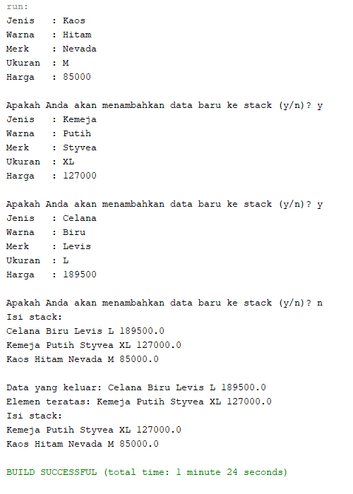
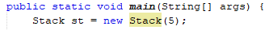
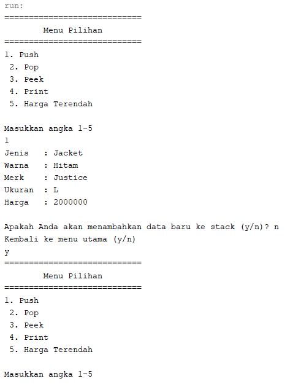
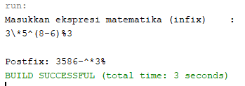
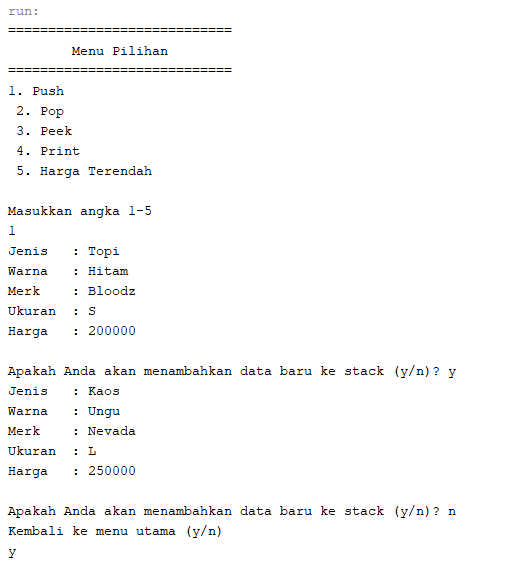
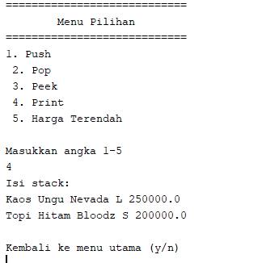
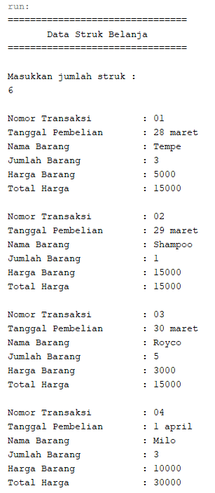
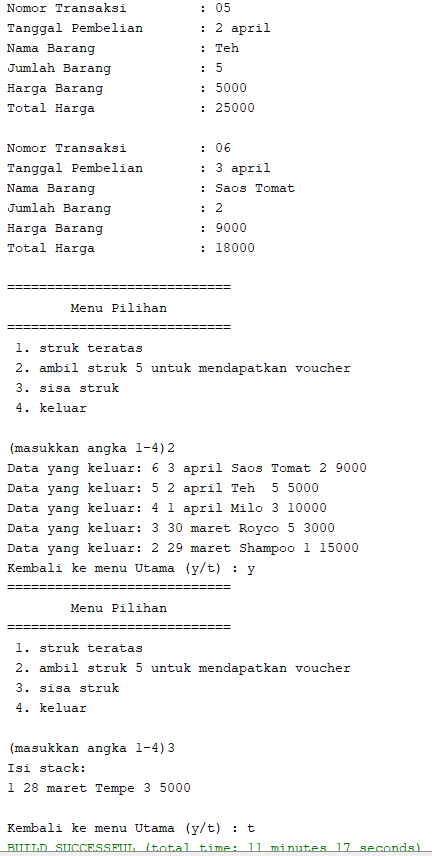

## LAPORAN PRAKTIKUM PERTEMUAN 9
>Nama  : Naresh Pratista<p>
>Kelas : 1F-D4TI<p>
>Absen : 22<p>
**STACK**

**7.1 Tujuan Praktikum**  

Setelah melakukan materi praktikum ini, mahasiswa mampu: 

1. Mengenal struktur data Stack 
2. Membuat dan mendeklarasikan struktur data Stack 
3. Menerapkan algoritma Stack dengan menggunakan array 

**7.2 Praktikum 1**  

Pada percobaan ini, kita akan membuat program yang mengilustrasikan tumpukan pakaian yang disimpan ke dalam stack. Karena sebuah pakaian mempunyai beberapa informasi, maka implementasi Stack dilakukan dengan menggunakan array of object untuk mewakili setiap elemennya. 

**7.2.1 Langkah-langkah Percobaan** 
1. class Pakaian
```java
package percobaan;
/**
 *
 * @author nares
 */
public class Pakaian {
    String jenis, warna, merk, ukuran;
    double harga;
    
    Pakaian(String jenis, String warna, String merk, String ukuran, double harga){
        this.jenis = jenis;
        this.warna = warna;
        this.merk = merk;
        this.ukuran = ukuran;
        this.harga = harga;
    }
}
```

2. class Stack
```java
package percobaan;
/**
 *
 * @author nares
 */
public class Stack {
    int size;
    int top;
    Pakaian data[];

    public Stack(int size) {
        this.size = size;
        data = new Pakaian[size];
        top = -1;

    }

    public boolean IsEmpty() {
        if (top == -1) {
            return true;
        } else {
            return false;
        }
    }

    public boolean IsFull() {
        if (top == size - 1) {
            return true;
        } else {
            return false;
        }
    }

    public void push(Pakaian pkn) {
        if (!IsFull()) {
            top++;
            data[top] = pkn;
        } else {
            System.out.println("Isi Stack penuh !!");
        }

    }

    public void pop() {
        if (!IsEmpty()) {
            Pakaian x = data[top];
            top--;
            System.out.println("Data yang keluar: " + x.jenis + " " + x.warna + " " + x.merk + " " + x.ukuran + " " + x.harga);
        } else {
            System.out.println("Stack masih kosong");
        }
    }

    public void peek() {
        System.out.println("Elemen teratas: " + data[top].jenis + " " + data[top].warna + " " + data[top].merk + " " + data[top].ukuran + " " + data[top].harga);
    }

    public void print() {
        System.out.println("Isi stack: ");
        for (int i = top; i >= 0; i--) {
            System.out.println(data[i].jenis + " " + data[i].warna + " " + data[i].merk + " " + data[i].ukuran + " " + data[i].harga);
        }
        System.out.println("");
    }

    public void clear() {
        if (!IsEmpty()) {
            for (int i = top; i >= 0; i--) {
                top--;
            }
            System.out.println("Stack sudah di kosongkan ");
        } else {
            System.out.println("Gagal! Stack masih kosong");
        }
    }
```

3. class stackMain
```java
package percobaan;
/**
 *
 * @author nares
 */
import java.util.Scanner;
public class StackMain {
    public static void main(String[] args) {
        Stack st = new Stack(5);
        Scanner sc = new Scanner(System.in);

        char pilih;
        do {
            System.out.print("Jenis\t: ");
            String jenis = sc.nextLine();
            System.out.print("Warna\t: ");
            String warna = sc.nextLine();
            System.out.print("Merk\t: ");
            String merk = sc.nextLine();
            System.out.print("Ukuran\t: ");
            String ukuran = sc.nextLine();
            System.out.print("Harga\t: ");
            double harga = sc.nextDouble();
            System.out.println("");

            Pakaian bk = new Pakaian(jenis, warna, merk, ukuran, harga);
            System.out.print("Apakah Anda akan menambahkan data baru ke stack (y/n)? ");
            pilih = sc.next().charAt(0);
            sc.nextLine();
            st.push(bk);

        } while (pilih == 'y' || pilih == 'Y');

        st.print();
        st.pop();
        st.peek();
        st.print();
    }
    
}
```
**7.2.2 Verifikasi Hasil Percobaan** 



**7.2.3 Pertanyaan** 
1. Berapa banyak data pakaian yang dapat ditampung di dalam stack? Tunjukkan potongan kode program untuk mendukung jawaban Anda tersebut! 
    > ada 5 data
    

2. Perhatikan class **StackMain**, pada saat memanggil fungsi push, parameter yang dikirimkan adalah **p**. Data apa yang tersimpan pada variabel **p** tersebut? 
    > data yang dimasukkan melalu scanner

3. Apakah fungsi penggunaan **do-while** yang terdapat pada class **StackMain**? 
    > untuk melakukan perulangan agar nantinya user dapat menginputkan data yang meliputi judul, nama pengarang, tahun terbit, jumlah halaman, dan harga.

4. Modifikasi kode program  pada  class **StackMain** sehingga pengguna dapat memilih operasi-operasi pada stack (push,pop,peek,atau print) melalui pilihan menu program dengan memanfaatkan kondisi IF-ELSE atau SWITCH-CASE! 
```java
package percobaan;
/**
 *
 * @author nares
 */
import java.util.Scanner;
public class StackMain {
    public static void main(String[] args) {
        Stack st = new Stack(8);
        Scanner sc = new Scanner(System.in);
        Scanner sd = new Scanner(System.in);
        
        char pilih;
        do{
            System.out.println("============================");
            System.out.println("        Menu Pilihan        ");
            System.out.println("============================");
            System.out.println("1. Push\n 2. Pop\n 3. Peek\n 4. Print\n 5. Harga Terendah\n");
            int pilihan;
            System.out.println("Masukkan angka 1-5");
            pilihan = sd.nextInt();
        
            switch (pilihan){
                case 1:
                    do{
                       System.out.print("Jenis\t: ");
                       String jenis = sc.nextLine();
                       System.out.print("Warna\t: ");
                       String warna = sc.nextLine();
                       System.out.print("Merk\t: ");
                       String merk = sc.nextLine();
                       System.out.print("Ukuran\t: ");
                       String ukuran = sc.nextLine();
                       System.out.print("Harga\t: ");
                       double harga = sc.nextDouble();
                       System.out.println("");

                       Pakaian bk = new Pakaian(jenis, warna, merk, ukuran, harga);
                       System.out.print("Apakah Anda akan menambahkan data baru ke stack (y/n)? ");
                       pilih = sc.next().charAt(0);
                       sc.nextLine();
                       st.push(bk);

                }while (pilih == 'y');
                    break;
                    
                case 2:
                    st.pop();
                    break;
                    
                case 3:
                    st.peek();
                    break;
                    
                case 4:
                    st.print();
                    break;
                
                case 5:
                    st.getMin();
                    break;
                
                default:
                    System.out.println("Input yang anda masukkan salah");
                    System.exit(0);
            }if(pilihan == 5){
                pilih = 't';
            }else{
                System.out.println("Kembali ke menu utama (y/n) ");
                pilih = sc.next().charAt(0);
            }
        }while (pilih == 'y');
        
    }
    
}
```
Hasil Run :
    

**7.3 Praktikum 2** 

Pada percobaan ini, kita akan membuat program untuk melakukan konversi notasi infix menjadi notasi postfix. 

**7.3.1 Langkah-langkah Percobaan** 
1. class Postfix
```java
package praktikum2;
/**
 *
 * @author nares
 */
public class Postfix {
        int n;
    int top;
    char stack[];

    public Postfix(int total) {
        n = total;
        top = -1;
        stack = new char[n];
        push('(');
    }

    public void push(char c) {
        top++;
        stack[top] = c;
    }

    public char pop() {
        char item = stack[top];
        top--;
        return item;
    }

    public boolean isOperand(char c) {
        if ((c >= 'A' && c <= 'Z') || (c >= 'a' && c <= 'z') || (c >= '0' && c <= '9') || c == ' ' || c == '.') {

            return true;
        } else {
            return false;
        }
    }

    public boolean isOperator(char c) {
        if (c == '^' || c == '%' || c == '/' || c == '*' || c == '-' || c == '+') {
            return true;
        } else {
            return false;
        }
    }

    public int derajat(char c) {
        switch (c) {
            case '^':
                return 3;
            case '%':
                return 2;
            case '/':
                return 2;
            case '*':
                return 2;
            case '-':
                return 1;
            case '+':
                return 1;
            default:
                return 0;
        }
    }

    public String konversi(String Q) {
        String P = "";
        char c;
        for (int i = 0; i < n; i++) {
            c = Q.charAt(i);
            if (isOperand(c)) {
                P = P + c;
            }
            if (c == '(') {
                push(c);
            }
            if (c == ')') {
                while (stack[top] != '(') {
                    P = P + pop();
                }
                pop();
            }
            if (isOperator(c)) {
                while (derajat(stack[top]) >= derajat(c)) {
                    P = P + pop();
                }
                push(c);
            }
        }
        return P;
    }
}
```
2. class postFixMain
```java
package praktikum2;
/**
 *
 * @author nares
 */
import java.util.Scanner;
public class PostFixMain {

    public static void main(String[] args) {
        Scanner sc = new Scanner(System.in);
        String P, Q;
        System.out.println("Masukkan ekspresi matematika (infix)\t: ");
        Q = sc.nextLine();
        Q = Q.trim();
        Q = Q + ")";

        int total = Q.length();
        Postfix post = new Postfix(total);
        P = post.konversi(Q);
        System.out.println();
        System.out.println("Postfix: " + P);
        sc.close();
    }
}
```

**7.3.2 Verifikasi Hasil Percobaan** 


**7.3.3 Pertanyaan** 
1. Perhatikan class **Postfix**, jelaskan alur kerja method **derajat**! 
    > saat '^' maka akan mereturn nilai 3, jika operator '%', '*' maka akan mereturn nilai 2. sedangkan '-', dan '+' akan mereturn nilai 1 menggunakan switch case.

2. Apa fungsi kode program berikut? 
    > untuk menyimpan data char (i) kedalam Q dengan menggunakan charAt(i)


3. Jalankan kembali program tersebut, masukkan ekspresi **3\*5^(8-6)%3**. Tampilkan hasilnya! 


4. Pada soal nomor 3, mengapa tanda kurung tidak ditampilkan pada hasil konversi? Jelaskan! 
    > karena apabila terdapat tanda kurung pada ekspresi matematika, maka tanda tersebut akan langsung meng-pop tanpa harus kedalam postfix.

**7.4 Tugas** 
1. Perhatikan dan gunakan kembali kode program pada **Praktikum 1**. Tambahkan method **getMin** pada class **Stack** yang digunakan untuk mencari dan menampilkan data pakaian dengan harga terendah dari semua data pakaian yang tersimpan di dalam stack! 

> class stack
```java
package percobaan;
/**
 *
 * @author nares
 */
public class Stack {
    int size;
    int top;
    Pakaian data[];

    public Stack(int size) {
        this.size = size;
        data = new Pakaian[size];
        top = -1;

    }

    public boolean IsEmpty() {
        if (top == -1) {
            return true;
        } else {
            return false;
        }
    }

    public boolean IsFull() {
        if (top == size - 1) {
            return true;
        } else {
            return false;
        }
    }

    public void push(Pakaian pkn) {
        if (!IsFull()) {
            top++;
            data[top] = pkn;
        } else {
            System.out.println("Isi Stack penuh !!");
        }

    }

    public void pop() {
        if (!IsEmpty()) {
            Pakaian x = data[top];
            top--;
            System.out.println("Data yang keluar: " + x.jenis + " " + x.warna + " " + x.merk + " " + x.ukuran + " " + x.harga);
        } else {
            System.out.println("Stack masih kosong");
        }
    }

    public void peek() {
        System.out.println("Elemen teratas: " + data[top].jenis + " " + data[top].warna + " " + data[top].merk + " " + data[top].ukuran + " " + data[top].harga);
    }

    public void print() {
        System.out.println("Isi stack: ");
        for (int i = top; i >= 0; i--) {
            System.out.println(data[i].jenis + " " + data[i].warna + " " + data[i].merk + " " + data[i].ukuran + " " + data[i].harga);
        }
        System.out.println("");
    }

    public void clear() {
        if (!IsEmpty()) {
            for (int i = top; i >= 0; i--) {
                top--;
            }
            System.out.println("Stack sudah di kosongkan ");
        } else {
            System.out.println("Gagal! Stack masih kosong");
        }
    }
    
    public void getMin(){
        double hrgMin = data[0].harga;
        int idn = 0;
        for(int i = 1; i <= top; i++){
            if (hrgMin > data[i].harga){
                idn = i;
                hrgMin = data[i].harga;
            }
        }
        System.out.println("Pakaian Dengan Harga Terendah adalah\t: "+data[idn].harga);
        System.out.println("Dengan merk\t\t\t\t: "+data[idn].merk);
    }
}
```

> class stackMain
```java
package percobaan;
/**
 *
 * @author nares
 */
import java.util.Scanner;
public class StackMain {
    public static void main(String[] args) {
        Stack st = new Stack(8);
        Scanner sc = new Scanner(System.in);
        Scanner sd = new Scanner(System.in);
        
        char pilih;
        do{
            System.out.println("============================");
            System.out.println("        Menu Pilihan        ");
            System.out.println("============================");
            System.out.println("1. Push\n 2. Pop\n 3. Peek\n 4. Print\n 5. Harga Terendah\n");
            int pilihan;
            System.out.println("Masukkan angka 1-5");
            pilihan = sd.nextInt();
        
            switch (pilihan){
                case 1:
                    do{
                       System.out.print("Jenis\t: ");
                       String jenis = sc.nextLine();
                       System.out.print("Warna\t: ");
                       String warna = sc.nextLine();
                       System.out.print("Merk\t: ");
                       String merk = sc.nextLine();
                       System.out.print("Ukuran\t: ");
                       String ukuran = sc.nextLine();
                       System.out.print("Harga\t: ");
                       double harga = sc.nextDouble();
                       System.out.println("");

                       Pakaian bk = new Pakaian(jenis, warna, merk, ukuran, harga);
                       System.out.print("Apakah Anda akan menambahkan data baru ke stack (y/n)? ");
                       pilih = sc.next().charAt(0);
                       sc.nextLine();
                       st.push(bk);

                }while (pilih == 'y');
                    break;
                    
                case 2:
                    st.pop();
                    break;
                    
                case 3:
                    st.peek();
                    break;
                    
                case 4:
                    st.print();
                    break;
                
                default:
                    System.out.println("Input yang anda masukkan salah");
                    System.exit(0);
            }if(pilihan == 5){
                pilih = 't';
            }else{
                System.out.println("Kembali ke menu utama (y/n) ");
                pilih = sc.next().charAt(0);
            }
        }while (pilih == 'y');
        
    }
}
```
> Hasil Output :



2. Setiap  hari  Minggu,  Dewi  pergi  berbelanja  ke  salah  satu  supermarket  yang  berada  di  area rumahnya. Setiap kali selesai berbelanja, Dewi menyimpan struk belanjaannya di dalam laci. Setelah dua bulan, ternyata Dewi sudah mempunyai delapan struk belanja. Dewi  berencana mengambil lima struk belanja untuk ditukarkan dengan voucher belanja. Buat sebuah program stack untuk menyimpan data struk belanja Dewi, kemudian lakukan juga proses pengambilan data struk belanja sesuai dengan jumlah struk yang akan ditukarkan dengan voucher. Informasi yang tersimpan pada struk belanja terdiri dari: 

    - Nomor transaksi 
    - Tanggal pembelian 
    - Jumlah barang yang dibeli 
    - Total harga bayar 

    Tampilkan informasi struk belanja yang masih tersimpan di dalam stack! 

> class strukBelanja
```java 
package tugas;
/**
 *
 * @author nares
 */
public class strukBelanja {
    String nmBarang, tanggal;
    int noTransaksi, jumlah, total;
    
    strukBelanja(int nt, String tgl, String nb, int jml, int t){
    noTransaksi = nt;
    tanggal = tgl;
    nmBarang = nb;
    jumlah = jml;
    total = t;
    }
}
```
> class Belanja
```java
package tugas;
/**
 *
 * @author nares
 */
public class belanja {
    int size;
    int top;
    strukBelanja data[];
    
        public belanja(int size){
        this.size = size;
        data = new strukBelanja[size];
        top = -1;
        }

        public boolean IsEmpty(){
        if(top == -1){
            return true;
        }else{
            return false;
        }
    }

        public boolean IsFull(){
        if(top == size - 1){
            return true;
        }else{
            return false;
        }
    }

        public void push(strukBelanja sb){
        if(!IsFull()){
            top++;
            data[top] = sb;
        }else{
            System.out.println("Isi stack penuh!");
        }
    }

        public void pop(){
        if(!IsEmpty()){
            strukBelanja x = data[top];
            top--;
            System.out.println("Data yang keluar: " + x.noTransaksi + " " + x.tanggal + " " + x.nmBarang + " " + x.jumlah + " " + x.total);
        }else{
            System.out.println("Stock masih kosong");
        }
    }

        public void peek(){
        System.out.println("Elemen teratas: " + data[top].noTransaksi +"."+ " " + data[top].tanggal + " " + data[top].nmBarang + " " + data[top].jumlah + " " + data[top].total);
    }

        public void print(){
        System.out.println("Isi stack: ");
        for(int i = top; i >= 0; i--){
        System.out.println(data[i].noTransaksi + " " + data[i].tanggal + " " + data[i].nmBarang + " " + data[i].jumlah + " " + data[i].total);
    }
        System.out.println("");
    }
        public void clear(){
            if(!IsEmpty()){
            for(int i = top; i >= 0; i--){
                top--;
            }
            System.out.println("Stock sudah dikosongkan");
            }else{
            System.out.println("Stock kosong");
        }
    }
}
```
> class strukBelanjaMain
```java
package tugas;

/**
 *
 * @author nares
 */
import java.util.Scanner;
public class strukBelanjaMain {
    public static void main(String[] args) {
        Scanner sc = new Scanner(System.in);
        Scanner ss = new Scanner(System.in);
        
        System.out.println("================================");
        System.out.println("       Data Struk Belanja       ");
        System.out.println("================================");
        System.out.println();
        System.out.println("Masukkan jumlah struk :");
        int banyak = sc.nextInt();
        System.out.println();
        belanja blj = new belanja(banyak);
        
        int totalHarga = 0;
        int jml, harga;
        for (int i = 0; i < banyak; i++) {
        System.out.print("Nomor Transaksi\t\t: ");
        int nt =sc.nextInt();
        System.out.print("Tanggal Pembelian\t: ");
        String tanggal =ss.nextLine();
        System.out.print("Nama Barang\t\t: ");
        String nb =ss.nextLine();
        System.out.print("Jumlah Barang\t\t: ");
        jml = sc.nextInt();
        System.out.print("Harga Barang\t\t: ");
        harga = sc.nextInt();
        totalHarga =jml * harga;
        strukBelanja sb =new strukBelanja(nt, tanggal, nb, jml,harga);
        blj.push(sb);
        System.out.print("Total Harga\t\t: "+ totalHarga);
        System.out.println("\n");
    }
        char pilih;
     do{
        System.out.println("============================");
        System.out.println("        Menu Pilihan        ");
        System.out.println("============================");
        System.out.println(" 1. struk teratas\n 2. ambil struk 5 untuk mendapatkan voucher\n 3. sisa struk\n 4. keluar\n"); 
        System.out.print("(masukkan angka 1-4)");
        int pilihan =sc.nextInt();
        
        switch (pilihan){
        case 1:
            blj.peek();
            blj.print();
            break;
        case 2:
            blj.pop();
            blj.pop();
            blj.pop();
            blj.pop();
            blj.pop();
            break;
        case 3:
            blj.print();
            break;
                case 4:
                    System.out.println("Terima Kasih");
                    break;
                default:
                    System.out.println("Menu yang anda masukkan salah");
                    break;
            }if(pilihan == 4) {
                pilih = 't';                
            }else{
                System.out.print("Kembali ke menu Utama (y/t) : ");
                pilih = sc.next().charAt(0);
            }
        }while(pilih == 'y');
    }
}
```
> Hasil Output :



